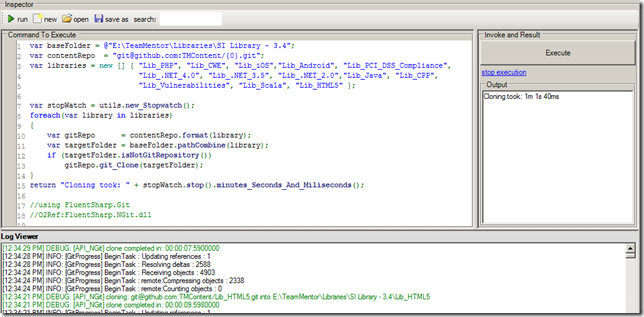
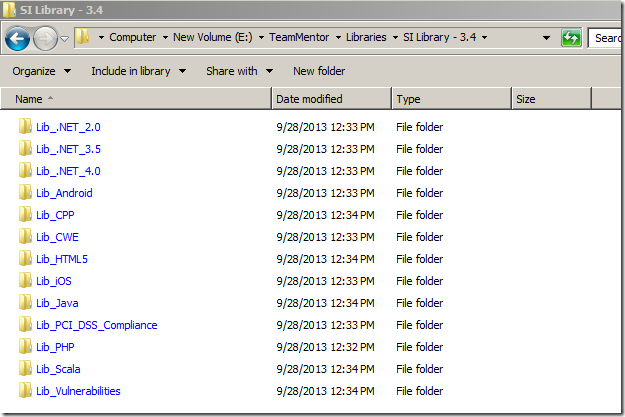
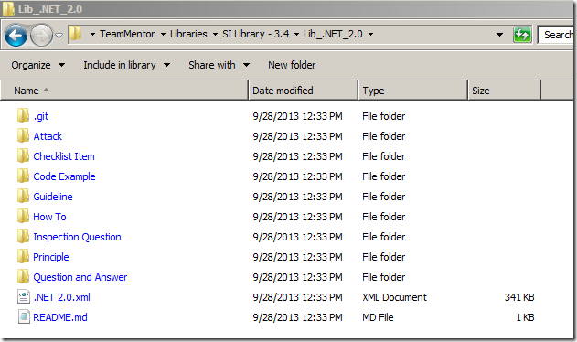
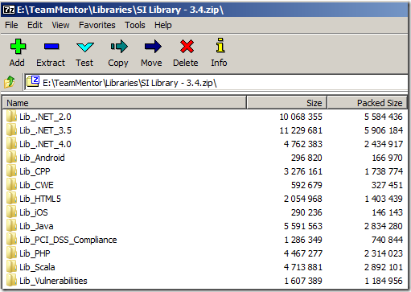
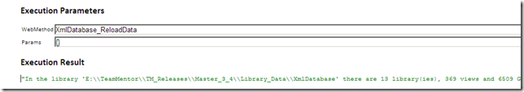
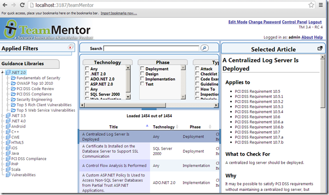
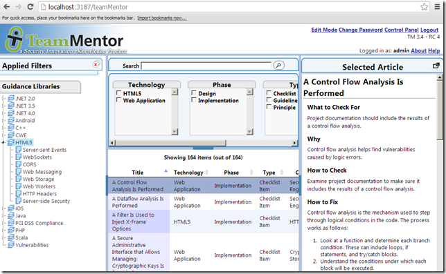
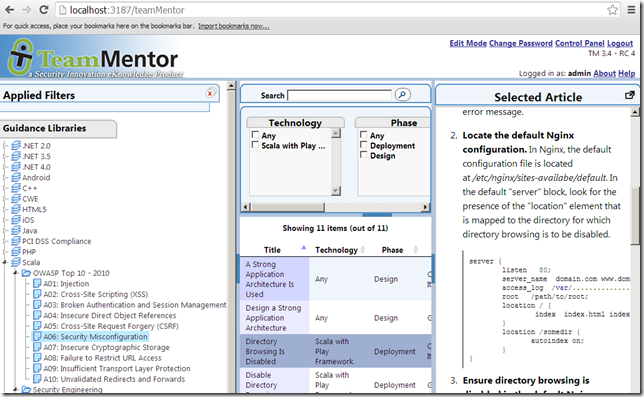

## Script to Git Clone 13 repositories in order to have all TeamMentor Libraries in one folder

Part of the push for the 3.4 release of [TeamMentor](https://teammentor.net/), I wanted to have a copy of all TeamMentor libraries locally (there are 13 libraries on the 3.4 release).

Since O2 Platform's FluentSharp has native Git support, I was able to do create the clones using this script (note how simple it is to create a clone from a GitHub repo):  

{lang="csharp"}  
    var baseFolder = @"E:\TeamMentor\Libraries\SI Library";
    var contentRepo  = "git@github.com:TMContent/{0}.git";
    var libraries = new [] { "Lib_PHP", "Lib_CWE", "Lib_iOS","Lib_Android", "Lib_PCI_DSS_Compliance",
                             "Lib_.NET_4.0", "Lib_.NET_3.5", "Lib_.NET_2.0","Lib_Java", "Lib_CPP",
                             "Lib_Vulnerabilities", "Lib_Scala", "Lib_HTML5" };

    var stopWatch = utils.new_Stopwatch();
    foreach(var library in libraries)
    {
        var gitRepo      = contentRepo.format(library);
        var targetFolder = baseFolder.pathCombine(library);
        if (targetFolder.isNotGitRepository())
            gitRepo.git_Clone(targetFolder);
    }
    return "Cloning took: " + stopWatch.stop().minutes_Seconds_And_Miliseconds();  

    //using FluentSharp.Git
    //O2Ref:FluentSharp.NGit.dll
The script takes about 1m to run:

And the end result is a folder with all libraries cloned:

With each folder containing the git repository for that library

Next, I zipped all these files into the **SI Library --3.4.zip** file (note that they all must be on the root of the zip)

Then, on a local QA TM instance, I:

  * went into the admin panel,
  * chose up upload the zip,
  * triggered the installation (i.e. unzip) of those libraries
  * rebuilt the cache:

Once that was completed, a reload of the home page shows the 13 libraries:

Including the new **_Html5_** library:

... and the new **_Scala_** library

