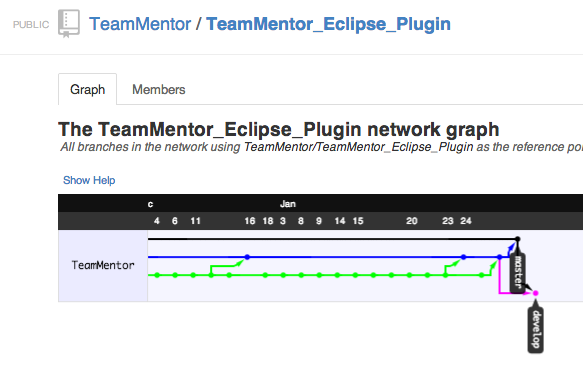
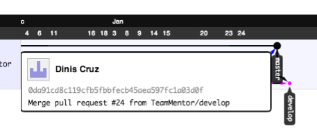
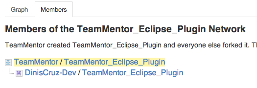
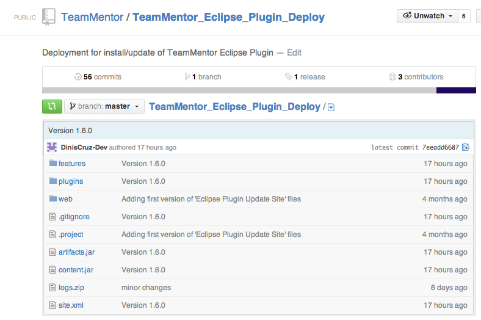
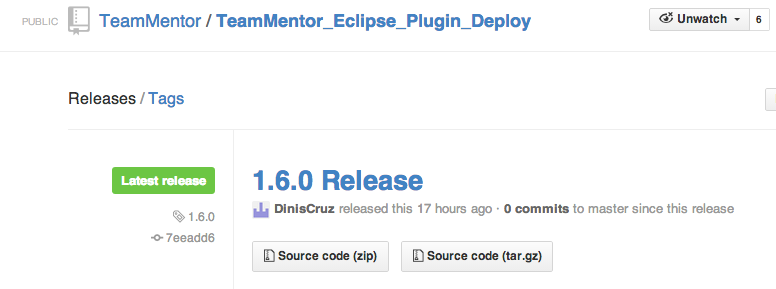

## Updating the GitHub repos for the 1.6.0 release of the Eclipse Fortify Plugin

As you can see by the [recent eclipse related posts](http://blog.diniscruz.com/search?q=+eclipse), I have been working on a Plugin for Eclipse that shows [TeamMentor](https://teammentor.net/) guidance to users that have access to the Fortify Eclipse plugin (and \*.fpr files). We are now in the final stages of releasing the first public version (1.6.0) which is actually made of two parts: An [Eclipse Plugin builder](http://blog.diniscruz.com/2013/11/si-open-sources-eclipse-plugin.html) (which is Open Source) and a small 'Fortify Specific' code-mapping script. Very soon these will be in separate projects, but for now they are all hosted at the [TeamMentor/TeamMentor_Eclipse_Plugin](https://github.com/TeamMentor/TeamMentor_Eclipse_Plugin).

This post is just to document the current GitHub development model and where to find the main parts of this release.

As mentioned above, the master version of the code is at [TeamMentor/TeamMentor_Eclipse_Plugin](https://github.com/TeamMentor/TeamMentor_Eclipse_Plugin) which currently looks like this:

One interesting point here is that for this release I did not use my main GitHub **_DinisCruz_** account, but used instead a much less powerful GitHub **_DinisCruz-Dev_** account.

To see this in action, note how the Pull Request commits (into the master and develop branch) are made using the **_DinisCruz_** account:  

...  and the development commits are made using the **_DinisCruz-Dev_** account:  

What I did was to fork into the **_DinisCruz-Dev_** account, the [TeamMentor/TeamMentor_Eclipse_Plugin](https://github.com/TeamMentor/TeamMentor_Eclipse_Plugin) repo:

... which was then used during development (which in practice means that the**_ DinisCruz-Dev_** account does NOT have commit privileges to the release version of the code base)

In terms of the 1.6.0 release, I also added a Git Tag to it (now possible to do via the GitHub web UI), so that this version can be easily accessed and downloaded from the [repo's Releases page](https://www.blogger.com/the%20https://github.com/TeamMentor/TeamMentor_Eclipse_Plugin/releases):

In order to help installation and deployment of this plugin in Eclipse, there is also this Eclipse Update site repo [TeamMentor/TeamMentor_Eclipse_Plugin_Deploy](https://github.com/TeamMentor/TeamMentor_Eclipse_Plugin_Deploy)

... which also contains the v.1.6.0 release tag:

... and can be used inside eclipse using a local clone of this repo, or via this temp update site

[https://eclipse-plugin-builder.scm.azurewebsites.net](https://eclipse-plugin-builder.scm.azurewebsites.net/) (see more detailed installation instructions at:[ TeamMentor Plugin and Builder v1.5.6 (Source Code and Eclipse Update site)](http://blog.diniscruz.com/2013/11/teammentor-plugin-and-builder-v156.html) ).

Now that this release is out of the way, I will try to write a number of blog posts that show how it works and how powerful the Eclipse Plugin Builder is (for example to add support for more tools or easily create eclipse plugins to help developers to write better/securer code)
