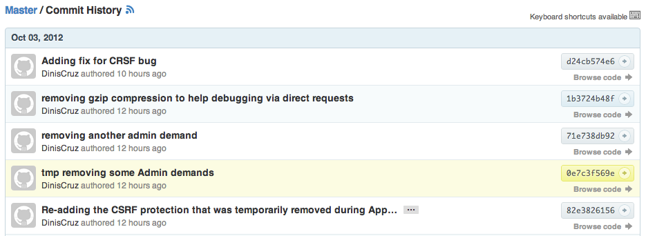
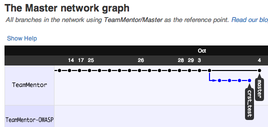

##  Using a Git Branch to fix a Bug

On Git I don't tend to use branches for big code changes, and the only time I tend to use them (on development) is when trying new code changes or fixes.

For example I was working last night on a CRSF fix for TeamMentor (more on that later) and I created a new branch using ($ **git checkout -b crst_test**) which contained a number of temp commits, like the ones that selectively disabled some Admin security demands so that I could debug the issue better :) :

As you can see by the Commits, I did a number of changes that where only pushed to the crst_test branch (**$ git push origin crst_test:crst_test**) and not be propagated to the main code base.

Then then once I finally found the issue and fixed (see last commit), I went back to the the main branch (**$ git checkout master**) added my fixes, commit them and pushed them to the master branch (**$ git push origin master**).

At the moment this is what the main repo looks like:

The final step is to remove the local branch (**$ git branch -D crst_test**) and the branch from GitHub ($ **$ git push tm_master --delete crst_test**), which after GitHub recreates the graph ([sometimes it takes a couple minutes](http://stackoverflow.com/questions/12729317/force-github-network-graph-refresh)), it looks like this:

