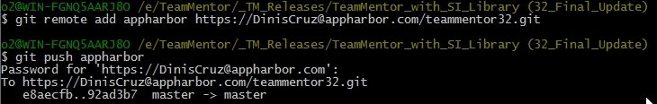

## Creating the final TeamMentor with SI Library repository via multiple Git pulls and pushes

This is going to be a long one, so if you are interested in seeing Git and GitHub in action in a real-world application, grab a coffee/tee/beer and read on :)

This is the scenario at the start:  

  * We need to create the final TeamMentor 3.2.3 package for release
  * The **_TeamMentor_SI_Library_** repository is at version 3.2
  * The **_TeamMentor/Master_** repository is at version 3.2.3
  * The **_Library_SI_** has a couple content changes since the last pull
  * We need to do a pull of both **_TeamMentor/Master_** and Library_SI into **_TeamMentor_SI_Library_** and push the final result to GitHub

For background information on the current TeamMentor git architecture, take a look at:  

* [Git and GitHub commands to create and deploy new version of TeamMentor](http://diniscruz.blogspot.co.uk/2012/10/git-and-github-commands-to-create-and.html) (this explains the subtree merge strategy, which is the reason why the multiple **git pull **used below actually work)
* [New GitHub structure for the multiple TeamMentor development and deployment scenarios](http://diniscruz.blogspot.co.uk/2012/10/new-github-structure-for-multiple.html)  
* [The need to create forks/clones for TeamMentor.net website](http://diniscruz.blogspot.co.uk/2012/10/the-need-to-create-forksclones-for.html)

It all starts with a pull request from Roman the last content changes to be added to **_Library_SI_**  

Which I opened

Quickly reviewed the changes

And _Confirmed Merge_  

This will close the Pull Request

With changes now part of the main **_Library_SI_** repository

For reference here is the network graph of **_Library_SI_**  

Next we move into the TeamMentor_SI_Library:

Opening the local copy of the _TeamMentor_SI_Library_ , as the log list shows (below) we are 1 commit behind the version at GitHub:  

Let's create a new branch to do the updates (just in case)

And confirm that we are also not in sync with the **_TeamMentor/Master_** repository

Here are the current remotes (in **_TeamMentor_SI_Library_**):

Here is gitk visualization of the **TeamMentor_SI_Library** commits  

Here is GitHub visualization of the **TeamMentor_SI_Library** commits  

We're now ready to do the pulls (fetch+merge), and let's start with the **_TeamMentor_SI_Library_** (origin remote)

Next lets do the **_TeamMentor/Master_** (tm_master remote)

A quick look at git shows how these multiple commits are being nicely merged together

Finally lets do a git pull on the **_Library_SI _**(tm_library remote)

With gitk now looking like this, which is a pretty cool graph:

A look at the file system, shows that it looks as expected

So let's quickly start cassini to take a look (via the 'start TeamMentor.bat')

Hummm... on load there was a problem with the right-hand side panel

The error was this one (which is the first time I saw it)

Luckily a quick google search, revealed these articles:

* [http://stackoverflow.com/questions/2782329/specified-argument-was-out-of-the-range-of-valid-values-parameter-name-utcdate](http://stackoverflow.com/questions/2782329/specified-argument-was-out-of-the-range-of-valid-values-parameter-name-utcdate)
* [http://weblogs.asp.net/hajan/archive/2011/10/30/time-travel-issue-specified-argument-was-out-of-the-range-of-valid-values-parameter-name-utcdate.aspx](http://weblogs.asp.net/hajan/archive/2011/10/30/time-travel-issue-specified-argument-was-out-of-the-range-of-valid-values-parameter-name-utcdate.aspx) (screenshot below)

Which pointed me to the fact that I hit a weird 'time bug' that happens when the clock moves due to Daylight Saving Time.

Next step is to try the AppHarbor (Cloud) deployment, so I went to AppHarbor and copied the target Application _**Repository URL**_

Which I added as a remote, and used to push the content

This built ok, but when I deployed it, I noticed that the site was still on version 3.2 (instead of the new 3.2.3)

Back in git, I realize that I had pushed the wrong branch, and bellow I'm pushing the 32_Final_Update branch into the AppHarbor master branch (which is automatically built)

With the correct version ready, I deployed it:

And here she is in action:

The reason why there is no content is because AppHarbor will only copy to the live servers the files it can find using the VisualStudio solution, which means that the Library files where not there.

To make the test realistic, I zipped the TM_Libraries folder

And used TeamMentor's Control Panel to upload the file:

And install it:  

After that, the home page looks like it should:

Testing the need to login to see the Article's content:  

Next step is to push into the **_TMClients/TeamMentor_SI_Library_** repository this latest version  

But not before we update the local **_master_** branch with the _**32_Final_Update**_ branch

Next we replace the origin remote mapping with  _TMClients/TeamMentor_SI_Library_ and push into it:

After all these steps is good to take a look at the GitHub's network graph and confirm that all looks as expected:

As a final confirmation, let's download the zip file from the  _TMClients/TeamMentor_SI_Library_ and make sure it is all good (this is the file given to customers via a password protected zip file)

Once the file downloads, unzip it to a temp folder:

And use 'start TeamMentor.bat' to run it locally:

**Final comment:**  

If you actually look at the workflow we have here, this is pretty powerful stuff!

We were able to have two complete separate activities (development and code changes) done in completely different timings, to be combined into a single package (preserving all history), that can then be delivered to customers (who don't care about the multiple repositories).

In a way it is just like doing copy and paste of the two source repositories into a 'release folder', but in a way that we have the full (independent) git history (check out the graphs to see how the git commits from two separate repositories are correctly preserved) and can be easily updated/synced (it took me a LOT more time to write this post than to do the actually pushes and pulls :)  )

What I also like about this workflow is that it works :). We are now doing the 2nd release using it, and it is surviving the real-world acid-test.

But aren't there a lot of 'manual' steps that be automated? Yes, yes there are!

But I'm a big fan of:  
 - first figure out the solution for the problem (in a "let's make it work" kinda way)  
 - then automate as much as possible the workflow that 'works'

It's a mistake to automate too soon, specially when the understanding of 'the problem' and all its moving parts is still not very high.

**UPDATE:** I just did the same process for the [https://github.com/TeamMentor-OWASP/Master](https://github.com/TeamMentor-OWASP/Master) version (the TeamMentor Eval), and it took less than 5m to do it :)

Remotes (of my local clone)

    origin  git@github.com:TeamMentor-OWASP/Master.git (fetch)  
    origin  git@github.com:TeamMentor-OWASP/Master.git (push)  
    tm_library      git://github.com/TeamMentor-OWASP/Library_OWASP.git (fetch)  
    tm_library      git://github.com/TeamMentor-OWASP/Library_OWASP.git (push)  
    tm_master       https://github.com/TeamMentor/Master (fetch)  
    tm_master       https://github.com/TeamMentor/Master (push)  

Commands executed:  

    $ git checkout -b 32_Final_Update  
    $ git pull origin master  
    $ git pull tm_library master  
    $ git pull tm_master master  

(there was a small conflict on the About.html page which is different on the eval version)  

    $ git checkout master  
    $ git merge 32_Final_Update  
    $ git push origin  

Network Graph:

