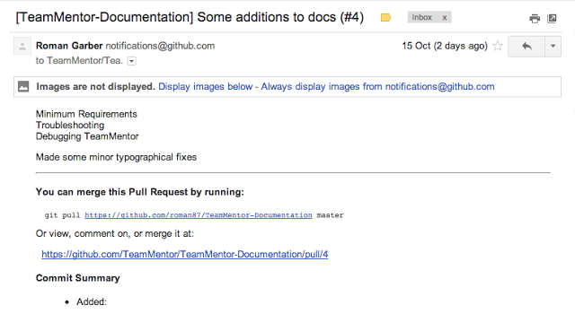
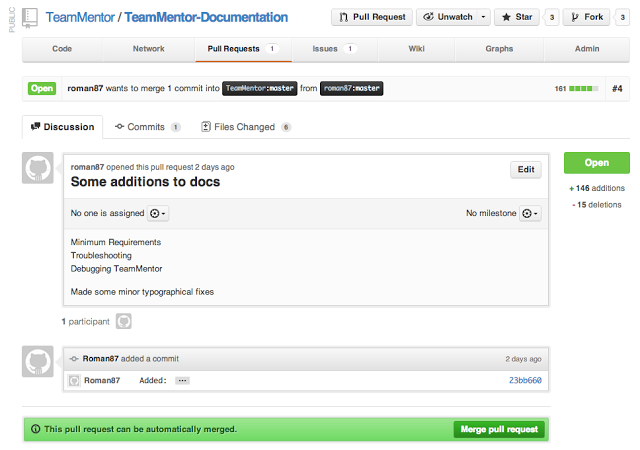
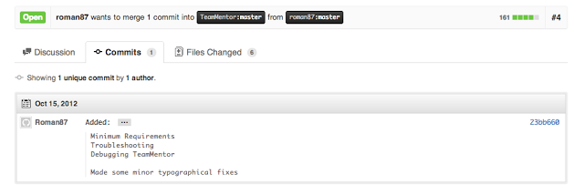
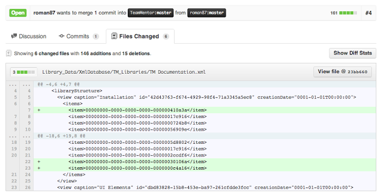
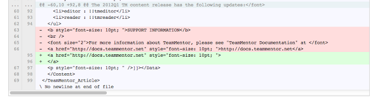
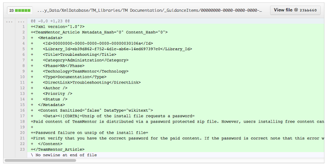
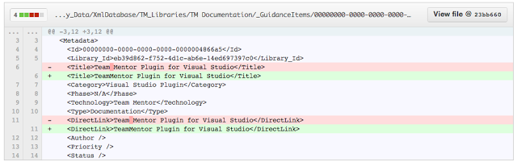
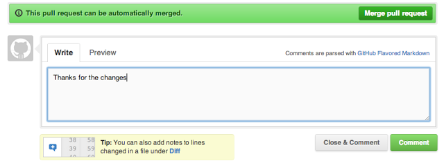
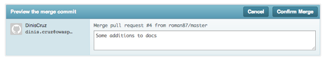
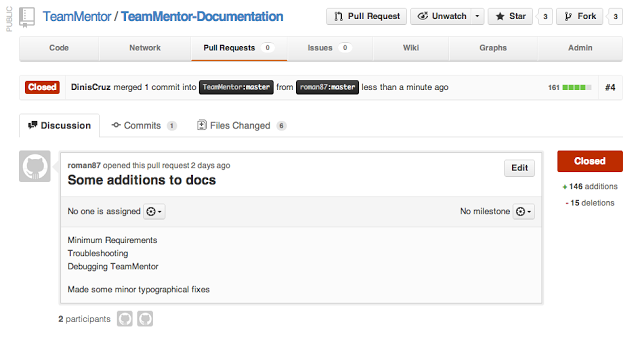

## Approving a GitHub Pull Request Workflow

I just received a GitHub's **_Pull Request_** from Roman for some new content that he added to TeamMentor's Documentation Site.

Here is the workflow I used to approve this request using GitHub's web-based workflow:

**1) Receive GitHub email alert:**  

**2) Go to GitHub and see the Pull Request there:**

The main page ([https://github.com/TeamMentor/TeamMentor-Documentation/pull/4](https://github.com/TeamMentor/TeamMentor-Documentation/pull/4)) gives us a nice overview of the Pull Request:  

Here are the Commits:

On the **_Files Changed_** tab we can easily see (in colours) the proposed changes.

For example, here is a change to the main TM Library xml file with a couple new articles added:  

Here are a couple lines removed and some added:

This is a new file:

These are a couple metadata changes:

**3) Approving the Pull request**  

Going back to the first page (the **_Discussion_** tab) the most important part of this whole process is the green bar that shows that this Pull Request can be merged ok

This basically means that there are no conflicts between the new changes and the current content. When this is not possible (and you get a red bar), the best thing is to do this 'manually' (i.e. via a git bash on your local box)

When you click on the 'Merge Pull Request' button you get this confirmation request:

And clicking on 'Confirm Merge' will do the commit and close this Pull Request:

