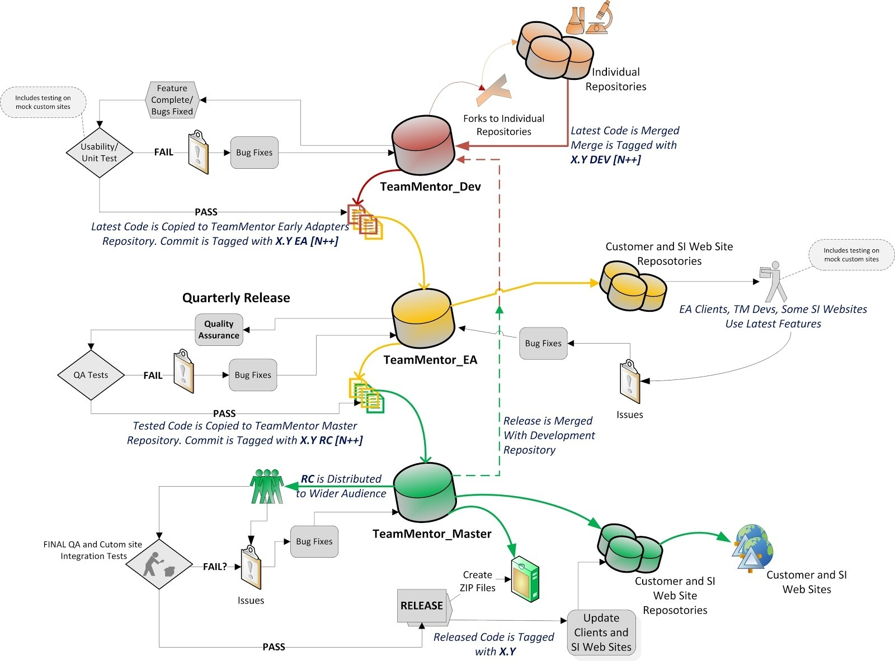

## Pretty cool visualization of the 'GitHub based' TeamMentor Development+QA+Release workflow

Roman created this nice Visio diagram with out current 'GitHub based' workflow for [TeamMentor](http://teammentor.net/):

Although this is still a draft, it is already a good representation of how we are using Git's powerful forking/cloning capabilities to implement solid Development + QA + Release workflows.

Roman is also creating simpler versions of this diagram, for:

* the cases where we push a patch on a released version (for example targeted bugs or security fixes)
* the workflow used to manage the multiple TeamMentor's Content repositories

Let me know if you have any ideas or suggestions on how to make this even better :)

One area we still need to do some work (and help), is the automation of some of these steps/workflow. We have figured out the git commands, and now we need to automate their execution.
