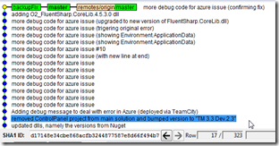
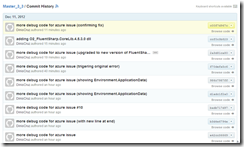
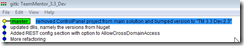
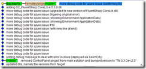
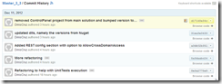
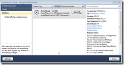
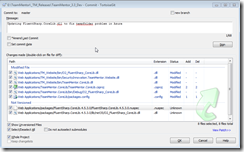
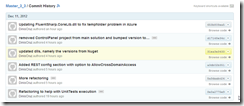

## Rewriting Git History (locally and at GitHub)

When fixing the [ASP.NET WCF REST help page 'Memory gates checking' error at AppHarbor](http://blog.diniscruz.com/2012/12/problem-with-environmentspecialfolderap.html),

I ended up with a number of Git Commits: locally

and at GitHub

Once we found the solution (and pushed a new version of FluentSharp.CoreLib.dll to Nuget), it was time to clean up the history (since those commits don't really need to be in the [main TM master](https://github.com/TeamMentor/Master_3_3)). Yes I could had used a branch, but since this was part of the TeamCity deployment tests, It was useful to do it on the master branch (and see how fast TeamCity can be :)  )

So what we want to do, is to **something that is not very common in Git: rewrite Git's history** (i.e. remove pushed commits). In practice this means that we want to 'go back' to the commit marked in blue (gitk image above) ,and remove the extra commits from the main Git History:

Just in case something goes wrong, lets let's backup the current changes as a local branch :)

Once that is done, we do a 'forced git reset':

This does the trick, and now the (local) history looks good:

and

Next,  to remove these commits from GitHub ...

....we do a **_git push --force _**

   

And GitHub's version has been moved back:

Finally we update ( on the TeamMentor VS Projects) the FluentSharp.CoreLib.dll via NuGet:

and commit it:

Creating the desired Git Commit History:

