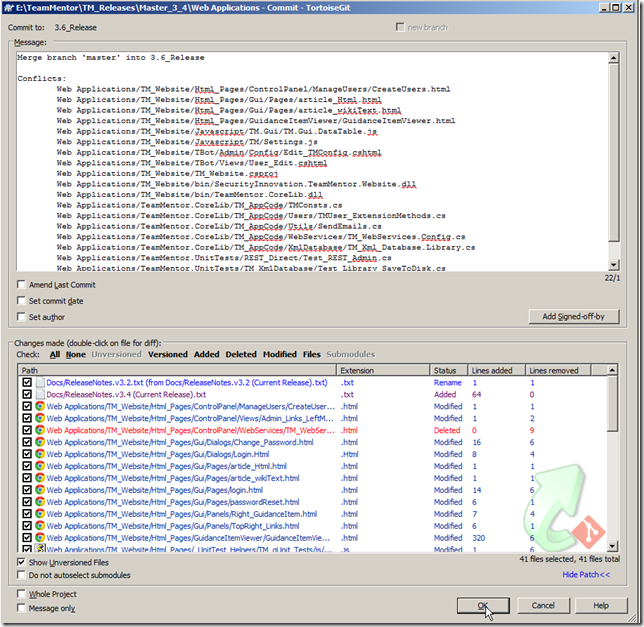
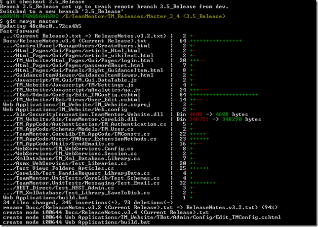

## Dangerous bug between Git, GitHub and Windows (duplicate directories with different capitalization)

After doing [this rename](https://github.com/michaelhidalgo/Dev/commit/2bb8505ef95969fac0a9057baf963b8c4f8e6708), here is what GitHub looks like:  

Note the two Web Applications folders!!!

I have hit this issue in the past, and I think it is something to do with Windows capitalization inconsistencies (as seen on the windows search), Git and GitHub

Note how my local folder looks good.

Even weirder is the fact that the commit message looks good (note the renames):

Let's try to do a git clone to see if what happens locally:

Humm, the clone looks good, so I wonder if this will self correct after the next commits:

Question: **Any ideas on how to fix this?**

My only thought at the moment is to:  
a) delete that folder (from Git)  
b) commit and push the delete  
c) add that folder   
d) commit and push
