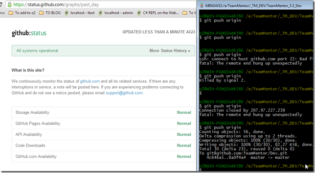
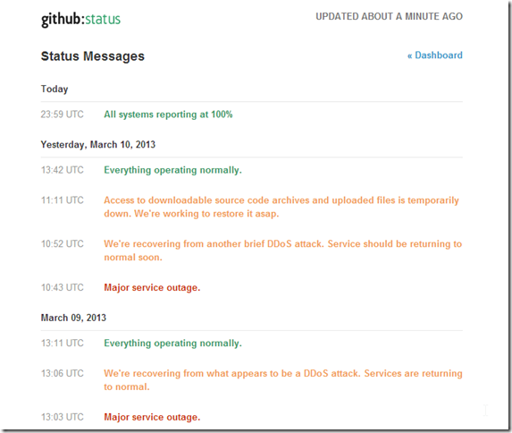

## Another GitHub 'Normal' status that doesn't allow me to Push

It took me 5 attempts over about 10m (from 7:40pm on 11th Mar 2013) to get a commit pushed into GitHub's servers:  

It looks like GitHub is having DDos probs, which is another reason why they need to improve they visibility into what is going on:

