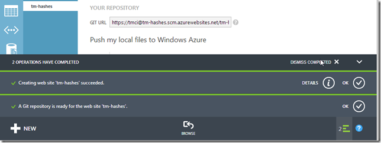

## Creating a new TeamMentor test site using TeamCity, GitHub and Azure

Serge just asked me to create a new TeamMentor (TM) website for him using a particular TM library, so here are the steps I took (note: some of this will be automated in the next TM release)  

**In Azure ....**  

It all started by going into Azure and creating a new website:

In this case called tm-hashes

in a couple secs it was available

next I set-up git publishing:

using  'Local Git' since that works well with TeamCity and doesn't require that Azure is given pull privileges into the target repo:

Azure worked for a bit, and after a couple secs I had:

**In TeamCity ...**

Next, in the TeamCity server, to make it easier on next deployments, I added this site to one of the builds that already pushes other sites into Azure:

Specifically I added another build-step similar to the ones already there for tm-vulnerabilities and tm-DennisGroves

The easiest way to do it, was to create a copy of one of the existing steps:

After editing the 'copied build step', called _Publish to Azure (tm-Hashes)_, I quickly reordered the build steps

from:

to:  

Next, I clicked on Run:

in order to trigger a TeamCity build:

That build will:

* do a git pull from the latest version of the TM code (currently at 3.3 RC3.01),
* build the VisualStudio main project,
* and push to Azure

Here are the build logs during the 'push to Azure' step:  

At this moment the Azure admin page for the tm-hashes site, will show a **_Deploying_** message

which becomes **_Active Deployment_** once it is completed:

 

One of the nice hacks the Azure team did with their git implementation is to provide good messages/info in the git data sent back on pushes (the lines in dark-orange below where created by Azure):

Once the push in complete, we can browse the Azure site:

And see an empty TeamMentor installation:

**In TM Control panel using GitHub zip file ...**  

The final step is to add the library that Serge wants (note: for this example I'm going to install the library via drag and drop of zip files.)

To get the library files, I went to its private Github repository, and clicked on the **_zip_** button

which downloaded the zip file into my current vm:

back in TeamMentor,

I logged in:

as admin

went to the control panel:

clicked on **_Advanced Admin Tools_** and **_Install/Upload Libraries_**

drag-n-dropped the local zip file into the **_Upload a file_** red box

Depending on the network speed, this can take a couple seconds or minutes:

Once the upload was completed,

I clicked on the 'Lib_Hashes-master.zip' link that appeared at the top:

waited a little bit:

and once I saw the success message:

I clicked on _**Open Main Page**_  

and the main TeamMentor GUI showed the imported libraries:

The final step was to remove the original temp library (created by TeamMentor on first install)

And finally, I sent Serge an email with the link to his brand new install of TeamMentor :)

