## Extracting content files from a Azure deployed version of TeamMentor (pre 3.3 git support)

I was asked by Serge to retrieve some changes he made to a test version of TM hosted in Azure.

This site was hosted at [https://tm-hashes.azurewebsites.net](https://tm-hashes.azurewebsites.net/) and since this was a version before the built-in Git Support (where git TM Libraries are natively supported by TM), the only way to get the files was to copy them from the live server.

So my first attempt was to use SFTP (which Azure supports) to connect directly to the web root.

To get the STFP address, I went into Azure's control panel for the tm-hashes site:

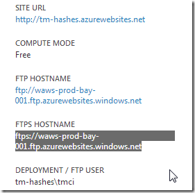
Copied the SFTP address and opened it in local windows explorer (which will require login into the **_tm-hashes\tmci_** account):

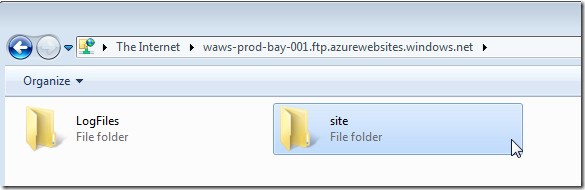

Navigated to the site's webroot (which are the deployed files)

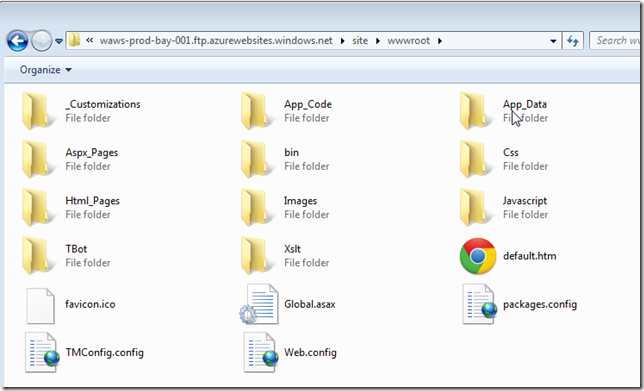

Then into TM's **_Library_Data_** folder, which is located inside the **_App_Data_** folder (because this is the main location where this site's IIS account has 'write privileges')

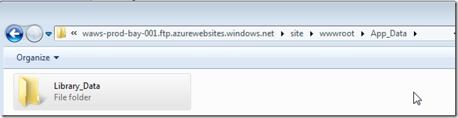

In there we can find the **_XmlDatabase\TM_Libraries_** folder which contains all libraries currently loaded in this server

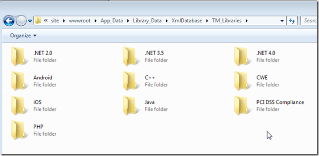

Back in my local VM, I have clone of the target git repository ([https://github.com/TMContent/Lib_Hashes](https://github.com/TMContent/Lib_Hashes)):

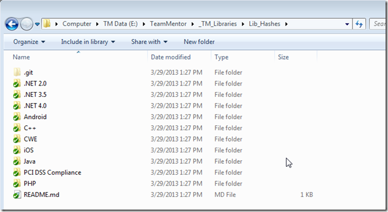

into which I'm going to copy the folders from the SFTP live site:

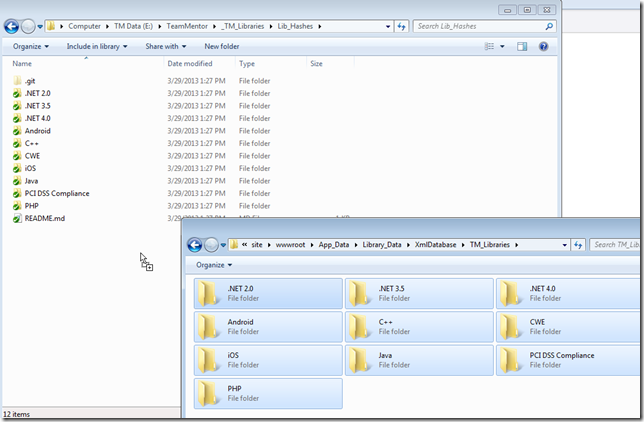

After some time of starting the drop ....

.... I confirm the overwrite

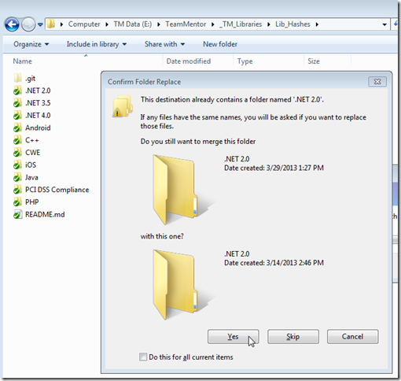

.... and it looks like it will take 1 hour

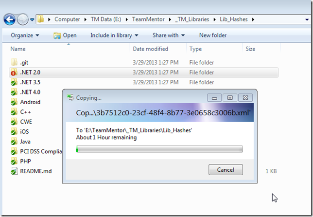

or maybe 6 hours :

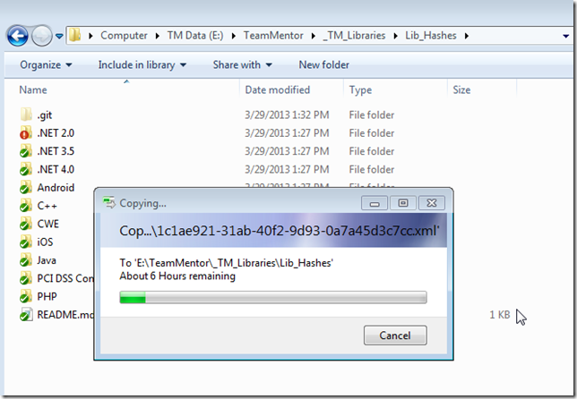

After 38m of copying it is now down to 3h

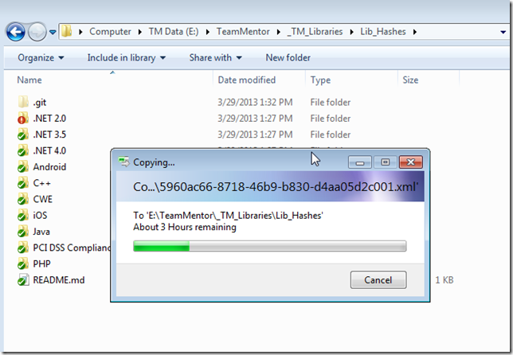

hummm..... damm  (after 1h and a bit of copying)

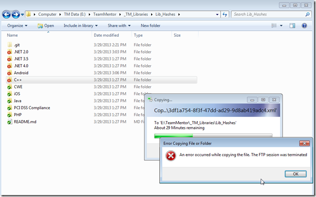

That kinda sucks

I think I need to try a different approach :)

**Time to open up the C# REPL included in TM:**

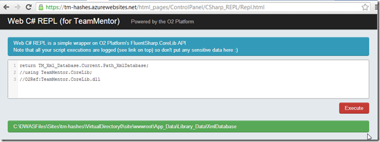

Get the path to the Xml Libraries folder:

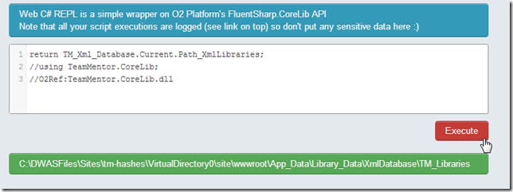

Confirm that the folders we want are in there:

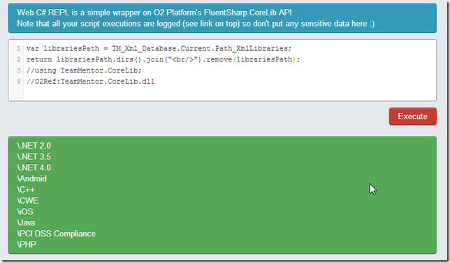

Lets first try to zip the forth library:

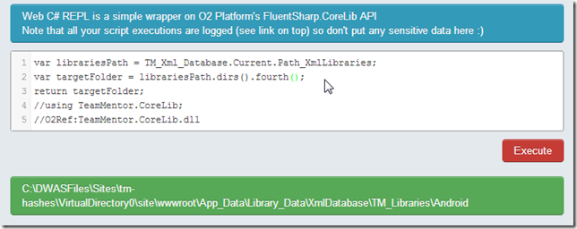

Which is the Android one:

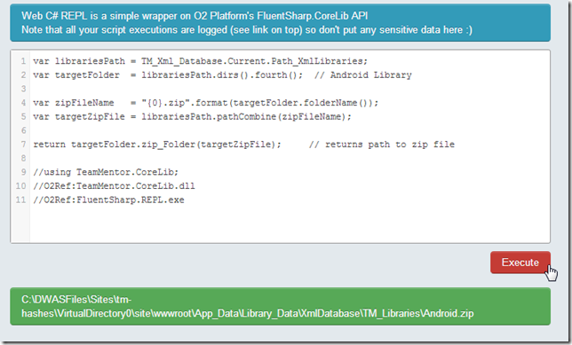

After the script shown above executes, a quick look at the ftp site shows the expected Android.zip in there:

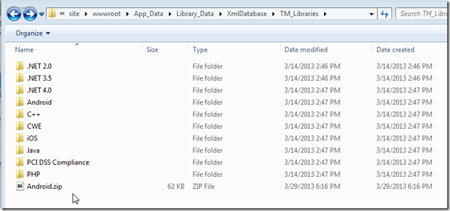

Which contains the files we want to get:

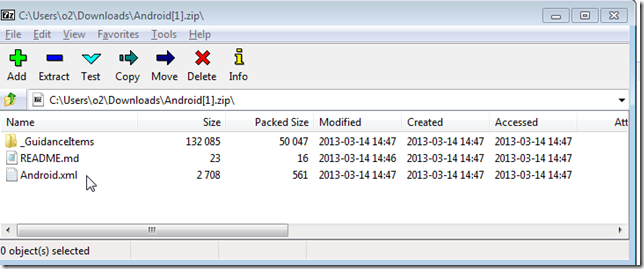

Next lets do the zip of the entire Libraries folder:

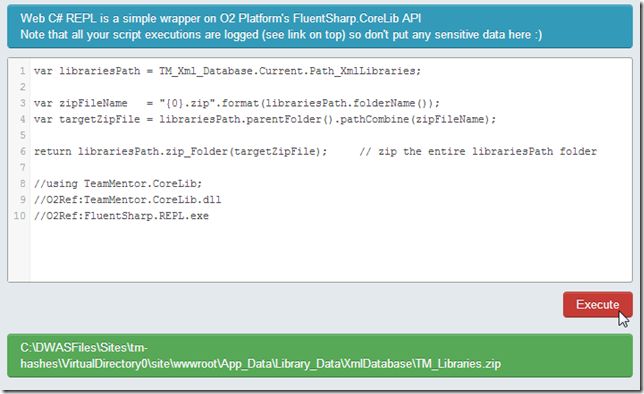

It takes about 1m to create the 11Mb file

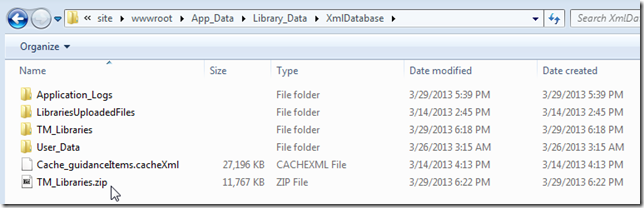

Which can now be copied locally

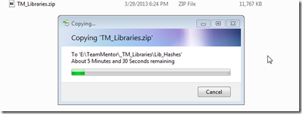

...note how this is much faster than the multiple hours wait we experienced above:

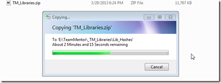

Once the zip file is downloaded:

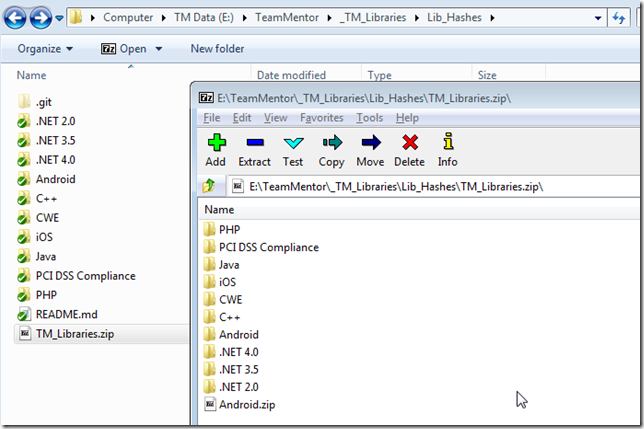

I unzipped the files into the Lib_Hashes folder:

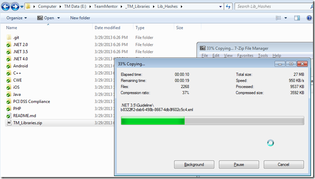

Choosing to overwrite the existing files:

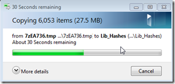

After the copy, Git will pick up the changed files:

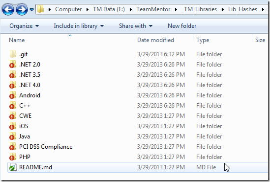

Which we can commit:

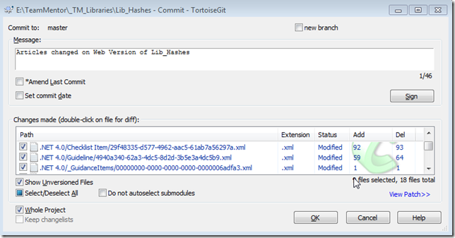

And push to GitHub:

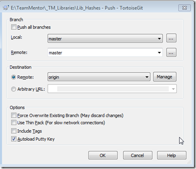
