## Git pulling a TeamMentor Library and renaming it

Here is an example of how to use the new TM 3.3 capabilities to load libraries from GitHub and to rename them.

Let's start with a version of TM that looks like this:

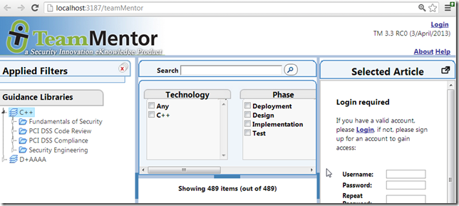

And let's say that we wanted to add the TM4TM Library to this server

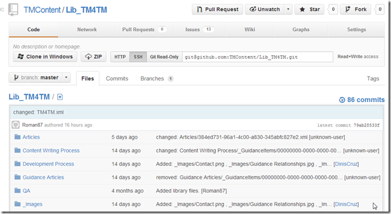

First thing to do is to copy the Git's **_Read-Only Url_**

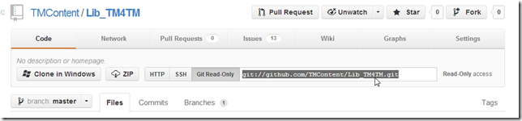

And add it to the TBot's Secret Data file:

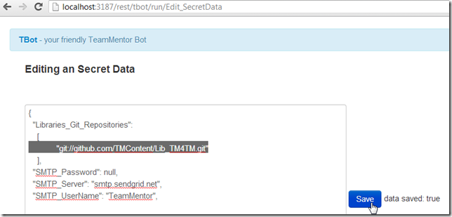

Before we reload the cache (which will do the git pull using NGit), lets see what the Library's folder looks like.

In this instance of TM, as we can see by the TMConfig.config file:

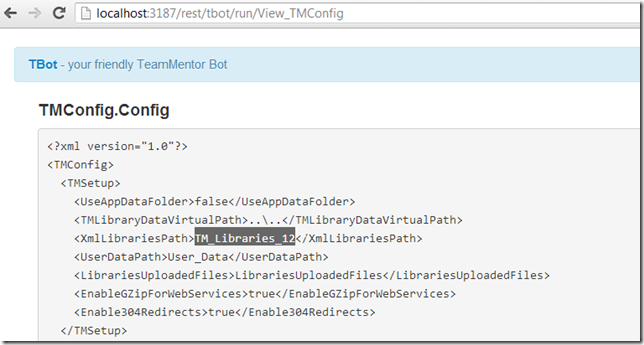

The Library files are located in the TM_Libraries_12 folder:

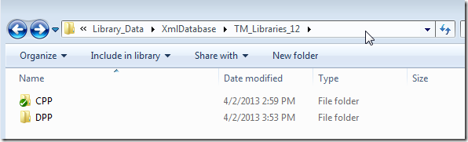

And if we now trigger the cache reload:

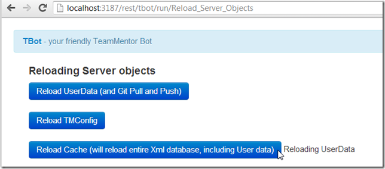

We will see that there is a new TM4TM folder:

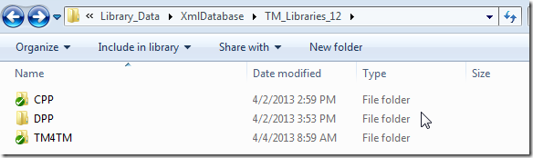

which is a git repository

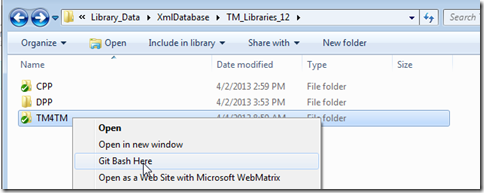

with its remote set to the Git;s **_Read-Only Url_**

After the cache reloads:

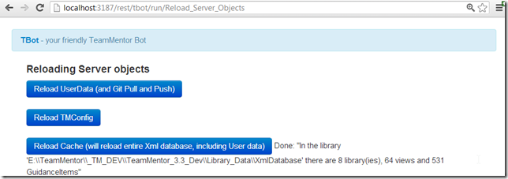

There are now 8 Libraries loaded in TM:

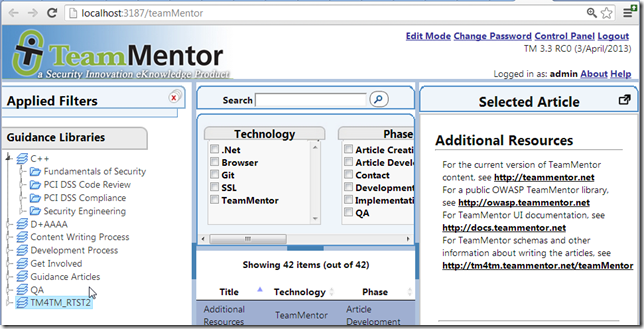

The reason for the extra 6 libraries (when we only added one new repository) is that from TM 3.3, there can be more than one library file in library folder (note: the recommendation is have one library xml file per folder)

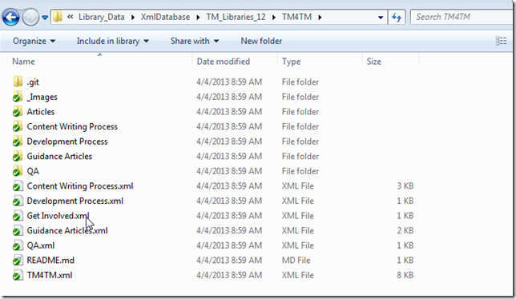

Also note that the library name/caption is now independent from the xml file name:

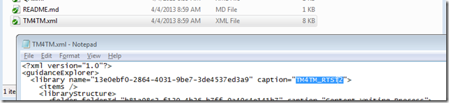

Let's now open TM's Edit mode

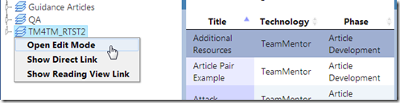

and use it to rename the *TM4TM_RTST2* Library:  

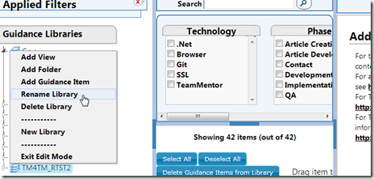

from:

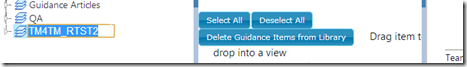

to:

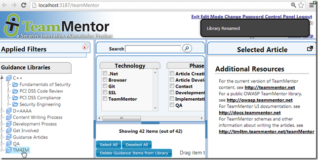

After the rename, a number of thinks happened.

**1) The TM4TM.xml library file contents changed:**

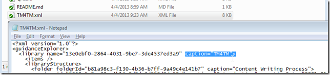

**2) There was a local commit with the change:**

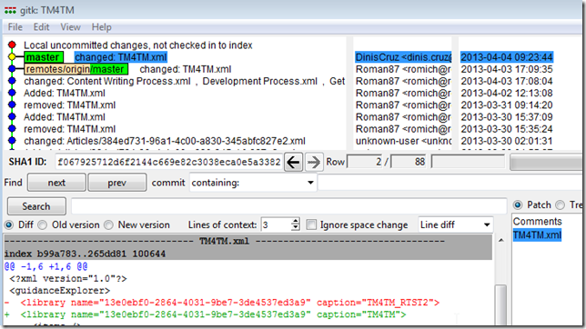

**3) the auto pull to GitHub failed**

This is confirmed by the commit list at GitHub:

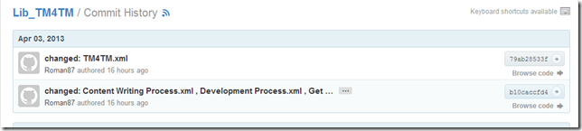

and the 'push error' we got on the TBot's **_DebugInfo_** page

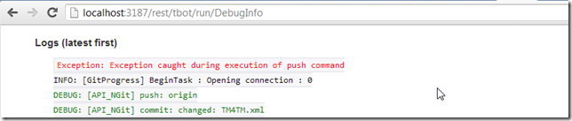

In this case I do want to push the changes, so back in GitHub I copied the **_SSH_** git url

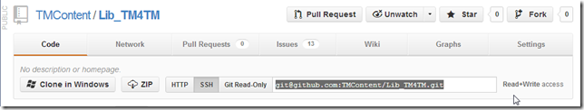

And use it directly on a git push (I could also had done this by setting up a new remote)

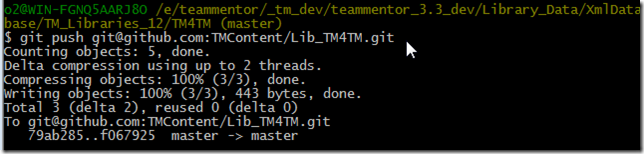

Now the commit created by TM (on library rename) exists in GitHub:

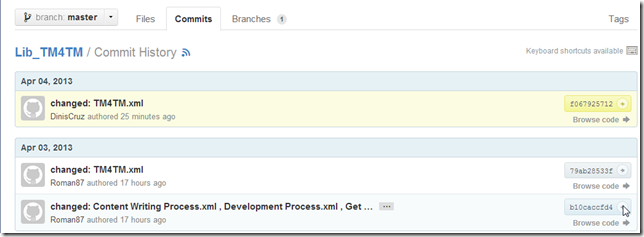

**Removing the extra Library files:**

Since we don't need the extra libraries xml files, I just removed them (and committed the changes)

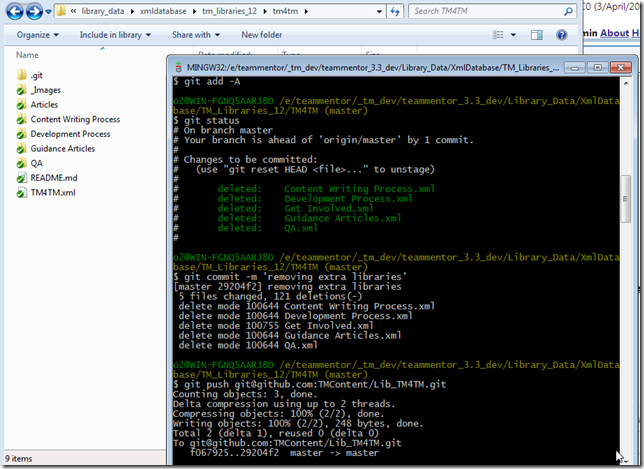

Which means that after cache reload,

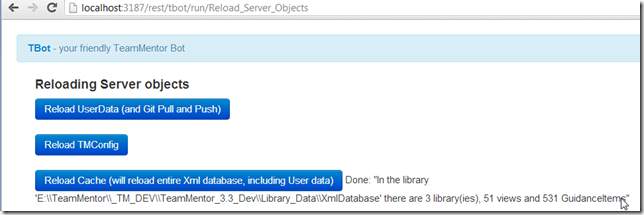

there are now 3 libraries in my local TM instance:

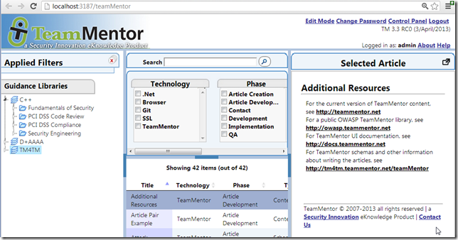
