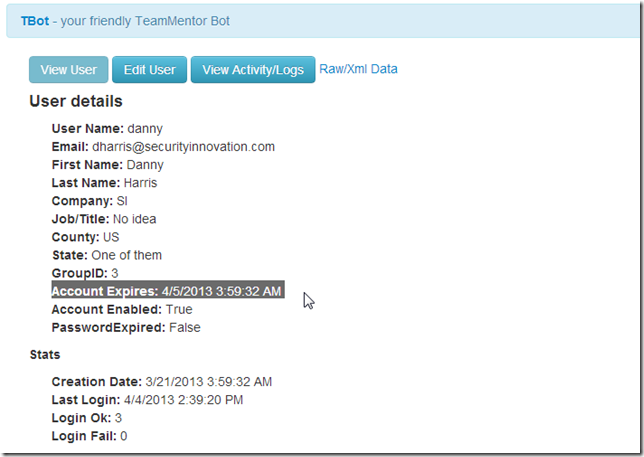
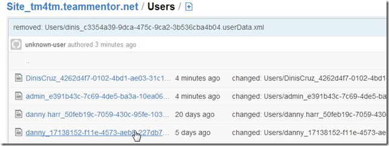
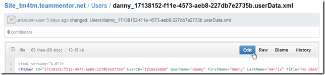
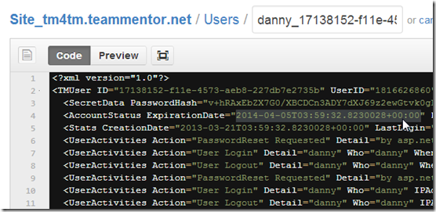
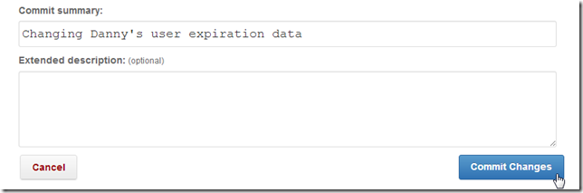
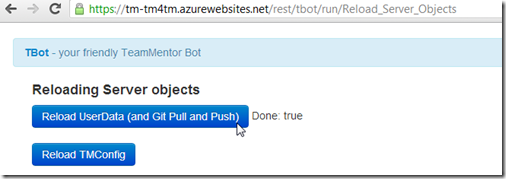
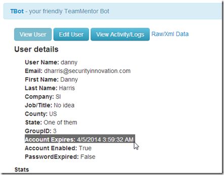

## Changing a User's ExpiryDate from GitHub hosted file

For the cases where TeamMentor UserData is loaded from a GitHub repository, it is possible to change/manage user data directly from GitHub's web GUI (or from a local clone of that repository).

Lets take for example Danny's account, which is expired at the moment (today is 4/10/2013):

In GitHub, this is the file that contains Danny's user data:

So we open and edit that file:

Change the **_ExpirationDate_** to a value in 2014

Commit the changes:

Reload the UserData:

And the Danny account details at the server is now set to the new date:

This is one of the nice side effects of having the ability to push TM's user data into a Git repository (another advantage is that we now have fully backed-up, logged and hashed user's change-history)
