## Setting up Ian's CI Development Environment (for TeamMentor)

Now that Ian (and Kofi) have pushed a couple commits (to [his fork of TeamMentor](https://github.com/IanIan123/Dev)) its time to set-up Ian's CI dev environment, so that his commits can be automatically tested and viewed on a live instance of TeamMentor.

First think to do is to go to Azure and create a website to hold Ian's Fork

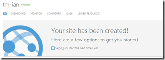

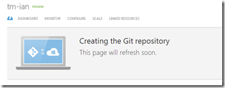

Which is going to be [http://tm-ian.azurewebsites.net/](http://tm-ian.azurewebsites.net/)

See the post [Creating a new TeamMentor test site using TeamCity, GitHub and Azure](http://www.blogger.com/blog.diniscruz.com/2013/03/creating-new-teammentor-test-site-using.html) for more details about how TeamCity is usually configured. The only major change for Ian's version, is that TeamCity is going to track the 'azure' branch (vs the master branch)

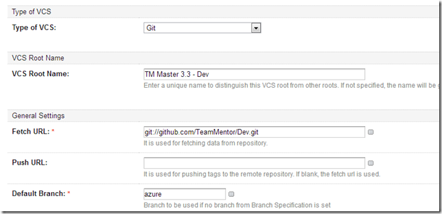

(See my next post for more details on how this azure branch was created)

Once TM is set-up and this TeamCity build is 'Run' , the Azure site goes from:

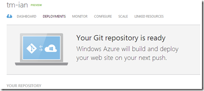

to:  

to:

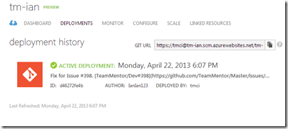

And when completed we will have a clean TM site based on Ian's repository (**_azure_** branch):

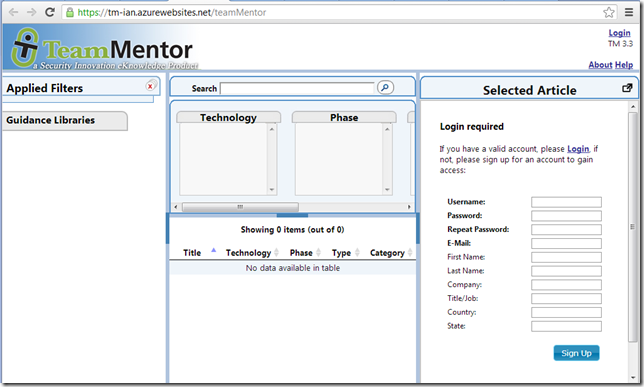

Finally, so that Ian has some data to play with, I logged in as admin and quickly added a couple libraries:

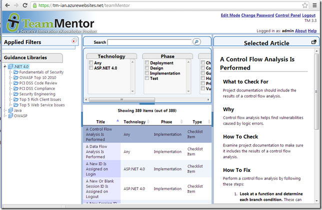

**Running NUnit tests in TeamCity:**  

I also configured TeamCity to run the NUnit UnitTests from Ian's solution.

And in this case there is 1 test that fails:

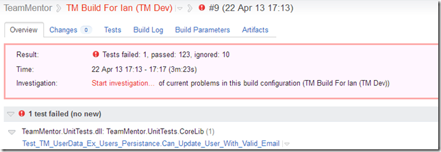

which is also failing locally (i.e. in VisualStudio):

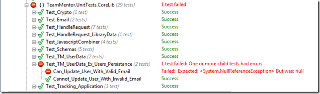

Which means that there is a side effect of one of Ian's code changes (which he will need to fix on his repo :) )

**Confirming Git to TeamCity to Azure**  

To double check that the workflow is working ok, let's make a file change:

In the TM Website Settings,js file:

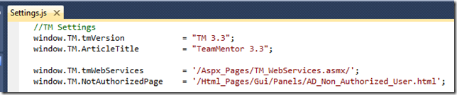

lets append Ian's name to the build version:

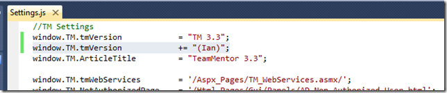

This change is picked up by Git:

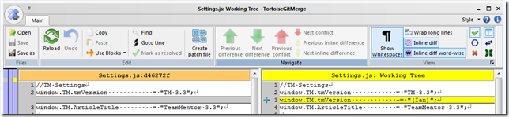

Where we can commit it locally (note the 'azure' branch)

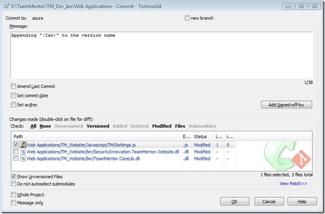

and Push it to GitHub:

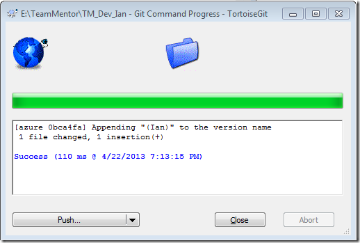

Making sure both local and remote branches are **_azure_**:

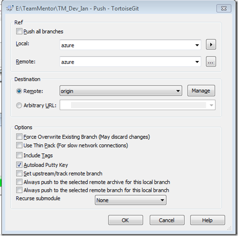

After the push is done:

TeamCity with trigger the build (TeamCity checks for new GitHub commits every 60sec):

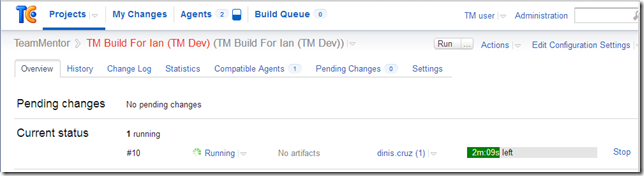

Azure will be pushed the new version (which is fast):

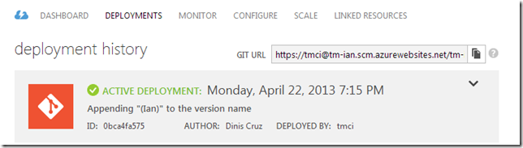

A refresh of the [https://tm-ian.azurewebsites.net](https://tm-ian.azurewebsites.net/) site confirms the change (notice the 'Ian' next to the version):

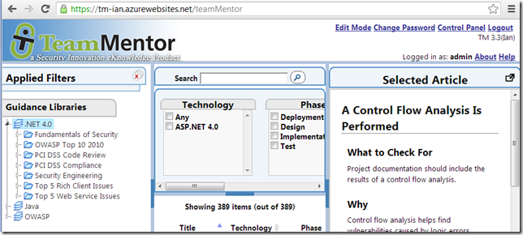

**Re-deploying a previous 'Azure deployed' version.**  

Note that it is also possible to go back a couple deployed versions in Azure. Just select the deployment and click on '**REDEPLOY'**  

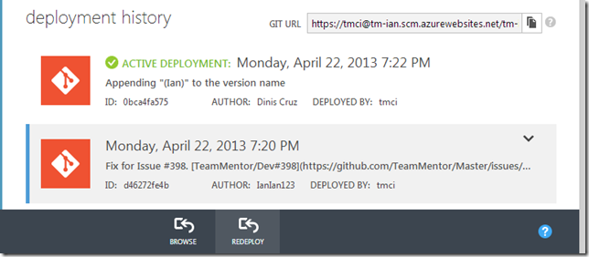

Which will change the active deployment:

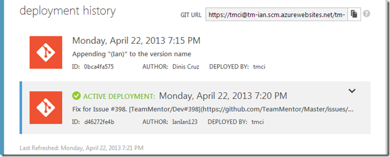
