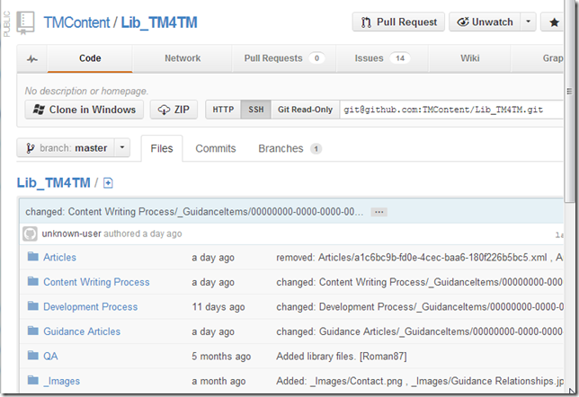
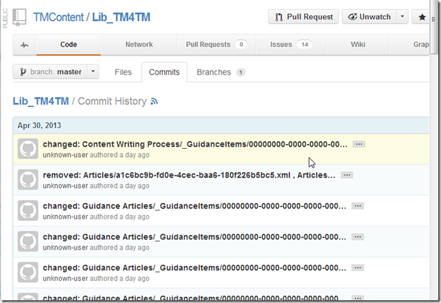
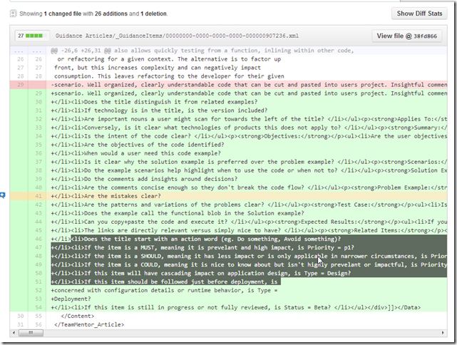
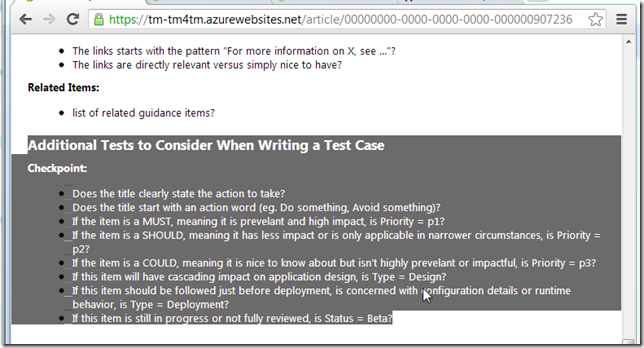
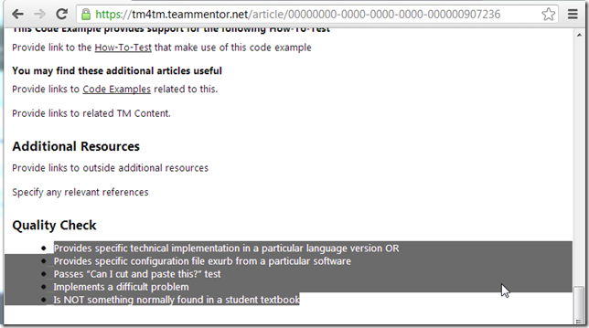
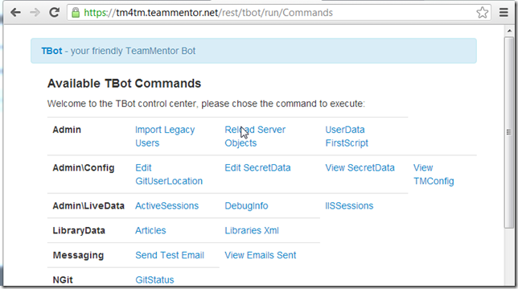
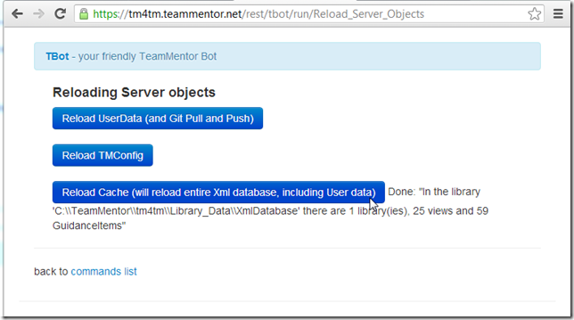
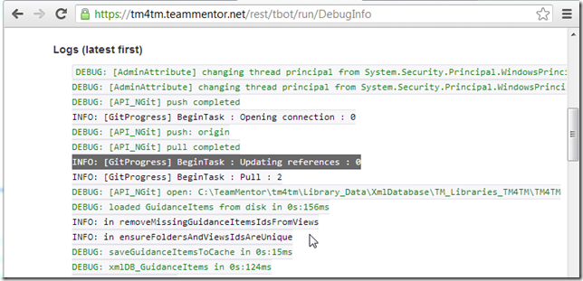
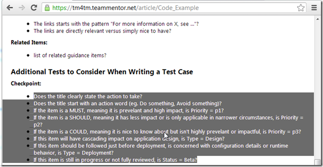

## Example of two TeamMentor sites using the same GitHub Content Library

Now that we [TeamMentor](https://teammentor.net/) 3.3. is able to automatically commit, pull and push from live GitHub repositories, we are able to support quite interesting set-up and workflows.

For example at the moment there are two live TM4TM sites:  

* [https://tm-tm4tm.azurewebsites.net](https://tm-tm4tm.azurewebsites.net/) (hosted as an Azure website, deployed from TeamCity)
* [https://tm4tm.teammentor.net](https://tm4tm.teammentor.net/) (hosted in an Azure VM, deployed by SI's MK directly on IIS)

Both are configured to consume data from the [https://github.com/TMContent/Lib_TM4TM](https://github.com/TMContent/Lib_TM4TM) repository:  

Yesterday, Serge was making some changes on the [https://tm-tm4tm.azurewebsites.net](https://tm-tm4tm.azurewebsites.net/)  server, which where automatically committed (locally) and pushed into the _Lib_TM4TM_ GitHub Repo:

For example, here is one of the articles that Serge changed: [https://tm-tm4tm.azurewebsites.net/article/Code_Example](https://tm-tm4tm.azurewebsites.net/article/Code_Example)

which looks like this on the [https://tm-tm4tm.azurewebsites.net/article/Code_Example](https://tm-tm4tm.azurewebsites.net/article/Code_Example) server

and like this on the [**https://tm4tm.teammentor.net**/article/Code_Example](https://tm4tm.teammentor.net/article/Code_Example) server

So at the moment the same page has different content on these servers.

There are two ways to fix this:  

1. make a change on the [https://tm4tm.teammentor.net](https://tm4tm.teammentor.net/) server (which will trigger a git pull and push), and do a cache reset
2. do a cache reset (which will also do a git pull)

Since a cache reset will be needed on both cases, that is our best option in this case.

So, I opened the TBot page for the tm4tm.teammentor.net server:

And triggered a cache reload:

A quick look at the server logs confirms that a git pull took place:

And the [https://tm4tm.teammentor.net/article/Code_Example](https://tm4tm.teammentor.net/article/Code_Example)  is now updated with the latest content:

Note that the current plan is to run TBot as a constant server thread, which will then be able to monitor the GitHub's content repository and automatically do git pulls (when needed).
