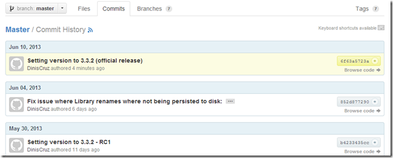
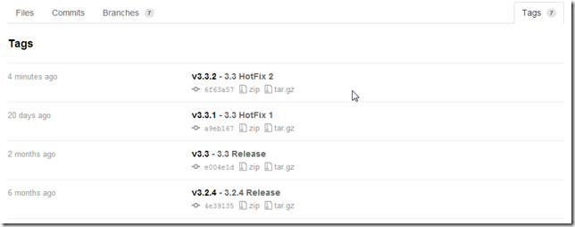

## Creating TeamMentor release 3.3.2 (3.2 version with HotFix 2)

Now that the two P0 issues are marked as fixed (after a round of QA):  

It's time to publish the 3.3.2 TeamMentor release.

At the moment the code changes are in the 3_3_2_HotFix branch

Which contains the commits that made up the **3.3.2 -- RC2** version (with the last commit being the **_852d877290_**)

As set in our release process, to make this the official official version, I will remove the **RC2** bit from the version number and make it the final commit for this release.

So I opened a Git Bash on a local copy of that repo TeamMentor/Master (same thing as doing a git clone and pull of the 3_3_2_HotFix branch)

A quick look using **git log --decorate --graph --oneline --date-order** shows that the latest commit is **852d877** (which matches the version at GitHub that was QAed and checked for this release)

My next steps was to change the version number,

... commit that small change:

... add the v3.3.2 tag (see [Adding Tags to TeamMentor Master repository](https://www.blogger.com/blog.diniscruz.com/2012/10/adding-tags-to-teammentor-master.html) for more details on tagging)

... and pushed into TeamMentor/Master the commit and tag:

Just to confirm, let's take a look at GitHub:

**Main page shows the 3.3.2 commit**

... so does the **commit page**:

... and the **Tags view**:

...and the **Network** graph:

The deployment of this version is now passed to the hands of the Infrastructure team, which will update all TM sites currently managed by SI.

On the development side, the last thing to do, is to add this version to the TeamMentor/Dev fork so that it is part of the next release

At the moment TeamMentor/Dev is on this commit

In a local copy of the this repo, I did a pull from TeamMentor/Master

... which failed (on master) because there has been updates done on this repo (since the last merge).

So I created a new branch called **_3_3_2_merge_**  

**Forced pulled** the 3.3.2 code into it (the code from TeamMentor/Master)

switch back into master branch and merged with **_3_3_2_merge_** branch

...which had (as expected) a couple conflicts), with I'm going to resolve using

... which lists the conflicts

... and in this case was mainly the version number:

... easily fixed by making the local version the one to use:

... next I resolved the dlls by selecting one of them (doesn't really mater since they will be recompiled soon)

... and committed the merge:

....which we can now see on Gitk:

The final step is to push these commits into TeamMentor/Dev

.... which can be seen on the following couple graphs:

The image above shows the TeamMentor/Dev commit done before the 3.3.2 merge, and below is the last commit made

It might be easier to read with out the labels (in blue is the **_TeamMentor/Dev_** code in black is the**_ TeamMentor/Master_** code:

