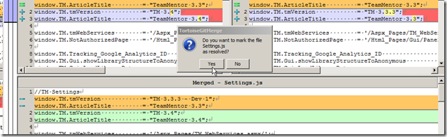
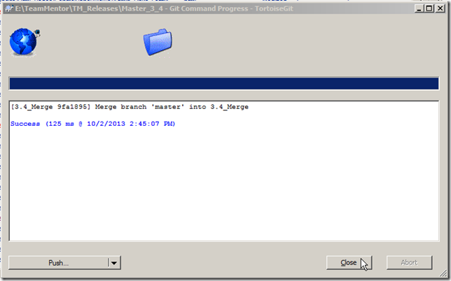
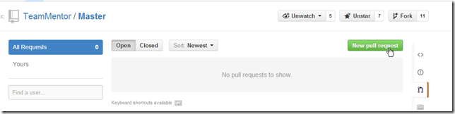
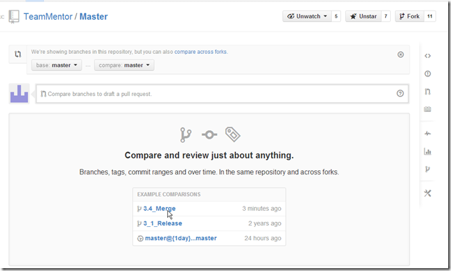
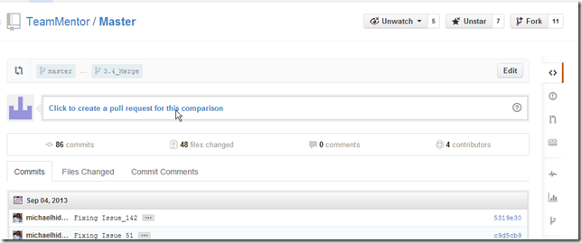
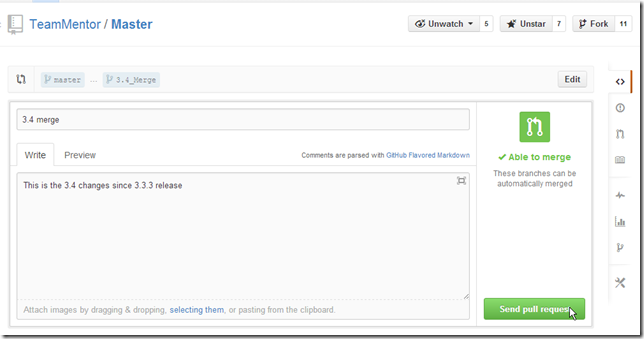
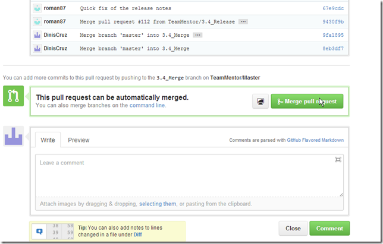

##  Fixing the Merge conflict caused by one extra commit on TeamMentor master 

On the 3.4 Release of [TeamMentor](https://teammentor.net/) (which was the first release we really used [Git Flow](http://nvie.com/posts/a-successful-git-branching-model/) on development (see this great presentation on [Git Branching Model](http://blog.diniscruz.com/2013/05/great-presentation-on-git-branching.html)) we ended up with a situation where the commit that was the parent of all feature/fix branches was off-by-one the master of the [TeamMentor/Master](https://github.com/TeamMentor/Master) repository (we also had to do a bunch of back-porting of fixes into that commit, see [Git Flow - Moving patches from one Commit into another Commit post](http://blog.diniscruz.com/2013/09/git-flow-moving-patches-from-one-commit.html))

In practice this means that the [TeamMentor/Master](https://github.com/TeamMentor/Master) graph currently looks like this:  
  

... with the master branch on the commit **fe26934d489e65660bd67be7811effcbccad1d19**  

 

.. .and the 3_3_3_Hotfix branch on commit **b97a470ffa173d67a9c74373593eea03eb7a2da4**  

But looking at the [TeamMentor/Dev](https://github.com/TeamMentor/Dev/) Graph

...we can see that all commits (done on 'one branch per issue' workflow) have the **b97a470ffa173d67a9c74373593eea03eb7a2da4** commit as its parent (see image above and below)

In practice this means that the final 3.4 release commit from the [TeamMentor/Dev](https://github.com/TeamMentor/Dev/) repo

... is incompatible with the [TeamMentor/Master](https://github.com/TeamMentor/Master) repo (note that these could be branches of the same repo, but I like the use of separate repositories, since they provide a nice air-gap between development and production repositories)

Actually in principle they could be merged automatically if there was no conflicts!

But if we look at that extra commit from [TeamMentor/Master](https://github.com/TeamMentor/Master) repo (the [fe26934d489e65660bd67be7811effcbccad1d19](https://github.com/TeamMentor/Master/commit/fe26934d489e65660bd67be7811effcbccad1d19) one)

... we see that the change was made on the version number (which in the 3.4 release will now say 3.4)

Note that GitHub will not allow a Pull Request to be made in cases like this, since GitHub has no online merge capabilities.

**Ok, so how do we solve this?**  

The solution is to:  

  1. create a local branch pointing to **b97a470ffa173d67a9c74373593eea03eb7a2da4**
  2. do a pull from [TeamMentor/Master](https://github.com/TeamMentor/Master) to get the [fe26934d489e65660bd67be7811effcbccad1d19](https://github.com/TeamMentor/Master/commit/fe26934d489e65660bd67be7811effcbccad1d19) commit
  3. merge the current 3.4 code into [fe26934d489e65660bd67be7811effcbccad1d19](https://github.com/TeamMentor/Master/commit/fe26934d489e65660bd67be7811effcbccad1d19) (which will cause a conflict)
  4. solve the conflict, 
  5. commit the result
  6. push to GitHub into a new branch (called 3.4_Merge)
  7. do a pull request (from 3.4_Merge into master)

  
In a local clone of [TeamMentor/Dev](https://github.com/TeamMentor/Dev/)   we start by to create a branch that is pointing to **b97a470ffa173d67a9c74373593eea03eb7a2da4**   

This can be done using the command: **$ git checkout **b97a470ffa173d67a9c74373593eea03eb7a2da4** **  

Followed by (as the help says) with: **$ git checkout -b 3.4_Merge**  

Next we do a pull from TeamMentor/Master using **$ git pull git@github.com:TeamMentor/Master.git master:3.4_Merge**  

The command above is basically saying:

_Go to the **git@github.com:TeamMentor/Master.git** repo and merge/add the commits from its **master** branch into the local **3.4_Merge** branch_

Note how the line **_b97a470..fe26934  master     -> 3.4_Merge _**(from screenshot above) shows how we went form the **b97a470ffa173d67a9c74373593eea03eb7a2da4** commit to the **fe26934d489e65660bd67be7811effcbccad1d19 **commit

Next we merge into the **_3.4_Merge_** branch, the contents of the **master** branch (which contains the 3.4 code) using: **$ git merge master**  

.... which predictably failed with a conflict on **_Settings.js_**  

**Solving git conflicts**  

My preferred UI to solve conflicts is the one provided by TortoiseGit, which you can access from here:

... them on the popup window that shows up, double click on the conflicted file:

... and on the TortoiseMerge GUI :

... chose the option to **_Use 'theirs' text block_**  

... which will update the bottom pane with the fixed version of Settings.js (in this case with no changes from before)

Save the changes and chose yes to mark the file as resolved:

Close the TortoiseMerge and (since there is no other conflicts) click OK on the Resolve GUI 

... another OK:

As the multiple 'notes' in the previous UIs mention, we need to commit the changes.

This commit will contain all changes including the conflict fixes

Once the commit is done:

Go back to the Git Bash and push this branch into TeamMentor/Master (I prefer to do these things on a Git Bash)

After the push, this is what the TeamMentor/Master graph looks like:

...with the 3.4 code now being there:

Finally, what we can do now is to issue a Pull Request:

... from the**_ 3.4_Merge_** branch:

... into the master branch:

... which contain all the code changes since the 3.3.3 release

With the best part being that this Pull Request can be merged using GitHub's UI (since there are no conflicts)

And that's it!

Hopefully this provided a good example of how to use Git and TortoiseGit to easily merge commits and resolve any resulting conflicts.

  
**Tip: How to delete branches in GitHub:**  

To delete a branch in Github, we do a push from an 'empty branch' into an 'existing branch'

In this case, if I wanted to delete the 3.4_Merge branch at the TeamMentor/Master repository, I would use: 

    $ git push git@github.com:TeamMentor/Master.git :3.4_Merge

- - - 
[Table of Contents](../Table_of_Contents.md)
