##  Git Flow - Moving patches from one Commit into another Commit

This (longish) post will cover detailed git workflows and is part of the series of blog posts that show how we use the Git Flow workflow to manage TeamMentor's source code (you will also see practical applications of GitHub's powerful  of powerful features like Network Graphs and Pull Requests).

The key problem that we are going to solve, is the situation created by [Michael Hidalgo](http://blog.michaelhidalgo.info/)'s TeamMentor fixes/commits/branches that were done against an commit (**38bfcd54d8046372c0ace2409324ecc965761504**)** **which was originally planed to be part of the next release, but we decided that the next **_3.4 Release_** of TeamMentor will be based on the current 3.3.3 version (with is based on the earlier commit: **_b97a470ffa173d67a9c74373593eea03eb7a2da4_**).

The key reason is that he  **38bfcd54d8046372c0ace2409324ecc965761504 commit**(currently the parent of Michael's fixes/branches) is not stable and is going now to be the basis of the **_3.5_Release_** (this code contains a number of big changes which need more TLD and testing: native ASP.NET MVC routing, better Git support, native Markdown editor, depreciation of HTML WYSIWYG editor, and more)

In a nutshell, we need to re-apply Michael's bug fixes to an earlier commit than the one used (i.e. backport those commits).

To start, here is what Michael's branches look like at the moment (note that all have the **38bfcd54d8046372c0ace2409324ecc965761504** commit as parent):

Here is the commit (**38bfcd54d8046372c0ace2409324ecc965761504)** that we want to have as the parent, since this is the commit that is currently on the 3.3.3. release (and will be the basis for the 3.4 release of TeamMentor):

Basically, what we need to do is to 'just' backport the branches linked to **38bfcd54d8046372c0ace2409324ecc965761504** commit,  into the  _b97a470ffa173d67a9c74373593eea03eb7a2da_ commit  
Note: since this post was getting quite long, I moved some workflows into Appendixes (included below) so that the key actions/changes can be read in sequence.

Using the workflow described in the **_Appendix 1) Creating patches from Michael's branches_** here are the patches to apply (i.e. these are all changes from the branches currently available in Michael's dev repository):

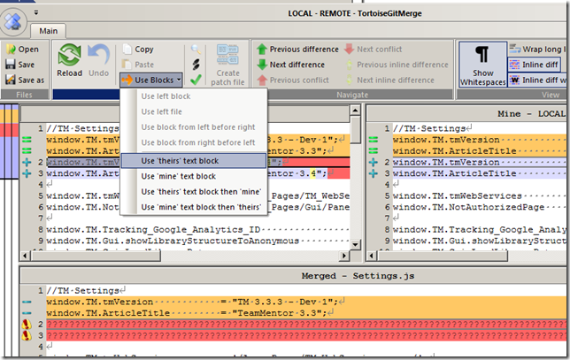

After:

* Fixing the master branch and creating a feature branch for the 3.5_Release (so that **_TeamMentor/Dev_** master branch is in sync with **TeamMentor/Master** master brach, and the 3.5 commits are not lost)
  * _... see __Appendix 2) Creating a 3.3.3 tag and branch in Dev repository_
  * _... see  Appendix 4) Creating a 3.5_Release Feature branch** )_

* Applying the 6 patches that merged without conflict
  * _... see Appendix 3) Applying patches_

...we get the following TeamMentor/Dev '_not merged branches'_:

After the pull requests are made into a new 3.4_Release branch (see **_Appendix 5) Creating a 3.4_Release Feature branch_** for more details) we have 5 Issues/branches applied (and ready for QA):

Here is the graph view, with **_TeamMentor/Dev_** master (blue line below):

.... now being the parent of the **_Issue_142, Issue_51, Issue_400, Issue_475_** and **_Issue_459_** branches:

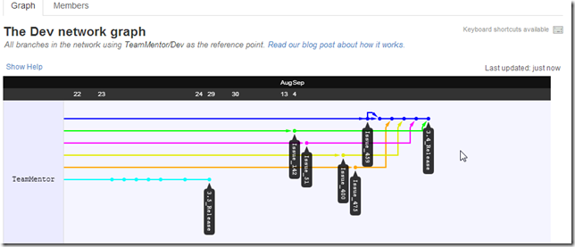

This concludes the (main part of) this post, which showed how to handle the scenario where  fixes (and branches) were applied to a commit whose release schedule was changed (and there was the need to back-port those changes into an earlier commit).

I think it is important to note that the workflow shown in here is a great proof of the power of Git (I can't even image doing this in SVN).

In fact, in this case, we are paying the price for not being more formal in the use of Git Flow workflows, and for not being more strategic on where we applied simple fixes (like the ones shown here).

I.e. this should be easier next time.

That said, it took me orders-of-magnitude more time to write this blog post, than to actually make these changes/fixes :)

**Appendix 1) Creating patches from Michael's branches:**

To create the patches, I grabbed a fresh clone of Michael's dev repo (which is a fork of TeamMentor/Dev)

Then, on a git bash of this repository, I created a new branch that pointed to the current  
**_38bfcd54d8046372c0ace2409324ecc965761504_** commit, using the commands: **_$ git checkout 38bfcd54d8046372c0ace2409324ecc965761504 _** and **_$ git checkout -b Patch_Parent_**  

The reason I picked the **_38bfcd54d8046372c0ace2409324ecc965761504_** commit is because this is the commit that all Michael's current branches are based on:

Using the **$ git branch -a** command, we can see that this local repository/clone already contains the branches we need:

Let's start with a simple one, for example the changes on [Issue 534](https://github.com/TeamMentor/Master/issues/534):

whose changes are on branch **_Issue_534_**  

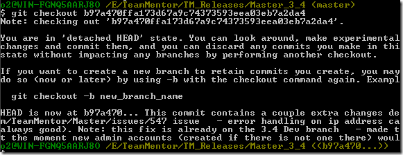

In order to create the patch, I created a local tracking branch using the command **_$ git checkout -b Issue_534 remotes/origin/Issue_534_**  

I then created a patch using **_$ git format-patch Patch_Parent_**  

...which created the file **_0001-Fixing-Issue_534.patch_**:

... containing these changes:

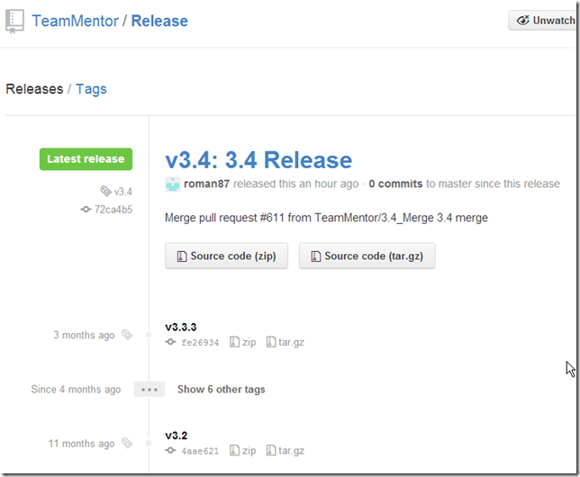

...the these ones:

Note: the reason the patch is about 1Mb is because Michael (on this branch) also committed a bunch of \*.dlls which should not be there.

One more little thing, since we are going to create a number of these patch files, it is better to put them on a dedicated folder. This can can be done using the command: **_$ git format-patch Patch_Parent -o ../_3.4_Patches_**  

... with the _'patch file'_ now being placed on the folder:

Here is the same process for Issue_565:

... with the patch created in:

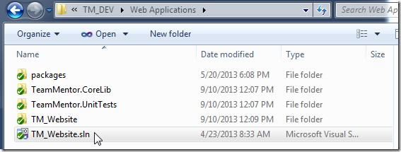

We can also create the patches without creating a tracking branch. For example here is how to create a patch for the code at the Issue_51 branch:

Note that the _0001-Fixing-Issue-51.patch_ file is much smaller (3k) then the others

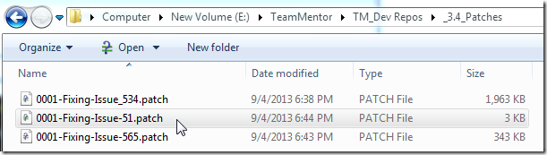

This is caused by this patch only containing text diffs (and no binaries), which is how all patches should be:

Finally here are all the patch files created (containing all commits made by Michael's branches):

**Appendix 2) Creating a 3.3.3 tag and branch in the _TeamMentor/Dev_ repository**  

In order to be able to apply the changes into the _TeamMentor/Master _master branch, I created a branch in the current **_TeamMentor/Dev_** that points to the last common commit between**_ TeamMentor/Master_** and **_TeamMentor/Dev_** (this way the commits can be pushed into **TeamMentor/Master** master branch, and eventually pulled into the **_TeamMentor/Dev_** 3.5_Release branch)

Since **_b97a470ffa173d67a9c74373593eea03eb7a2da4_**  is the last commit in **_TeamMentor/Master_** that also exists in **TeamMentor/Dev**, we are we are going to use as the parent for the patches/branches to apply:

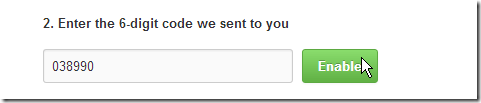

To do so, I started by opening up my local dev repo (currently in sync with the latest commit to Dev) , and executed **_$ git checkout b97a470ffa173d67a9c74373593eea03eb7a2da4_**   

I then created a tracking branch (called 3.3.3_Release) and added a tag (called v3.3.3), using the commands: **_$ git checkout -b 3.3.3_Release_** and **_$ git tag -a v3.3.3  -m '3.3.3_ Release'**  

I then pushed the _**3.3.3_Release**_ branch and **_v3.3.3_** tag into the **_TeamMentor/Dev_** repository, using the commands: **_$ git push dev 3.3.3_Release:3.3.3_Release_** and **_$ git push dev v3.3.3_**  

Following these commands (and without the pushes that will happen next) we can see the **_3.3.3_Release_** tag in **_TeamMentor/Dev_** network graph  

**Appendix 3) Applying patches**  

We are now going to apply the patches files (previously created), into the 3.3.3_Release branch of the current local clone of **_TeamMentor/Dev_**

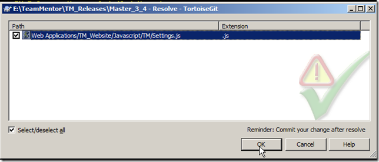

Starting with the **_0001-Fixing-Issue_142.patch_** which is a simple change:

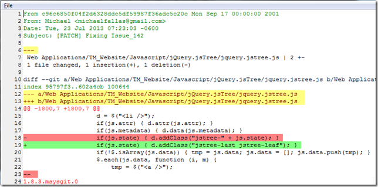

To get a preview of what will change when we apply a patch, we can use the command: **_$ git apply --stat ../_3.4_Patches/0001-Fixing-Issue_142.patch_**  

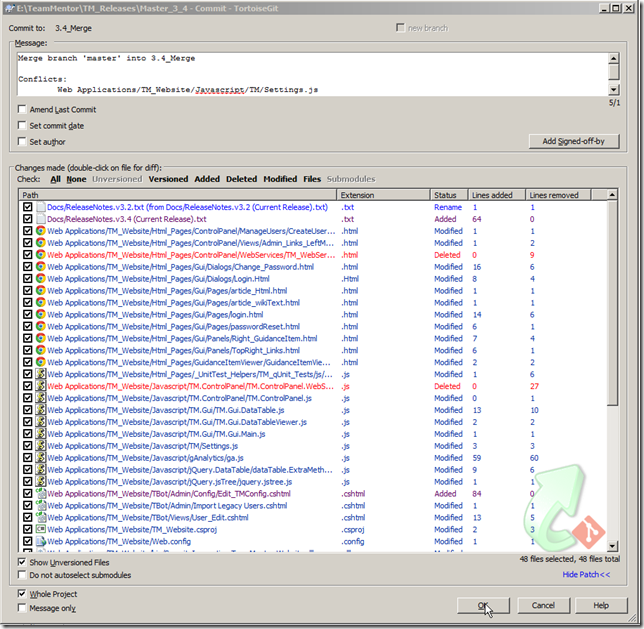

To see if we are going to have any errors when applying a patch, we can use the  command: **$ git apply --check ../_3.4_Patches/0001-Fixing-Issue_142.patch**  

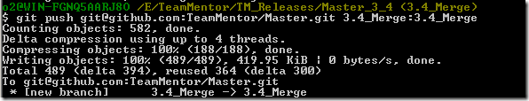

In this case, the fact that we saw no messages on the **---check** command (shown above), means that we can merge this patch file ok:

... in this case the change was applied on top of our current branch code (with no commit added)

But that has the problem that there was no commit made (just the files changed on disk).

Since we want to preserve the original commit we, will need to can use another command.

First lets reset the current change:

... and before we apply the **0001-Fixing-Issue_142.patch**, lets create the Issue_142 branch, using the command **git checkout --b Issue_142**  

Now lets apply the patch this using the command: **_$ git am --signoff < ../_3.4_Patches/0001-Fixing-Issue_142.patch_**  

...which will add a commit containing the original commit message and author:

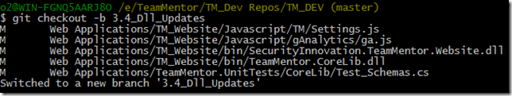

Next we push this branch into TeamMentor/Dev

And confirm that the Issue_142 changes are in the correct location (i.e with the **_b97a470ffa173d67a9c74373593eea03eb7a2da4_**  commit as its parent):

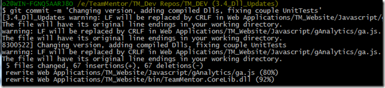

Note how the light blue line is connected from the **_b97a470ffa173d67a9c74373593eea03eb7a2da4_**  commit (see above) into the newly pushed **5319e3028da01c64d09409b833c4f33bc49b7208** commit (see below)

... which is the current head of the **Issue_142** branch

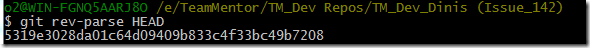

The next image shows how we can use GitHub's UI to create/view the pull request for this branch:

Note how in the screenshot above the **_Issue_142_** branch is 129x commit behind master.

That is caused by the fact that master is currently at the commit **16354b3ec1757f56f0ee1594de3c72bb506f6537** and it should be at the commit **b97a470ffa173d67a9c74373593eea03eb7a2da4**  

See **_Appendix 5) Creating a 3.4_Release Feature branch and merging branches_** for how that was fixed.

After mapping the current master commit into a new the 3.5_Release branch and doing a force reset to the master branch, we get the **_Issue_142_** branch correctly set-up with 1x commits ahead and 0x commits behind the master branch:

With TeamMentor/Dev master branch in the correct location, lets apply more patches into it:

For example Issue 51, using the commands:  

**$ git apply --check ../_3.4_Patches/0001-Fixing-Issue-51.patch** (check if patch can be applied)  
**$ git checkout -b Issue_51** (create patch branch)  
**$ git am --signoff < ../_3.4_Patches/0001-Fixing-Issue-51.patch**  (apply patch and preserve original commit)  **$ git push dev Issue_51:Issue_51** (push branch into GitHub)

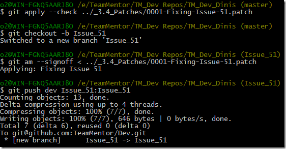

This makes the **_Issue_51_** branch to also be 1x ahead and 0x behind commits of the master branch:

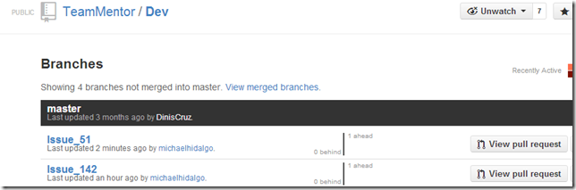

With this workflow in place, I quickly did the same workflow for the branches: **Issue_384 , Issue_400 , Issue_475** and **Issue_459**  

At the moment we have these branches to merge (_Appendix 5) Creating a 3.4_Release Feature branch and merging branches_ will show them in action):

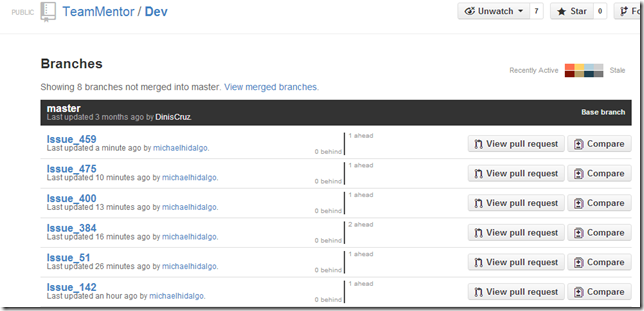

Note that there were numerous patches (534, 565, 193, 285, 461, 517, 504, 527,462 and 445) that didn't merge correctly.

For example this is what happened for the **0001-Fixing-Issue-565.patch** when executing the command **$ git apply --check ../_3.4_Patches/0001-Fixing-Issue-565.patch**  

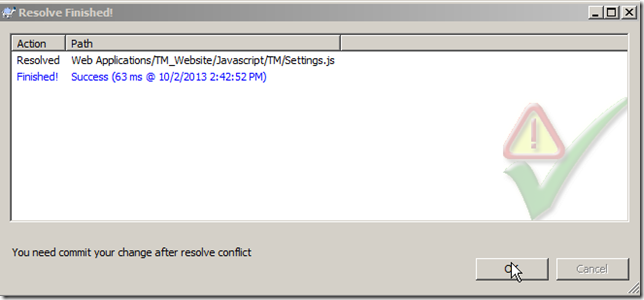

These will need to be handled separately (which is a topic for another blog post, since this one is already getting a bit long :) )

**Appendix 4) Creating a 3.5_Release Feature branch**

In order to make the current **_TeamMentor/Dev_** match the **_TeamMentor/Master_** in terms of the master branch, we need to move the current master of **_TeamMentor/Dev_** into a feature branch called **_3.5_Release_** (in a way we were using the master of **_TeamMentor/Dev_** as a 'feature branch' which was ok if that code was going to become the 3.4 release (which now it isn't).

First step is to move into the current master using the command **_$ git checkout master_**  

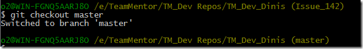

Then we create the 3.5_Release feature branch using the command **_$ git checkout --b 3.5_Release_**  

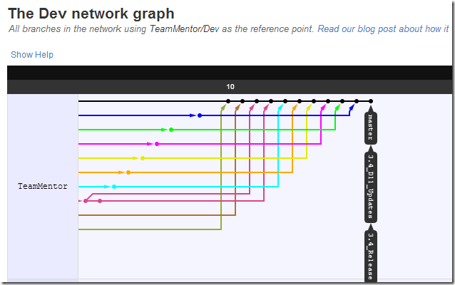

Next we push this branch into **_TeamMentor/Dev_**

At this moment, in the GitHub repo, **TeamMentor/Dev**'s master and 3.5_Release point to the same commit (**16354b3ec1757f56f0ee1594de3c72bb506f6537**):

Now comes the sledgehammer :)

We're going to (first locally) do a hard reset into the **b97a470ffa173d67a9c74373593eea03eb7a2da4** commit, using the command **$ git reset --hard b97a470ffa173d67a9c74373593eea03eb7a2da4** (remember that this commit is the common one between _TeamMentor/Master_ and _TeamMentor/Dev_)

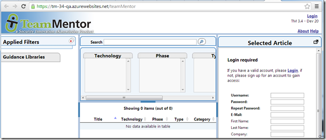

After this hard reset, the **_TeamMentor/Dev_** master is aligned with the 3.3.3_Release branch and v3.3.3 tag (previously created)

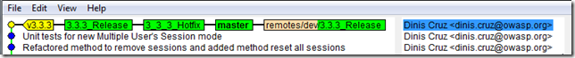

We can also double check this, by using the command **_$ git gui_**  

... followed by the **_Visualize all Branch History_** menu option:

...and see that the Issue_142 branch is now a child of the current **_TeamMentor/Dev_** master (which is in sync with the TeamMentor/Master master)

Finally we are ready to apply the sledgehammer to the repository hosted at GitHub, by forcing a push using the command **_$ git push --f dev master:master_**  

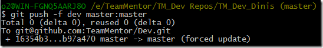

Which makes the TeamMentor/Master look like this:

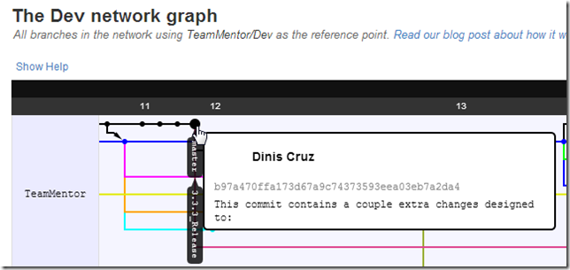

... with the **Issue_142** branch having the master/3.3.3_Release branch as parent (see rouge/brown line)

... and the 3.5_Release branch containing the commits that ware previously in the master branch (see yellow line)

Finally a look at the current branches in **_TeamMentor/Dev_** shows that the **Issue_142** is correctly 1x commit ahead and 0x behind the master branch (which means that it is ready for a pull request)

**Appendix 5) Creating a 3.4_Release Feature branch and merging branches**  

At this point we have these branches ready to commit (via a pull request)

Instead of merging them into the **_TeamMentor/Dev_** master branch, we are going to create a **_TeamMentor/Dev _** **_3.4_Release_** branch using the command **_$ git checkout -b 3.4_Release_** and push it to TeamMentor/Dev using the command **_$ git push dev 3.4_Release:3.4_Release_**  

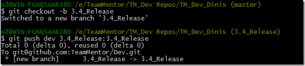

The reason for this branch is so that **_TeamMentor/Dev_** master branch is aligned with **_TeamMentor/Master_** master branch (which is the current official release), and only QA'd changes are pushed into **TeamMentor/Master** (first into 3.4_Release branch, and eventually into the official **_TeamMentor/Master_** master branch (note that we will most likely rename the **_TeamMentor/Master_** repo into **_TeamMentor/Release_**)

Next step is to create a pull request from the current Issue_XYZ branches into the 3.4_Release branch.

Let's start with **Issue_459,** by clicking on its Compare button:

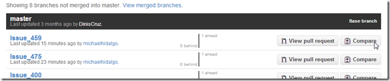

On the next page, click on Edit:

... to change the base branch (into 3.4_Release):

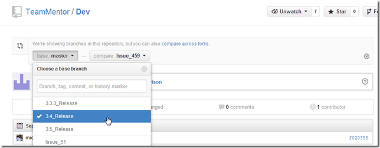

Then click on the **_Click to create a pull request for this comparison_** link

... click on the _Send the Pull Request_ button:

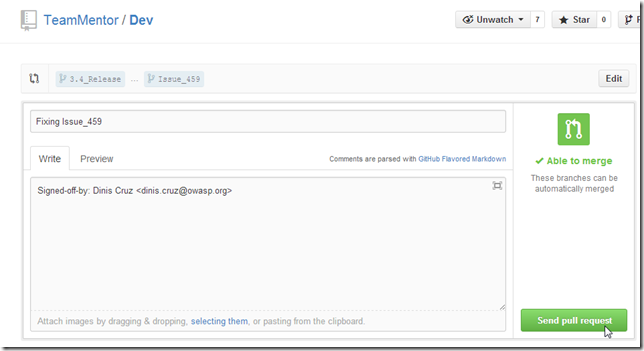

... click on the **Merge pull request** button  

... and the _Confirm Merge_ button:  

We could now delete the branch (but I'm not going to do that at this stage, since first I want to see these merged branches in a GitHub Network Graph):

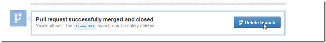

Back into the **_Branches not merged into master_** list, although the **_Issue_459_** branch is still 1x ahead of master, we now have the _**3.4_Release**_ branch with 2x commits ahead:

The two commits of the _**3.4_Release**_ branch are one from the **_Issue_459_** branch and one from the pull request merge (note above how we could now do a Pull request from this **_3.4_Release_** branch into the **_master_** branch):

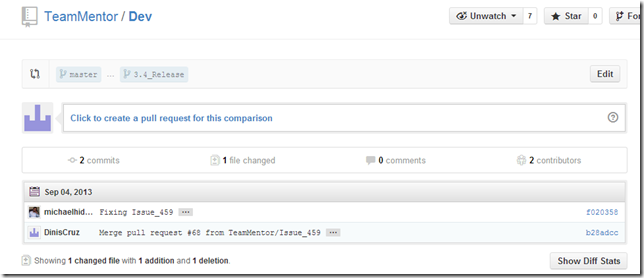

After doing the same workflow for **_Issue_475_** branch:

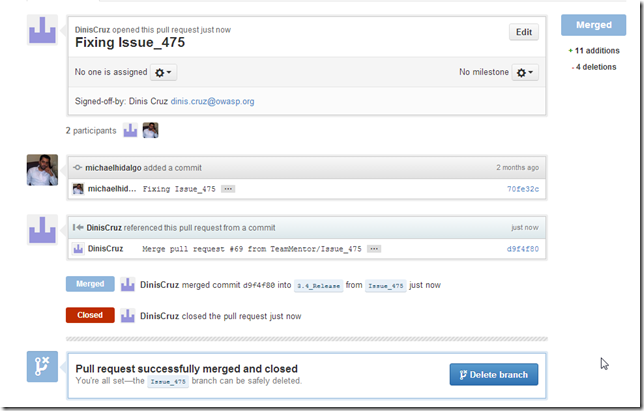

... the **_3_4_Release_** branch is 4 commits ahead:

And after doing the same workflow for the **_Issue_142, Issue_51_** and **Issue_400** branches/issues, the **_3_4_Release_** is 10 commits ahead (with 5 Issues_Xyz applied):

The TeamMentor/Dev graph also shows this workflow in action (note that If I had deleted branches after the pull request, we wouldn't see the tags in this network graph)

One important note is that the **_Issue_384_** didn't merge automatically with the 3.4_Release, which means that there is a conflict between one of the changes made by the applied branches and this code (i.e. Michael will need to fix this and resubmit the patch)

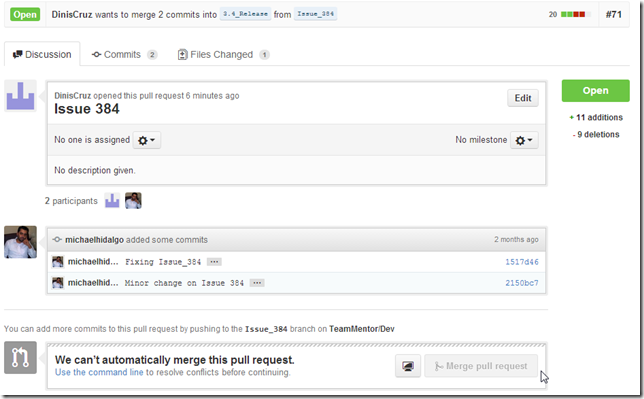

****Wrapping up: Feedback and better git commands:**

If you made it this far to the end, it would be great to have some feedback on this git workflow (and solution).

And if you know of better ways to do solve probs like this one, please ping us with your ideas, since there is still far too much Git functionality that I/we are not aware of.
