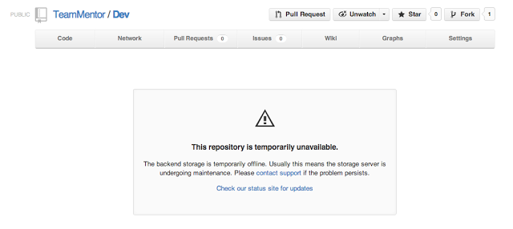
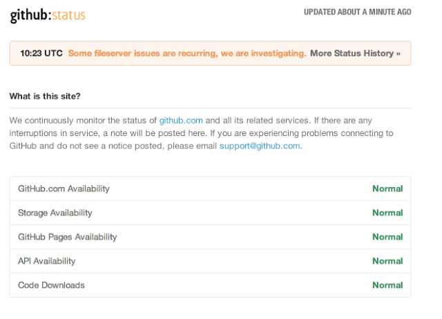
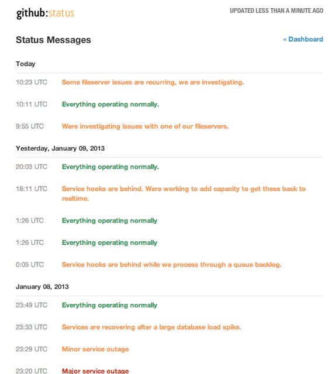

##  GitHub is having some probs today

Here is what a GitHub Commit page looks like:  

Here is the [status page](https://status.github.com/)  

And the [Status messages](https://status.github.com/messages) page:

