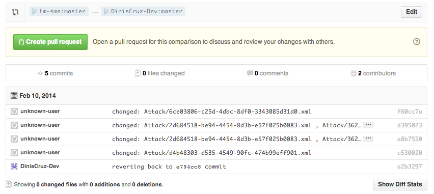

## Reverting changes mades to TeamMentor articles

The problem was simple, there were a number of commits made to an TeamMentor GitHub repo that I wanted to completely reverse (without re-writing history).

For reference this happened when I was doing some 'Link fixing' tests on a server that was configured to auto commit to GitHub (which meant that the option to do a pure _git reset --hard_ was not available since it would break the TM server)

In this case, the last good commit was [e794cc839689dfc7915099d39972abde643a969d](https://github.com/tm-sme/Lib_.NET_2.0/commit/e794cc839689dfc7915099d39972abde643a969d) and the last bad commit was [c53002083e85673f9a4dd7e6dbd2a37bc7ff9e2f](https://github.com/DinisCruz-Dev/Lib_.NET_2.0/commit/c53002083e85673f9a4dd7e6dbd2a37bc7ff9e2f) (currently HEAD of master)

My first idea was to just do a git revert to the [e794cc839689dfc7915099d39972abde643a969d](https://github.com/tm-sme/Lib_.NET_2.0/commit/e794cc839689dfc7915099d39972abde643a969d) which worked ok locally.

But I struggled to merge it with the master HEAD, because git was being too cleaver , since it realised that these two commits were compatible, and just fast-forwarded into the most recent one (vs doing a 'reverse merge')  

Based on the [this answer](http://stackoverflow.com/a/1470452/262379) from SO's [Revert multiple git commits](http://stackoverflow.com/questions/1463340/revert-multiple-git-commits) question, the solution was to

a) clone the target repo and create a test branch  

> **$ git clone git@github.com:DinisCruz-Dev/Lib_.NET_2.0.git **
> **$ cd  Lib_.NET_2.0.git**
> **$ git checkout -b mergeTest**

b) do a git reset hard into where I wanted to go:  

> **$ ****git reset --hard e794cc839689dfc7915099d39972abde643a969d**

c) then do a git reset soft into the current master

> **$ ****git reset --soft a8b755098884173a8f6eced1faddefc0c34a987e**

d) use the gitk tool to confirm that the local changes (about to be committed) exist after the current HEAD commit of the mergeTest branch

> **$ ****gitk**

e) committed the changes

> **$ ****git commit -m 'reverting back to e794cc839689dfc7915099d39972abde643a969d commit'**

f) checkout master branch and merged with mergeTest branch

> **$ git checkout master**

> **$ git merge mergeTest**

> _Updating c530020..a2b3297__Fast-forward__ _      
> _Attack/2d684518-be94-4454-8d3b-e57f025b0083.xml | 206 +++++++++++++++++++++++++++++++++++++++++++++++++++--------------------------------------__ _    
>_Attack/36208a74-52f2-4a48-9ecf-4d032d845f2b.xml | 162 ++++++++++++++++++++++++++++++++++++++++------------------------------_  
>_ Attack/4c053210-1a24-44c2-a3f9-f0cf5008eb3f.xml | 138 ++++++++++++++++++++++++++++++++----------------------------_  
>_ Attack/5af411c1-4606-4f7e-920c-186af71436c5.xml | 130 ++++++++++++++++++++++++++++++--------------------------_  
>_ Attack/6ce03806-c25d-4dbc-8df0-3343085d31d0.xml |  74 ++++++++++++++++----------------_  
>_ Attack/7dfbe9c9-481e-46d2-b1a5-9a776578d6c2.xml | 137 ++++++++++++++++++++++++++++++-----------------------------_  
>_ Attack/adf5df06-2b67-4e2a-ace2-6d7060e0bd95.xml | 209 ++++++++++++++++++++++++++++++++++++++++++++++---------------------------------------------_  
>_ Attack/d4b48303-d535-4549-90fc-474b99eff901.xml | 180 +++++++++++++++++++++++++++++++++++++++---------------------------------------_  
>_ Attack/dcf4e714-d7e2-4c7d-8609-6ab5bd309476.xml | 134 +++++++++++++++++++++++++++++++---------------------------_  
>_ 9 files changed, 734 insertions(+), 636 deletions(-)_

f) pushed into GitHub  

> **$ git push origin master:master**

g) in the TM website trigger a cache reload (which will also do a git pull from GitHub), opening the DebugInfo page will also show a Git Pull message  

> **https://tm-34-qa.azurewebsites.net/rest/tbot/run/Reload_Server_Objects**
> **https://tm-34-qa.azurewebsites.net/rest/tbot/run/DebugInfo**

h) finally to confirm that all is really the way it should be, I opened up the Pull Request page for the affected repo, and there are now 5 commits , but with 0 files changed:

> **https://github.com/tm-sme/Lib_.NET_2.0/compare/master...DinisCruz-Dev:master**

Note how in the screenshot above, the last commit is the one done created during this blog post (which reverts the other 4).

There is probably a better way to do this, but the solution described above was the one that made more sense to me (and the one that worked :)  )  
