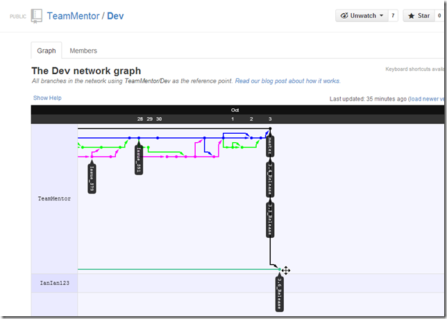

##  Creating a clone of WebGoat on GitHub 

I needed a couple vulnerable source code examples (to use on the new [TeamMentor](http://teammentor.net/) Eclipse plug-in) so an obvious option was to use [WebGoat](https://www.owasp.org/index.php/Category:OWASP_WebGoat_Project) (whose code is currently hosted at [Google Code page](https://code.google.com/p/webgoat/))

But since there wasn't a source code download option (in the current [download page](https://code.google.com/p/webgoat/downloads/list))

  
... and this project is not using Git (sorry, but I can't use SVN anymore :) ... it's too painful)

 

... I quickly created a clone of it using the **_$ git svn clone -s_** **_http://webgoat.googlecode.com/svn_** **_ webgoat_**  

... which downloaded the entire source code and available history:

When completed (it took a little bit since there was quite a bit of history)

I had this **File Structure:**  

and

This Git repo **Size:**  
  

This Git **History:**

which goes back all the way to 2006!

These **Braches:**

Note that after the svn clone the current git **_master_** branch is the original svn **_truck._**  

But as we can see by the above list, there is already an **_webgoat-6.0_** branch going on (in fact most of the recent code updates are done there), so here is how we can create+checkout a git tracking branch for it:

... which will make the file system look like this now:

... and the Git History like this:

Next step is to push this version to the newly created [https://github.com/OWASP/WebGoat](https://github.com/OWASP/WebGoat) repo (in OWASP GitHub organisation):

On the local repo add a remote:

... and **_push --all_**

Once the upload completes:

 

... the code will be at GitHub:

including the **webgoat-6.0 branch:**  

Finally I updated the OWASP WebGoat page to make references to this new GitHub repo:

And that's it!

Now you can go to [https://github.com/OWASP/WebGoat](https://github.com/OWASP/WebGoat) and clone (or [download the zip](https://github.com/OWASP/WebGoat/archive/master.zip)) of OWASP's WebGoat :) 
