## Adding Tags to TeamMentor Master repository

With 3.2 out, its time to add some [Git Tags](http://git-scm.com/book/en/Git-Basics-Tagging) to the main [TeamMentor/Master](https://github.com/TeamMentor/Master/) repository (which at the moment has none):  

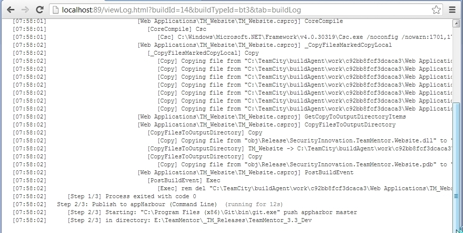

In a local Git Bash of this repository, we can create a tag using **$ git tag -a v3.2  -m '3.2 Release'**

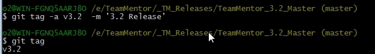

Next we push that tag into GitHub using **$ git push tm_master v3.2**

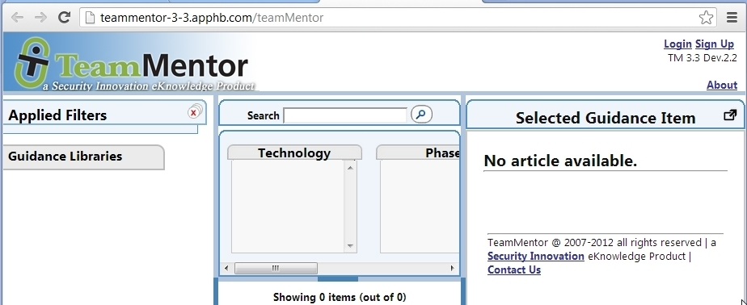

And if we look back in GitHub's Tag page, we will see that our **v3.2** tag is in there:

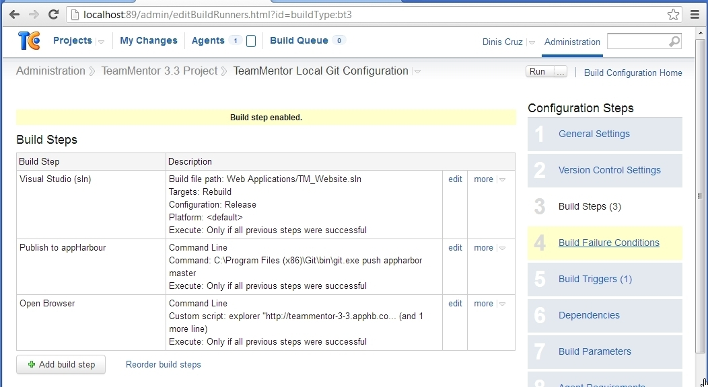

At the moment we are keeping track of the previous versions using Git Branches (but I think that tags will do a better job)

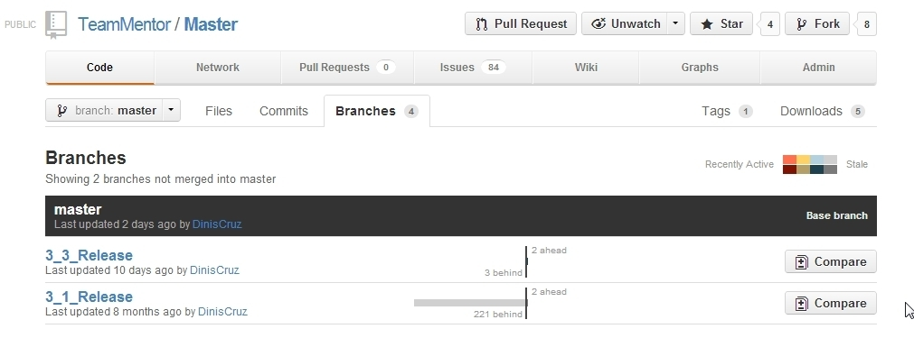

For example here is 3.1 release (with the _f71b016241_ id)

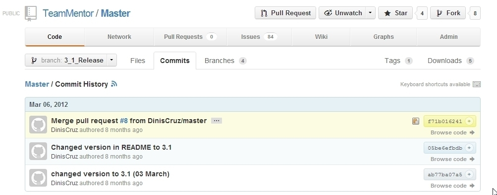

We can use this ID value to create the 3.1 tag

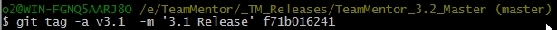

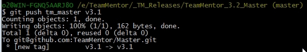

Use **gitk** to find the SHA1 ID of the 3.0 release

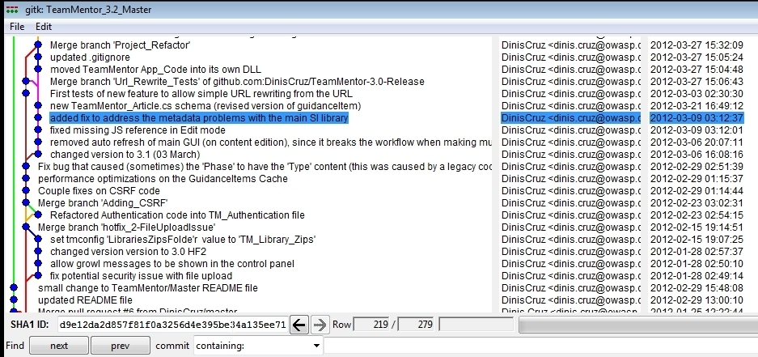

Which we use to create the 3.0 tag:

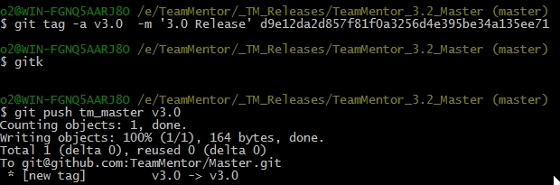

After pushing to GitHub, the Tag page looks like this:

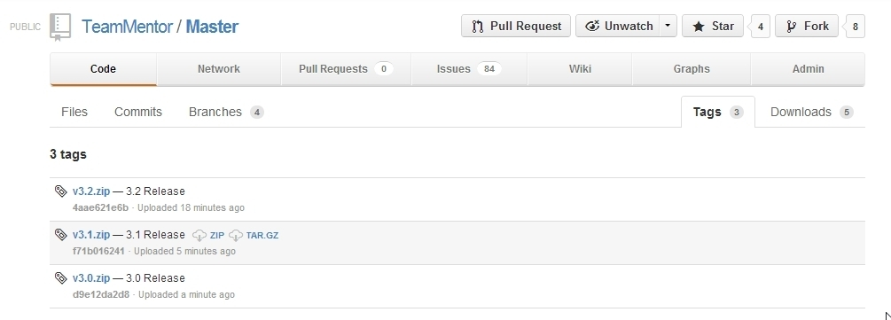

What is really cool about these Git Tags is that they also provide a nice location to download a particular release :) 
