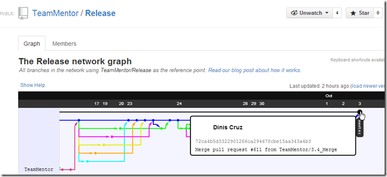
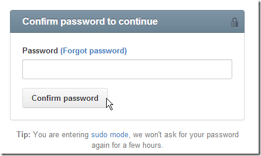
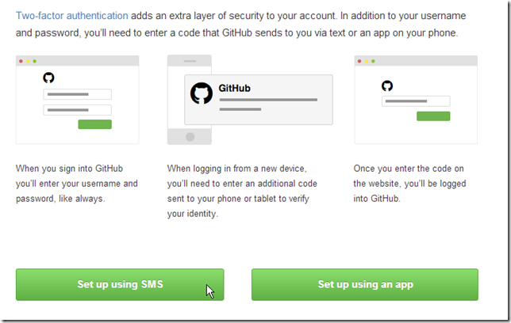
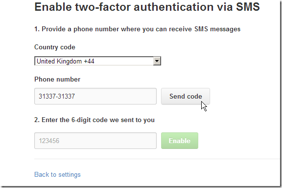
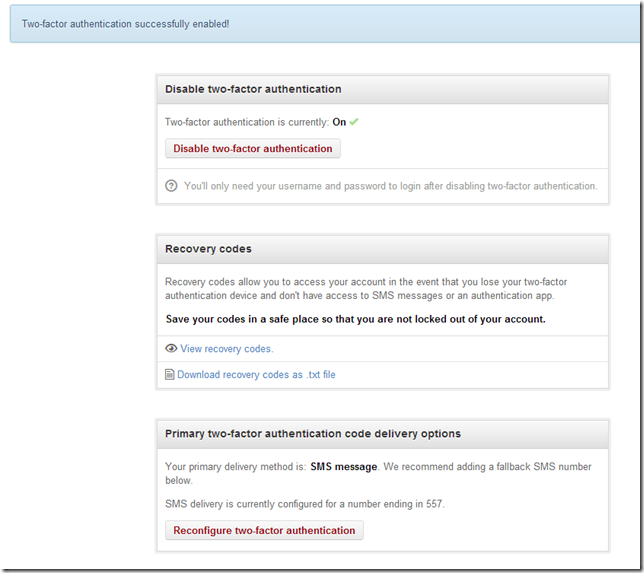
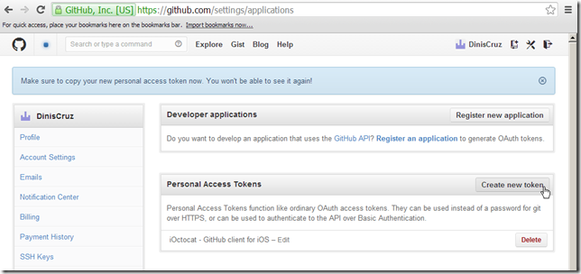
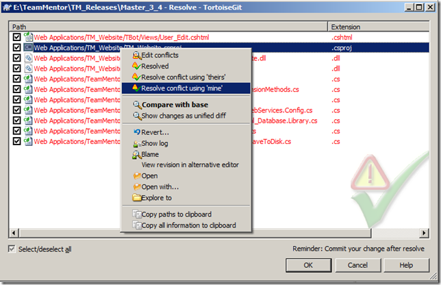
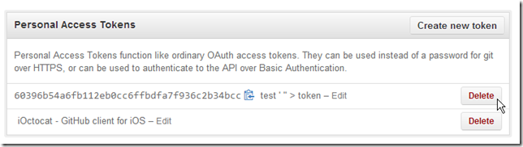

##  Enabling GitHub Two Factor Authentication

Inspired by Google's Two Factor Authentication workflow, last month GitHub did the same thing.

I just enabled it, and I strongly recommend that you do it to.

As per the instructions in GitHub's [Two-factor Authentication](https://github.com/blog/1614-two-factor-authentication) post, the first step is to go to [https://github.com/settings/admin](https://github.com/settings/admin) and click on the **_Set up two-factor authentication'_** button:  

... which requires the current password to be entered:

In this case I'm going to use SMS:

Next we enter the phone number and click on **_Send code_**:

... enter the number received by SMS and click **_Enable_**  

And that's it, two-factor authentication is now enabled:

**Creating Tokens to access repos (instead of pwds)**  

Also great from a security point of view, is that it is also possible to create 'login tokens' for Https logins.

This is done one the **_Applications_** Settings page:

... where new tokens can be created:

... which can now be used instead of passwords (with the great advantage of being revocable and assignable for a particular use (lets say a particular deployment or app))

I really like this functionality, and hope to eventually add something similar to TeamMentor
