## Git and GitHub commands to create and deploy new version of TeamMentor

With the new Release of TeamMentor, I needed to upgrade the main GitHub repositories to the new version. This is the detailed version of the Git and GitHub workflow used.

My objective was to create a set-up where I could push the new code base (3.2) while keeping a clean separation with the previous one(s).

My solution was to use branches to hold each version (yes I could have used tags, but I prefer the isolation provided by branches).

The actions taken are:  

  * Identify the repository with the latest version of TeamMentor (the Code)
  * Identify the repository with the TeamMentor Library to use (the Content)
  * Identify the repository to upgrade (with both the Code and Content)
  * Download the repository to upgrade and store it on a separate branch (the Backup)
  * Download the Code repository
  * Download and merge the Content repository
  * Publish changes

More specifically (using some Git commands)

  * Set up tm_master remote with the latest version of source-code (for example): [https://github.com/TeamMentor/Master](https://github.com/TeamMentor/Master)
  * Set up tm_library remote with the TeamMentor library to use (for example): [https://github.com/TeamMentor-OWASP/Library_OWASP](https://github.com/TeamMentor-OWASP/Library_OWASP)
  * Set up origin remote with the version to upgrade, which is the Code+Content version (for example): [https://github.com/TeamMentor-OWASP/Master](https://github.com/TeamMentor-OWASP/Master)
  * pull origin into master
  * move master branch into master_Old.Version (for example) master_3_1
  * create a new 'orphan' branch called master (and delete all files from it)
  * pull tm_master into master
  * pull (using tree merge strategy) tm_library into the Library_Data/XmlDatabase/TM_Libraries folder
  * push all branches to origin

### Step-by-Step workflow:

**1) Create a local clone from the version to upgrade and back it up:**

In this this case from [https://github.com/TeamMentor-OWASP/Master](https://github.com/TeamMentor-OWASP/Master)

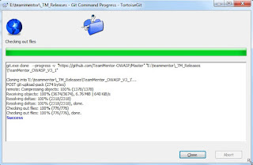

Once the repository is created locally, zip it up and upload it to the GitHub repository download section. It is important that this is the version with the .git folder (and not the .zip you can download from the repository main page). The fact that we can easily create a full backup of a complete Git repository is one of my favorite features of Git, and it allows for an easy restore for the inevitable mistakes that will be made :)

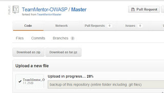

Tip: make sure to test the download, since I've seen cases where the upload fails and even if there is a download link on the page, there is no file downloadable:

[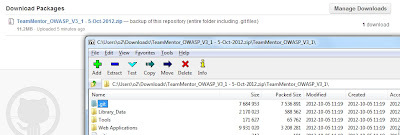](http://1.bp.blogspot.com/-QjWbparK0lo/UG623oQ0BDI/AAAAAAAAAKc/vqiNFdsUqro/s1600/CropperCapture%5B5%5D.jpg)

Once you're happy that you have a backup, you can delete the folder locally created (the one you zipped)

**2) Create a local repository with new version:**

Start by creating a folder to hold the files (in this case *E:\teammentor\_TM_Releases\TeamMentor_with_OWASP_Library*)

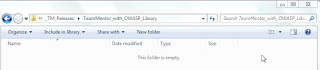

Open a git bash and cd into that folder

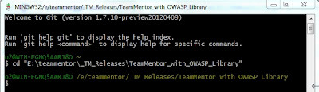

Execute the following commands in sequence:

After completion the target folder should look like this:

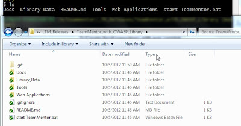

To quickly test TeamMentor, double click on_ 'start TeamMentor.bat'_

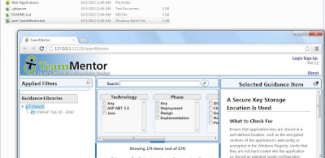

**3) Test rolling back to an earlier version:**

What is really cool with this set-up (and the power of Git), is that it is very easy to change to an earlier version.
Leaving the webserver on (which is running from the _Tools\CassiniDev_4.0.ex_ folder), go to the git batch and run the command: **$ git checkout -f TeamMentor_3_1**

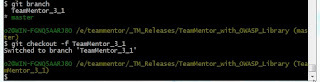

What this will do is to replace the current files in the target dir with the files from the TeamMentor_3_1 branch (which are the files from the repository we are upgrading).

This is what the file system looked like before the : **$ git checkout -f TeamMentor_3_1** command

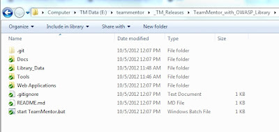

And this is after

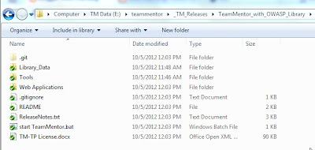

Can you spot the differences?

I can't overstate how powerful this is, specially due to the speed that it happens. What we are looking at here is a virtual file-system based on a Git database. It was this feature that really made me have a massive paradigm shift, and realize that **Git gives us a Version Control File-System** (maybe one day we will have an OS-Level git based file-system).

And just to make sure that we did change into the previous version of TeamMentor, refresh the browser and reopen [http://127.0.0.1:12120](http://127.0.0.1:12120/) (which will be the 3.1 version of TM)

Now go back to the Git Bash, switch to the master branch (via **$ git checkout -f master)** and refresh the browser:

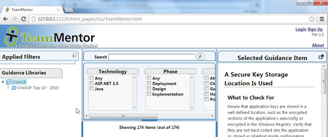

And we're back to version 3.2 (note the version number on the top right, under the 'Sign Up' link).

I have to say that I never get tired of seeing this _'virtual file system created by branches'_ in action. Try the checkouts a couple times with a windows explorer window open (so that you see the files change in real time).

**4) Confirm that both repositories have merged successfully:**

A key part of the structure created is the ability to have a merge of two Git repositories (one with the Code and one with the Data) while keeping track of their commit history (and allowing pulls of new content/data).

This is achieved using the Git subtree merge strategy, which can be seen in action if you run the **$ gitk** command (note: I did a **$ git stash** first to remove a couple temporary files created by the TeamMentor engine).

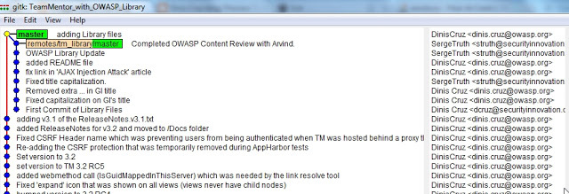

On the Git Commit tree shown above, the dots on the left column are from the tm_master repository (the Code) and the ones on the next column are from the tm_library repository (i.e. we have the Commits from both repositories :) )

**5) Push changes to the main repository:**

The final step is to push the changes (of both branches) to the origin repository using:

**$ git push -f origin master:master** and  
**$ git push -f origin TeamMentor_3_1:TeamMentor_3_1**

After completion we can double-check that the master branch is now the 3.2 version:

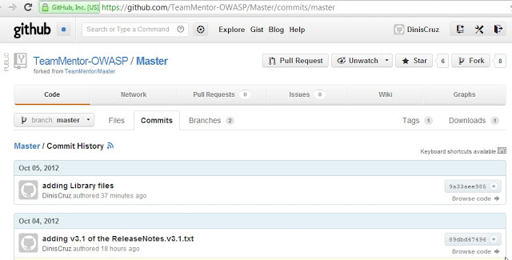

... and the TeamMentor_3_1 branch is the 3.1 version:  

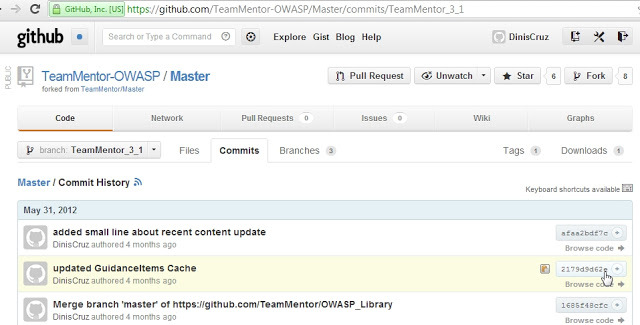

**6) Download the zip file and check that everything is okay:**

As a final test, download the zip file from the repository **master branch** home page:

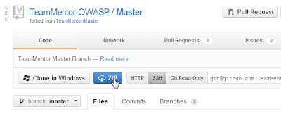

Extract the zip file somewhere on your disk, stop the running Cassini server (if it's still running) and double-click on the 'Start TeamMentor.bat' file:

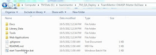

And you will see a clean 3.2 version of TeamMentor running locally:

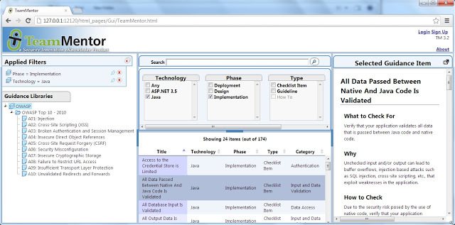
