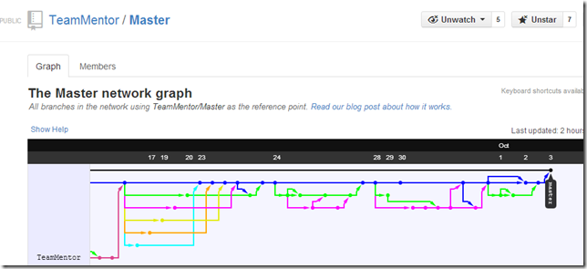
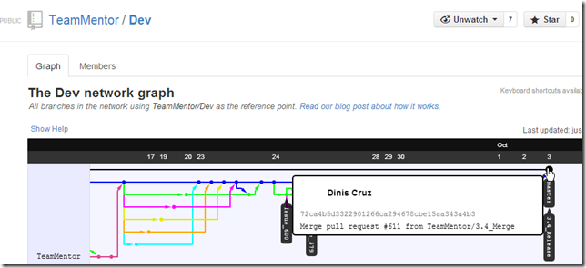
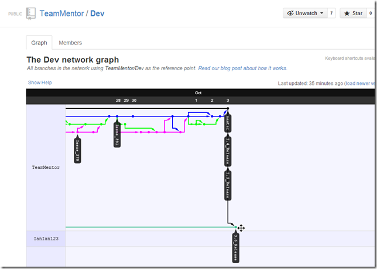
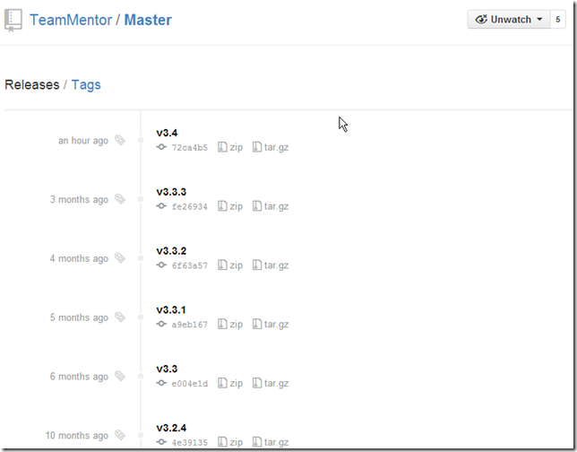
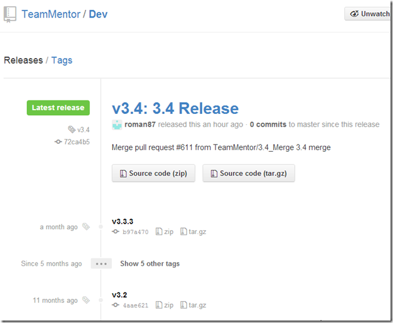
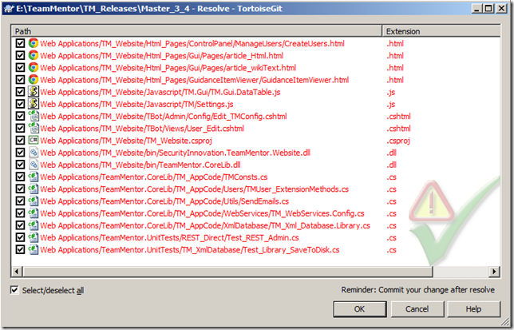
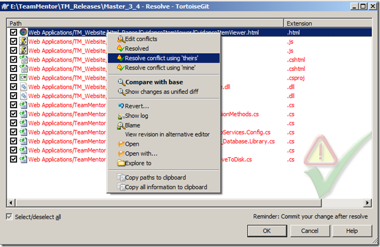
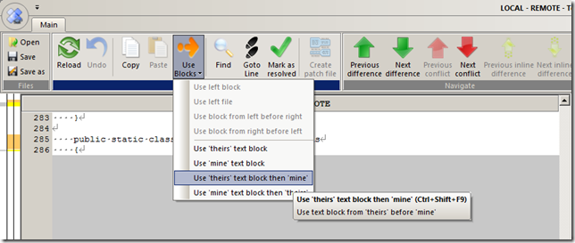
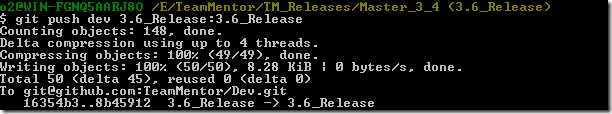

## Syncing all releases to the same commit and Tag (for TeamMentor v3.4)

This is a bit of house keeping, as you can see by the [Fixing the Merge conflict caused by one extra commit on TeamMentor master](http://blog.diniscruz.com/2013/10/fixing-merge-conflict-caused-by-one.html)  and [Git Flow - Moving patches from one Commit into another Commit](http://blog.diniscruz.com/2013/09/git-flow-moving-patches-from-one-commit.html) posts, not doing this has already cause us some pain in the past.

So after some pushes and pulls (of both commits and tags) I now have the main TeamMentor repos all synchronized at the [72ca4b5d3322901266ca294678cbe15aa343a4b3](https://github.com/TeamMentor/Release/commit/72ca4b5d3322901266ca294678cbe15aa343a4b3) commit:  

[TeamMentor/Release](https://github.com/TeamMentor/Release) - now the new official home for TeamMentor releases (i.e. the 'production code')  

[TeamMentor/Master](https://github.com/TeamMentor/Master/) -- the old TeamMentor official repo (and updated to help migrations into 3.4)

[TeamMentor/Dev](https://github.com/TeamMentor/De) #1 (before merge 3.5_Release and 3.6_Release merges) -- this is the main development clone/fork  

[TeamMentor/Dev](https://github.com/TeamMentor/De) #2 (after merge 3.5_Release and 3.6_Release merges) -- note how 3.5 is currently at the same level as 3.4 (see Appendix 1 and Append 2 for how this was done, and how the merge conflicts were resolved)

This can be further confirmed by GitHub's Branches view, where the **_3.5_Release_** and **_3_4_Release_** branches are synced with master:

... and the **_3.6_Release_** branch is already 131 commits ahead of **_master_** (and **_3.4_Release_** and **_3.5_Release_**)

**Updating the tags/Releases**  

I also updated the tags of 3 repos (Release, Master, Dev).

NOTE:** I had to force the update of the tags**, since there was already an v3.4 tag in there (I'm not 100% sure of the side effects of this, but I'm sure I'll soon find out :)  )

**Release repo (new production release):**  [https://github.com/TeamMentor/Release/releases](https://github.com/TeamMentor/Release/releases)

**Master repo (legacy/previous production release)**  [https://github.com/TeamMentor/Master/releases](https://github.com/TeamMentor/Master/releases)  (note sure why the GitHub's layout of this one is different)

**Dev repo:** [https://github.com/TeamMentor/Dev/releases](https://github.com/TeamMentor/Dev/releases)

**Appendix 1: Updating 3.5 Release branch**  

This one was easy since the 3.5_Release branch was already synced with an earlier version of the 3.4_Release branch:

The push also confirms that this branch is at **72ca4b5d3322901266ca294678cbe15aa343a4b3**  

**Appendix 2: Updating 3.6 Release branch**  

Merging the 3.4_Release into 3.6_Release was a bit more problematic due to the number of changes/fixes already done on 3.6 and the backporting of some fixes to 3.4.

After the merge failed, here are the conflicts that needed to be solved:

... with some resolved using the '**theirs**' strategy  

... a few using the '**_mine'_** strategy

... and a couple using the _**'theirs first then mine'**_ strategy (which I expect that will need further fixing in VisualStudio

Finally here is the commit that applies all 3.4 changes to 3.6 (including the merge fixes)

... and the respective push:

