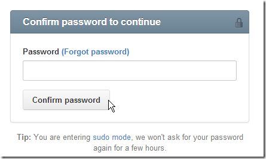
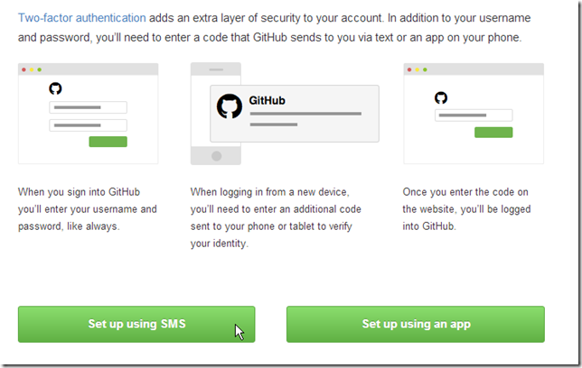
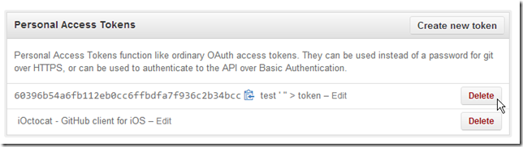
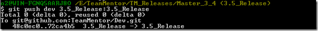
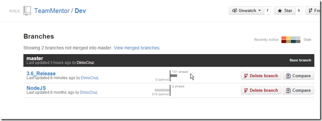
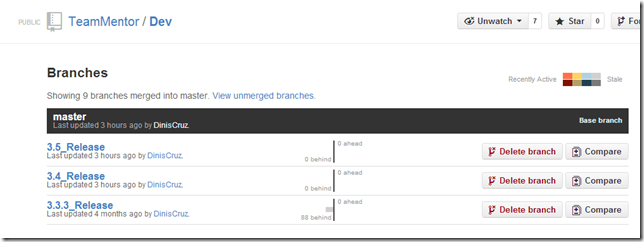

## Fixing bug in TBot user editor via Git merge of fix developed on another repo's branch

Here is an example of how I just created a HotFix branch to address an issue we want to push to our live servers asap, and how the fix was developed by Ian in one of this dev branches.

First I created _HotFix _Branch at a (freshly baked) local clone of the **_TeamMentor/Dev_** repository:  

Then I reviewed the code from Ian's branch I want to merge:

When happy with the changes, I used a **_ git fetch_** to get the latest version of Ian's fork of **_TeamMentor/Dev_**

Followed by a **_$ git merge Dev_Ian/#437-Password-Expiry HotFix_3_3_1_**  

Which did the merge with the**_ TeamMentor/Dev_** master branch

A look at GitK confirms that there was only one commit added (the Ian's '[Date value being saved to database](https://github.com/IanIan123/Dev/commit/32bd09708bc60c7e3d7e5e0c6d74a1f3c19c5915)')

At this stage if we look at Ian's network map, we will see that this commit is not linked to another commit (i.e. is the last one of the **_#437-Password-Expiry_** branch

Next step is to quickly test if the feature is working ok.

This fix is for the [Password expiry cannot be set from the main TM GUI](https://github.com/TeamMentor/Master/issues/437) issue  (i.e. make the 'Account Expiration' field editable).

So I opened an user's edit page

changed the expiration date:

Saved it

and on the file system:

My final step is to push the HotFix branch into the live server:

Here are the commits in the new **_HotFix_3_3_1_** branch (note the Ian's '[Date value being saved to database](https://github.com/IanIan123/Dev/commit/32bd09708bc60c7e3d7e5e0c6d74a1f3c19c5915)' branch is now there)

And now Ian's branch is connected with the new HotFix_3_3_1 branch:

same graph without the branch labels:

