##  Creating a version TeamMentor which uses the new GitUserData.config file 

Introduced in the 3.3 version of TM is a new feature to load the UserData repository from an external location (GitHub or local folder).

This post shows how to set it up.

First step is to get the latest version of TeamMentor from GitHub, where we can clone it locally or download the zip file

Using the Zip file has an example, unzip the 10Mb file into a local folder, and click on **_start_TeamMentor.bat_**  

This will open an empty TM site, and a new Library_Data folder should had been created:

With this default structure:

Now in GitHub (or on a local folder), create a new Git Repository (which should be marked as private, since security sensitive data will be stored here)

[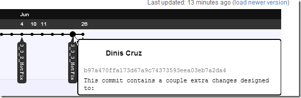](http://lh5.ggpht.com/-3Y0R310A89Y/UVHaRn-12LI/AAAAAAAAAUY/nvjmCHOdXXg/s1600-h/image%25255B20%25255D.png)

Once the repository is created, copy its git url (in this case [git@github.com:TMClients/Site_vulnerabilities.teammentor.net.git](mailto:git@github.com:TMClients/Site_vulnerabilities.teammentor.net.git) )

Back in the local copy of TeamMentor, open the TBot page:

[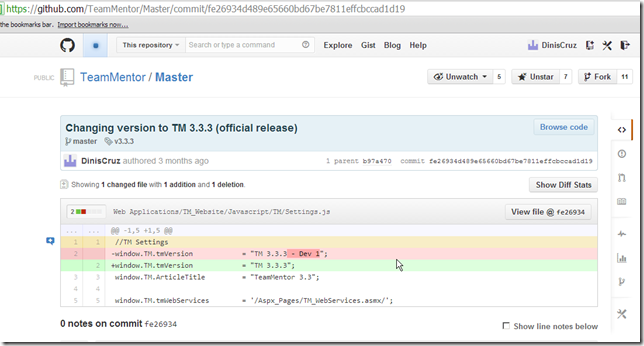](http://lh5.ggpht.com/-QW1Zmja20gc/UVHaU26QvWI/AAAAAAAAAU4/kc0vhJaHNyk/s1600-h/image%25255B32%25255D.png)

which will require an admin account:

After login, open the **_Edit GitUserLocation_**  
**_  
_**[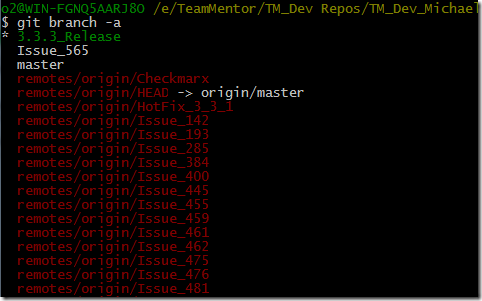](http://lh5.ggpht.com/-fuPN26I5sVo/UVHaYPFbnCI/AAAAAAAAAVY/VHtVgNq_ScM/s1600-h/image%25255B35%25255D.png)

And enter the Git url copied from GitHub:

[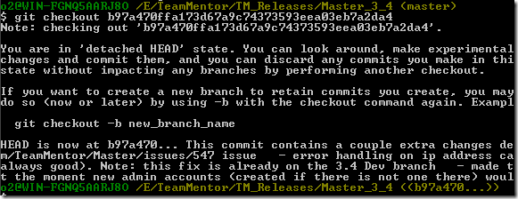](http://lh5.ggpht.com/-RKOso-jMa7M/UVHaZaPWjMI/AAAAAAAAAVo/hsfl7WQOdN4/s1600-h/image%25255B38%25255D.png)

After the data is saved, go back to the commands list:

[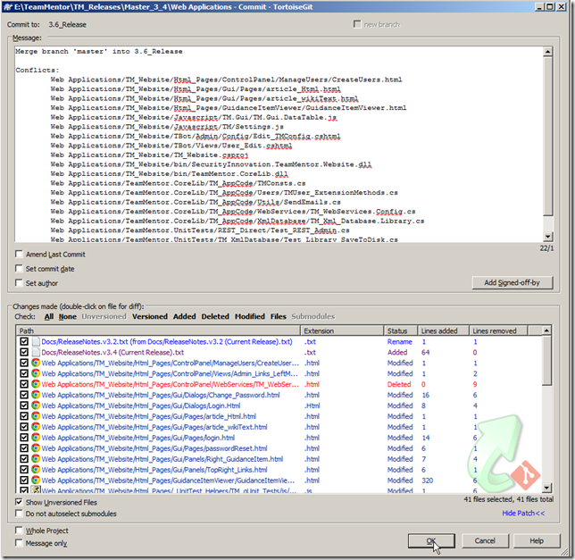](http://lh3.ggpht.com/-2dCJWTYLSFg/UVHaaqdbVmI/AAAAAAAAAV0/OU_c7BbJGOA/s1600-h/image%25255B44%25255D.png)

Go to the **Reload Server Objects**  

[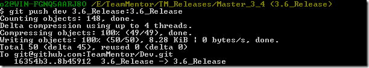](http://lh5.ggpht.com/-uec5SGbwpTw/UVHacQU6Z8I/AAAAAAAAAWI/8LTAIsm4KBU/s1600-h/image%25255B47%25255D.png)

And click on 'Reload UserData':

[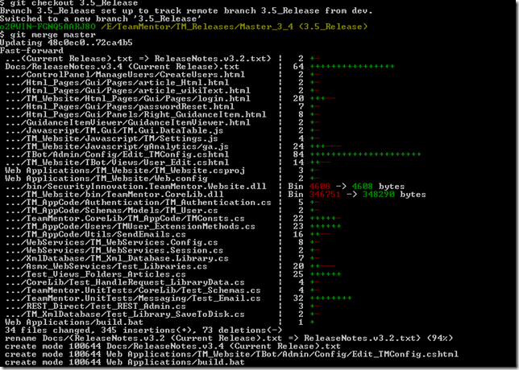](http://lh5.ggpht.com/-tonvsvTJ19c/UVHad5-ct8I/AAAAAAAAAWY/M2EAZlrNHgI/s1600-h/image%25255B50%25255D.png)

After that step is completed, if you look at the **_Library_**_Data folder, you should see a new UserData folder in there (that uses the git repository name as part of its path)

[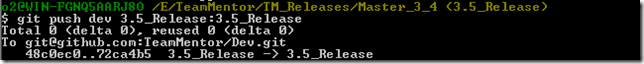](http://lh5.ggpht.com/-aZF93SV-mkw/UVHafOv_ZzI/AAAAAAAAAWo/XESe7hfcp5U/s1600-h/image%25255B53%25255D.png)

Inside it, you will see the README.md that was received from GitHub, and a new TMSecretData.config and Users folder

[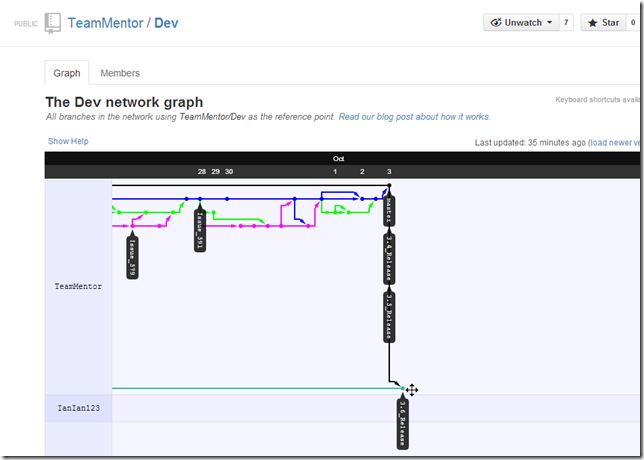](http://lh6.ggpht.com/-8D8CZPlftEA/UVHagycJsLI/AAAAAAAAAW4/6uwNpSnfs5o/s1600-h/image%25255B56%25255D.png)

Back in TBot's page, if you click on any link you should be redirected to the login page, and you will need to login again using the default admin credentials (this happens because the current browser cookie is pointing  
to the admin user that is in **_XmlDatabase\User_Data_** and not in the newly created **_XmlDatabase\User_Data_Git_Site_vulnerabilities.teammentor.net _**:

[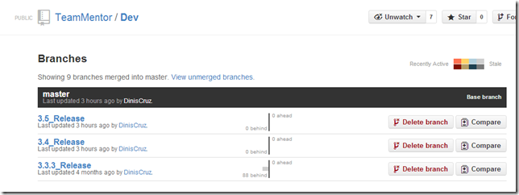](http://lh3.ggpht.com/-TkLHSZaCyNo/UVHaieh4oEI/AAAAAAAAAXI/Fwz_3NtUJwY/s1600-h/image%25255B59%25255D.png)

After logging in, open the **_Edit SecretData _**command:

[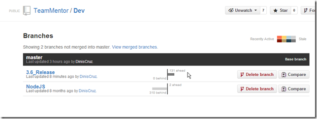](http://lh5.ggpht.com/-wPoJimL5Fi8/UVHajsjtVPI/AAAAAAAAAXY/jsI_Zmaq35A/s1600-h/image%25255B62%25255D.png)

Which should look like this (with correct values for the Rijndael and SMTP fields):

[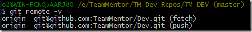](http://lh5.ggpht.com/-gwDxoFYaONA/UVHakwbYxfI/AAAAAAAAAXo/6K1BCuH_Wxw/s1600-h/image%25255B65%25255D.png)

The value that we want to change is the **_Libraries_Git_Repositories_**, which should point to the Git repo we want to add to this TM instance. In this case:

[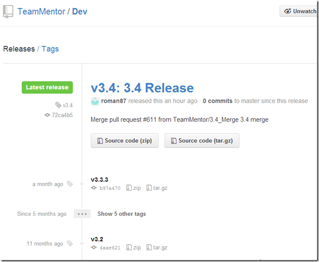](http://lh6.ggpht.com/-aH8uc9s5KBM/UVHamEnEMiI/AAAAAAAAAX4/ZMN93KMrIyQ/s1600-h/image%25255B68%25255D.png)

Add the git url as an item in the **_Libraries_Git_Repositories _**Javascript array:

After the data is saved, open the **_Reload Server Objects_** again:

And this time around click on the **_Reload Cache _**button:

[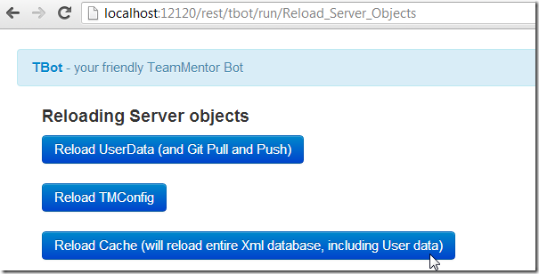](http://lh6.ggpht.com/-178tHC3UzV0/UVHaooM2i8I/AAAAAAAAAYY/cRLvFO7DjVM/s1600-h/image%25255B77%25255D.png)

Once that is completed, if your open the **_XmlDatabase/TM_Libraries _**folder, you should see a new **_Vulnerabilities_** subfolder

[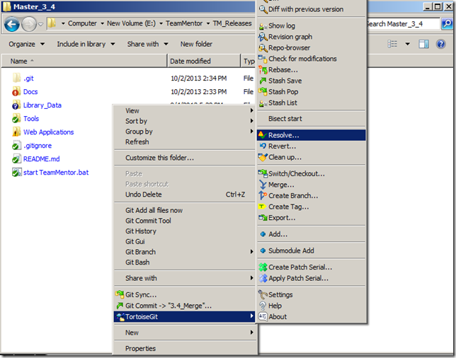](http://lh3.ggpht.com/-59LmX993Xdk/UVHaqGl9-zI/AAAAAAAAAYo/WimikQswUfk/s1600-h/image%25255B80%25255D.png)

Which is in fact a git clone:

[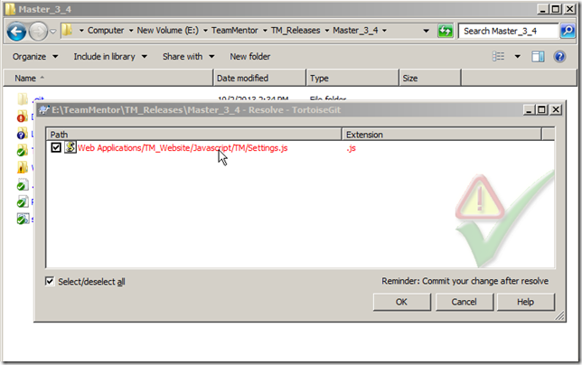](http://lh6.ggpht.com/-620t88PHr70/UVHarkleMlI/AAAAAAAAAY4/BWuzNyWUW2A/s1600-h/image%25255B83%25255D.png)

of the git repository configured on the **_Libraries_Git_Repositories _**value

[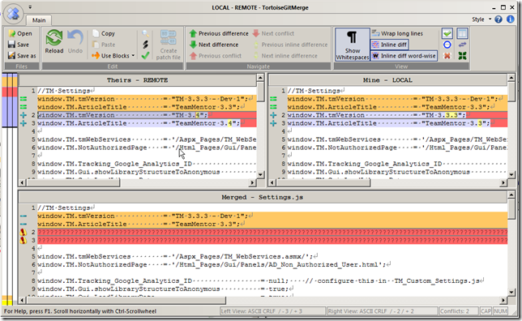](http://lh6.ggpht.com/-oeAZugPNDkY/UVHatL98BEI/AAAAAAAAAZI/D3dyP1VpzgI/s1600-h/image%25255B86%25255D.png)

Quickly opening the main TM page, will now show the **_Vulnerabilities_** Library:

[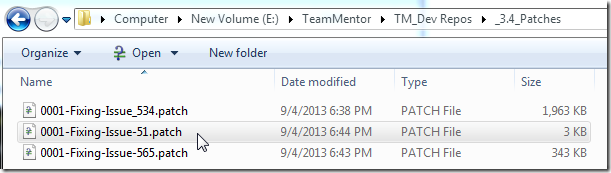](http://lh4.ggpht.com/-1dhVyQYi7U4/UVHauS3NoKI/AAAAAAAAAZY/GQLbJOvHFrc/s1600-h/image%25255B95%25255D.png)

Final step is to do manually commit the changes made to the **_User_Data_Git_Site_vulnerabilities.teammentor.net_** local repository (note: auto commit and push is disabled on the UserData when running TM from localhost)

[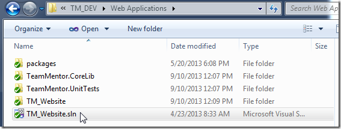](http://lh4.ggpht.com/-Xy_syfVyNX4/UVHawNfeXyI/AAAAAAAAAZk/Tz4PrExu1o8/s1600-h/image%25255B89%25255D.png)

Which will put those updates in GitHub

[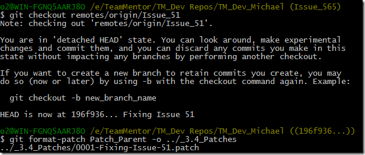](http://lh5.ggpht.com/-23LySkmncOw/UVHaxhgxdZI/AAAAAAAAAZ4/6r6IDSlc2aQ/s1600-h/image%25255B92%25255D.png)

Now that we have this GitHub repository configured, we can configure the **_Git UserLocation_** of live QA server:

[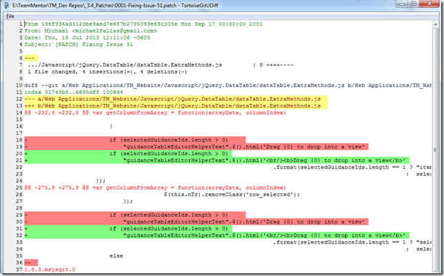](http://lh3.ggpht.com/---lZ_8uRy3Y/UVHay9jOiHI/AAAAAAAAAaI/metUyhPVtZA/s1600-h/image%25255B98%25255D.png)

And after reloading the cache:  
[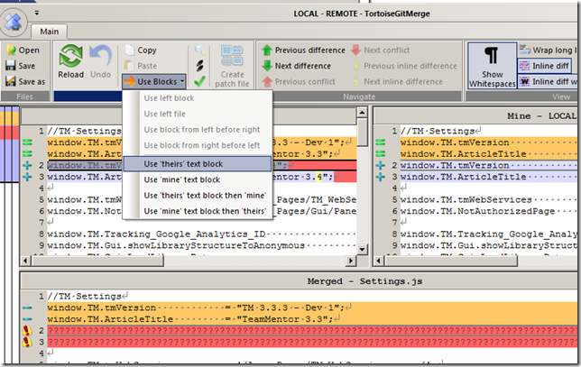](http://lh5.ggpht.com/-d33nP6-rZLg/UVHa0M0zyYI/AAAAAAAAAaY/rT4HA3E1vrg/s1600-h/image%25255B101%25255D.png)

The [https://tm-vulnerabilities.azurewebsites.net](https://tm-vulnerabilities.azurewebsites.net/) will now have the **_Lib_Vulnerabilities_** library

 [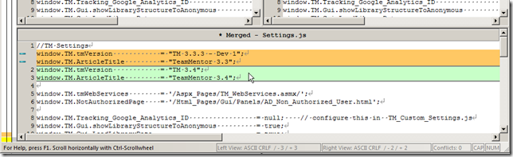](http://lh6.ggpht.com/-eoQdsUIEReI/UVHa1bEv_8I/AAAAAAAAAao/N5uKmLWPYgs/s1600-h/image%25255B104%25255D.png)
