## Releasing HotFix 1 for TeamMentor 3.3 (using Git to deploy updates to live servers)

This is how I updated the 3.3 version of TeamMentor to 3.3.1, which contained a fix for the [Password expiry cannot be set from the main TM GUI](https://github.com/TeamMentor/Master/issues/437) issue

Since we are now using the [Vincent Driessen GitFlow branching model](http://nvie.com/posts/a-successful-git-branching-model/) (see also these [Git-Flow](http://yakiloo.com/getting-started-git-flow/) scripts and this [great presentation](http://blog.diniscruz.com/2013/05/great-presentation-on-git-branching.html)), after the [issue 437](https://github.com/TeamMentor/Master/issues/437) was reported+prioritised, all development happened on a Feature Branch called [HotFix_3_3_1](https://github.com/TeamMentor/Dev/tree/HotFix_3_3_1) (which was created from a Pull Request from Ian's own [437-Password-Expiry](https://github.com/IanIan123/Dev/commits/%23437-Password-Expiry) dev branch).

Once TM's QA (ie. Roman) was happy with the patch, it was time to push it to the first batch of TM production servers (my responsibility was to update the [sme.teammentor.net](http://sme.teammentor.net/) server, while Roman updated the [tm4tm.teammentor.net ](http://tm4tm.teammentor.net/), and the rest will be updated by Michael K + Michael H). Technically I did a pull from those servers :)

Here are my steps:

**1) I RDP into the production server and opened up the respective TM folder** (which is a clone of https://github.com/TeamMentor/Master)

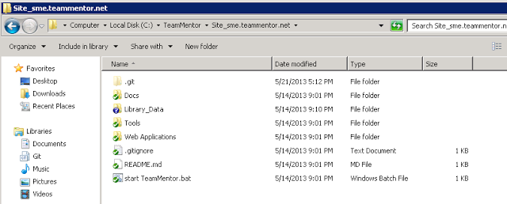

**2) opened up the Git Sync gui**  

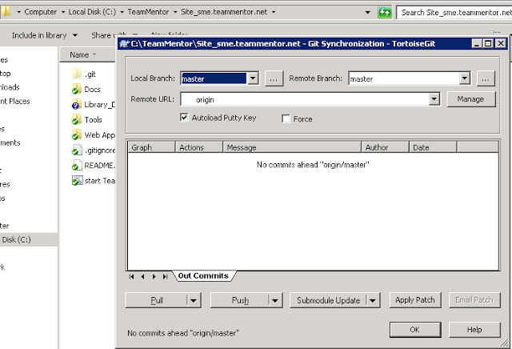

**3) and did a Pull**

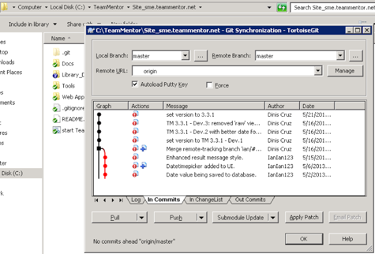

And that's it, update done :)

I would say that this took me about 1m and Roman says he did his in 58 secs :)

Just to make sure all is good:

**4) opened up sme.teammentor.net** (note the new version number on top right)

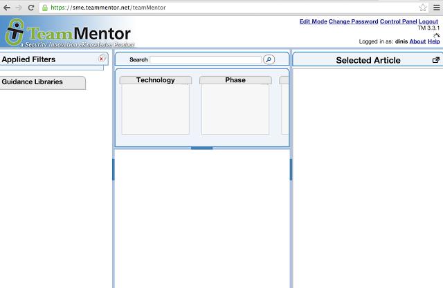

**5) and confirmed that all was good** (first load took a couple secs since there was a server side IIS W3WP process refresh, caused by the updated bin folder)

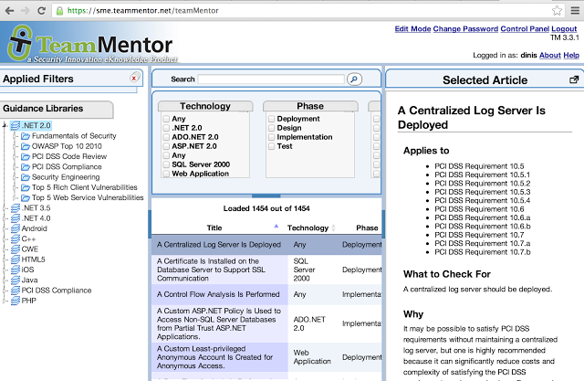

**6) I then opened TBot's user management page** (for my user)

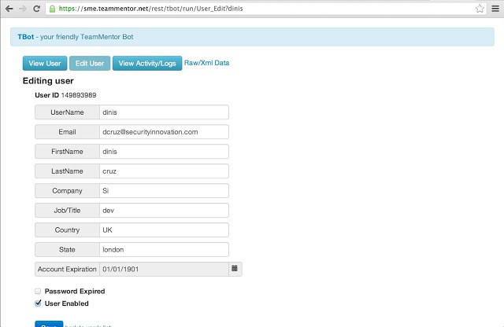

**7) changed the expiration date** (this was the [issue 437](https://github.com/TeamMentor/Master/issues/437) since it was not possible to change this value from the web (only via GitHub (see [Changing a User's ExpiryDate from GitHub hosted file](http://blog.diniscruz.com/2013/04/changing-users-expirydate-from-github.html)) or REPL script (see [Using CSharpRepl to batch change TeamMentor's users email and settings](http://blog.diniscruz.com/2013/04/using-csharprepl-to-batch-change.html)))

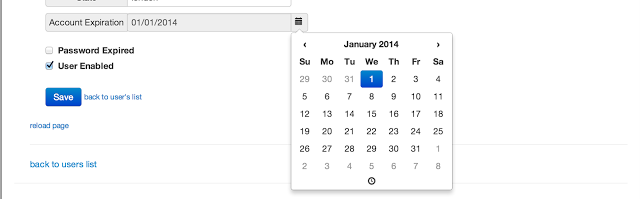

**8) Saved the changes**

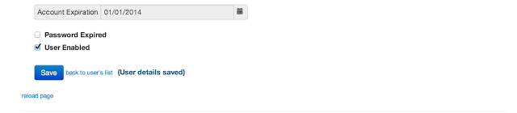

**9) and confirmed that they were committed ok locally (and into  GitHub)**

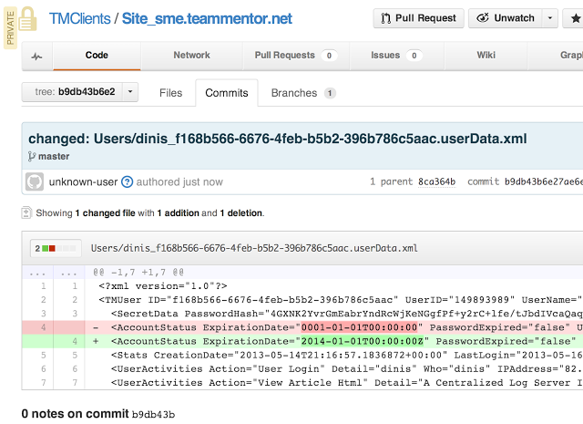

### **GitHub's Graphs and Git helper pages**

One of the great things about using GitHub as part of our workflow is that we can use its Graphing capabilities to visualize what is happening.

For example

**Here is the last commit:**

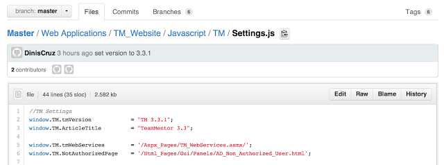

Which just changes the version number

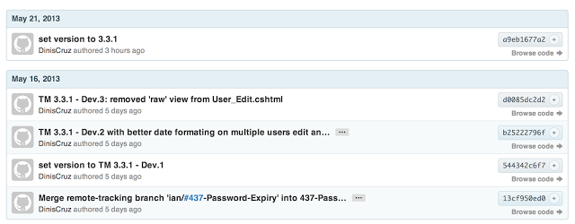

Note that this commit happen on the HotFix branch. So the next step is to push it into TeamMentor/Master (the production repo)

**This is what TeamMentor/Master looks like for 3.3** (before hotfix commits)  

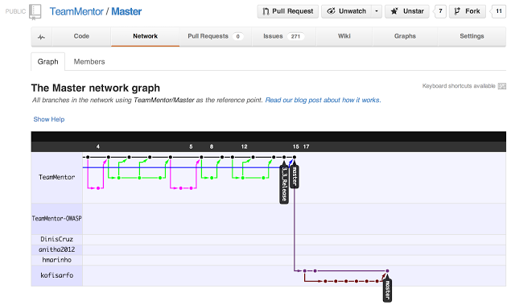

**This is what TeamMentor/Master looks like after the 3.3.1 commit**

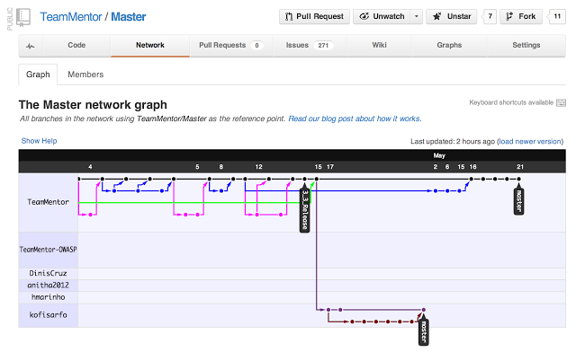

And this is what the TeamMentor/Dev Repo looks like after the commit (this is the development clone/fork, which has all the other feature branches)

I also update the Tags (using the commands described here [Adding Tags to TeamMentor Master repository](http://blog.diniscruz.com/2012/10/adding-tags-to-teammentor-master.html))

**Here are the git tags before the push:**

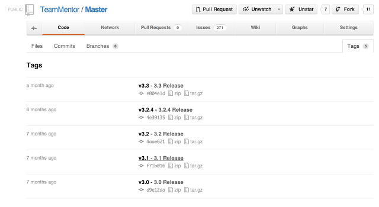

** Here are the Git tags after the tag push**  

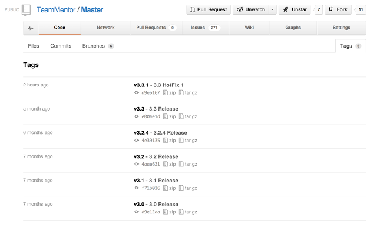
