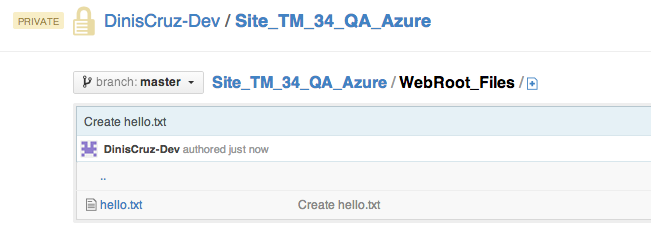
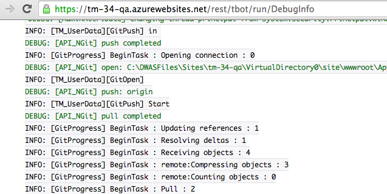
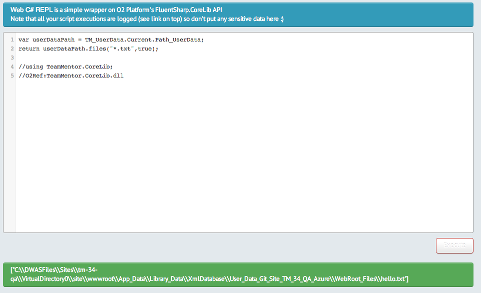
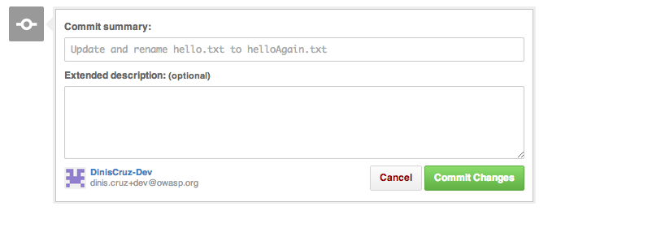

## Adding files to TeamMentor's web root via a UserData folder (synced with GitHub)

This post shows how to add custom files to the TeamMentor's webroot using a special feature of the TeamMentor's **_UserData_** folder.

In this demo I'm going to use the **_UserData_** [setup in this post](http://blog.diniscruz.com/2014/01/using-teammentor-34-tbot-admin-pages-to.html) (currently synchronised with a GitHub repo)

Basically we are going to edit a file in GitHub, which will end up in the root of the associated TeamMentor website (which is quite a powerful PoC and bug fixing feature).

First step is to go to the synced GitHub repo ([created here](http://blog.diniscruz.com/2014/01/using-teammentor-34-tbot-admin-pages-to.html)) and click the **Create a new file here** button in GitHub's UI:

... the next page allows us to define a folder name (which needs to be **WebRoot_Files** if we want these files to the copied to webroot of the current TeamMentor application) :

... and a file name (which can be anything):

... the file contents are added using the GitHub's text editor:

... and saved using the _Commit New File_ button:  

Here is the file added to the GitHub's **_UserData_** repo:

Here is the commit (created by GitHub)

Back in TeamMentor, if we click on the **Reload UserData**

A server side (to TeamMentor) git pull will occur, and the file added in the GitHub's UI is now also present in the local TeamMentor's **_UserData_** folder:

Note: in the next version of TM, the Git messages are much better (for example they will show the names of the files affected by a pull)

Here is a simple C# script that confirms that the file is already in the local **_UserData_** folder (this script was executed in the C# REPL that is part of TeamMentor's admin features)  

But, at this stage, if we try to open the **_hello.txt_** file in a browser, we will see that it doesn't (yet) exist:  

The reason is because the logic that checks for the existence of _WebRoot_Files_ in the current **_UserData_** folder, is only executed on server startup or cache reload.

The best solution is to go to the _TBot's_ **_Reload Server Object_**'s page and click on the **_Reload Cache_** button:

And once that is done, the **_hello.txt_** file will now exist in the TeamMentor's root folder:

Just to confirm that all is ok, let's try renaming that file in GitHub:

... to **_helloAgain.txt_**  

... saving it:

... checking that update commit is there:

... reloading the TeamMentor's cache:

... and finally confirming that the file has been updated in the live TM server.

**Note:** Doing this for **_*.txt_** file is not that interesting.

Where this technique will really show its power, is when we create **_*.aspx_** server-side pages, **_*.html_** client-side pages, **_*.ashx_** asp.net handlers  or **_*.cshtml_** Razor pages (these last ones will need to be placed inside a special **_TBot_** folder).

I will show how this works in one of my next blog posts.
