## Creating o2platform.com website using GitHub Pages (with screenshots of all design options)

In order to set-up a site for the [http://o2platform.com](http://o2platform.com/) domain, I just used GitHub Pages to create and publish a brand new site.

This is what it looks like:

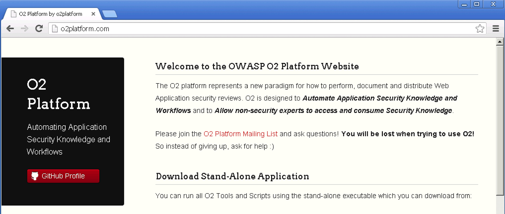

What do you think?

Please see below the other design options and let me know if I made a mistake. Also if you want help in editing this site, ping me with your GitHub account, and I'll give you push access (or fork the [o2platform.github.com](https://github.com/o2platform/o2platform.github.com) repo and send me  pull requests)

**Here is how I created it:**  

I went to the [https://github.com/o2platform/o2platform.github.com](https://github.com/o2platform/o2platform.github.com)** **repo, and on the settings page, I clicked on the **_Automatic Page Generator_**

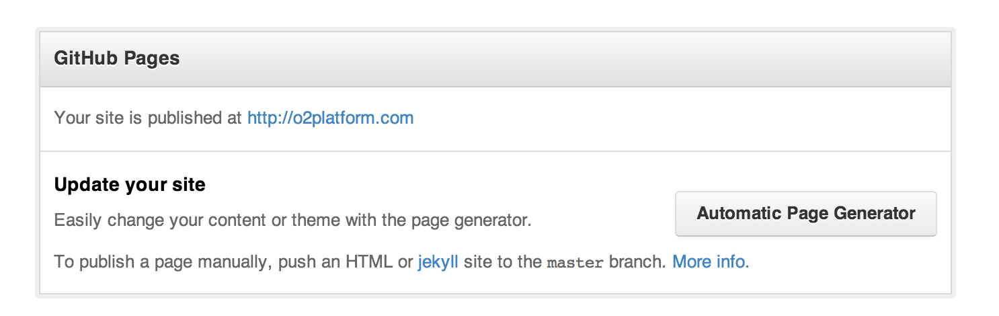

which opened up this page, where I added the content that is current on this blog's [O2 Platform](http://blog.diniscruz.com/p/owasp-o2-platform.html) page:

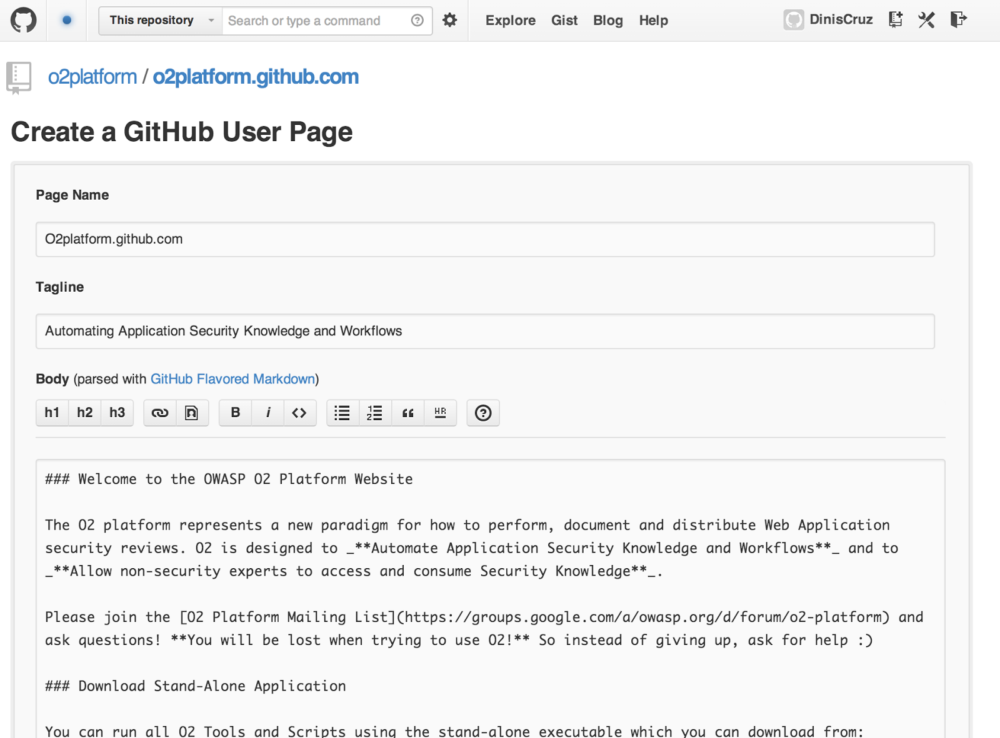

When finished I clicked on **_Continue to Layouts_**

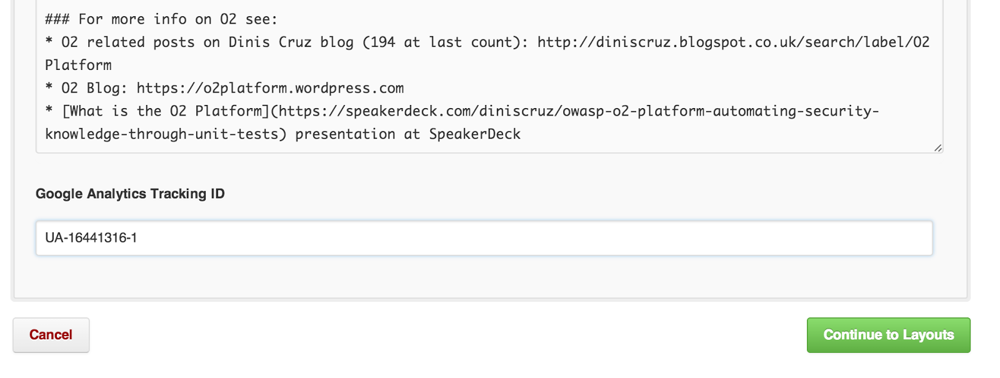

And I checkout the multiple design options:

**Slate:**

Merlot:**  

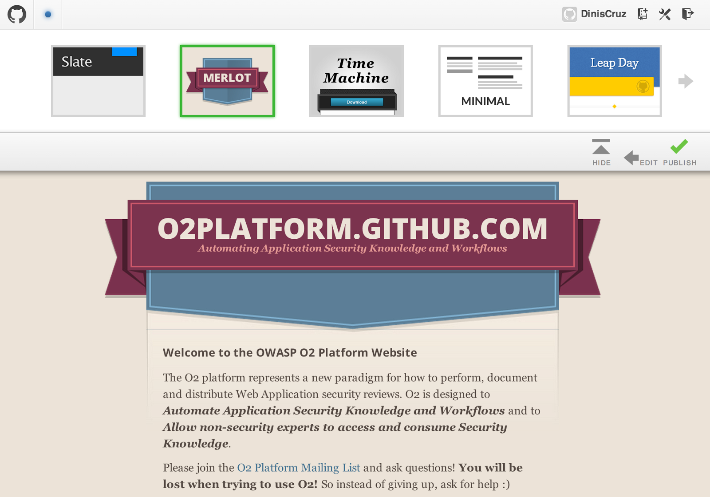

**Time Machine:**

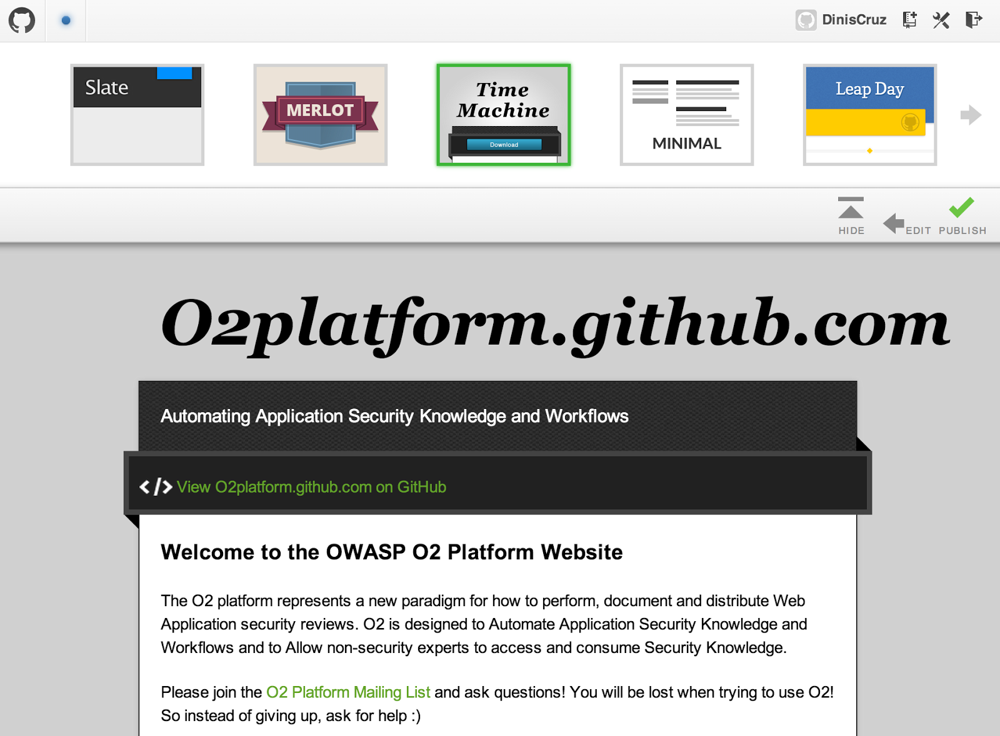

**Minimal:**

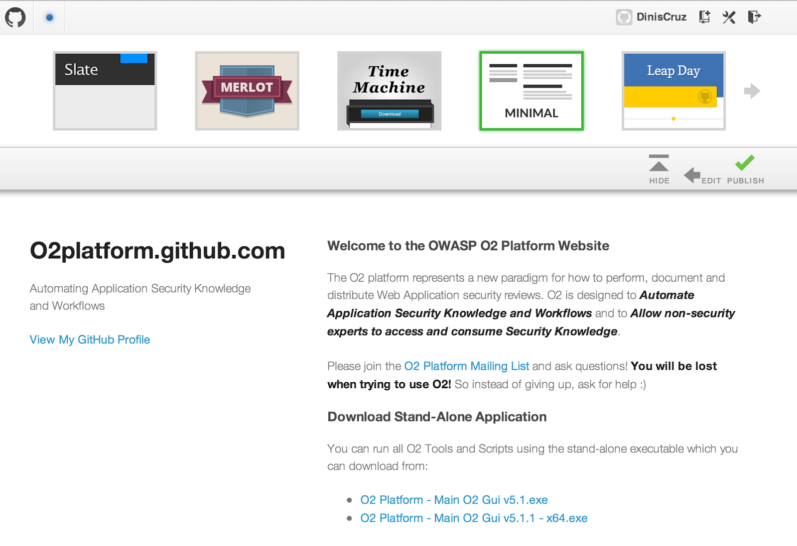

**Leap Day:**

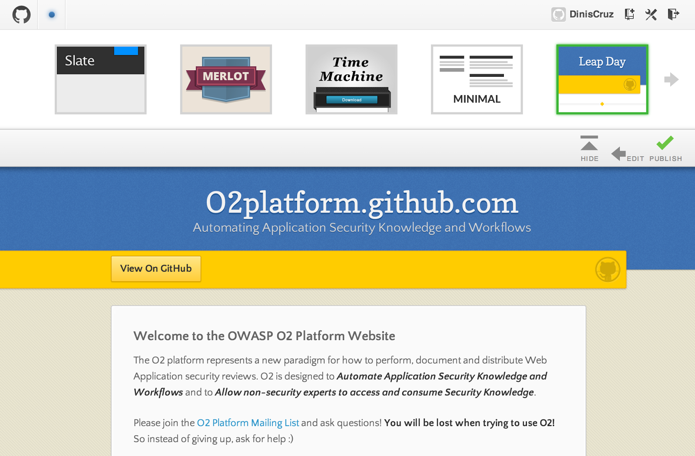

**Modernist:**

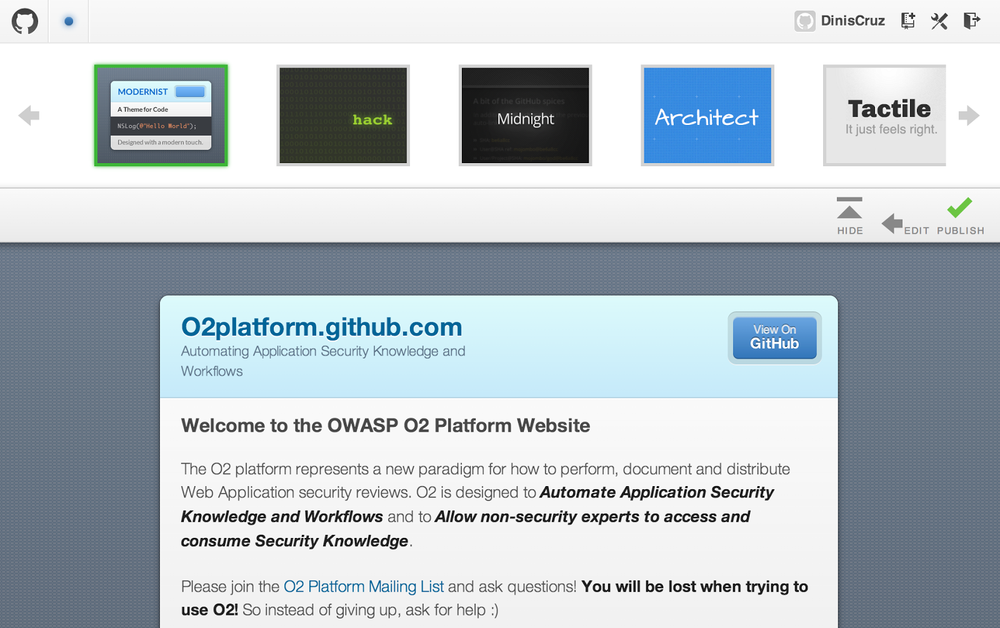

** Hack:**  

**Midnight:**

**Architect:**

**Tactile:**

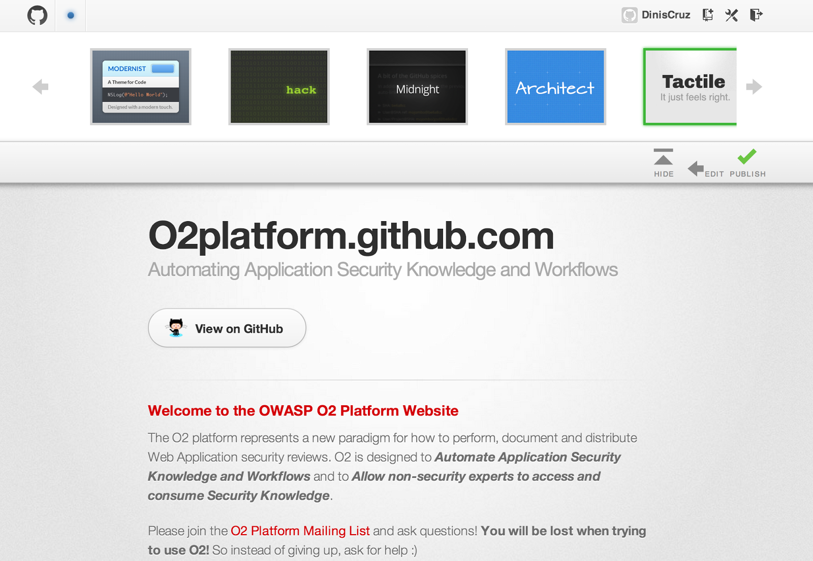

**And finally Dinky**

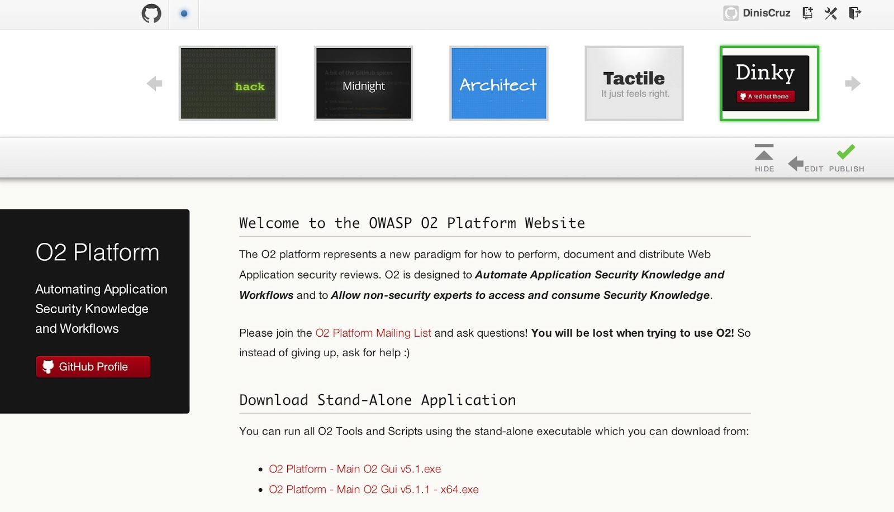

which was my preferred choice , so I clicked on **Publish**, and here it is in action (using the default domain provided by GitHub)** **

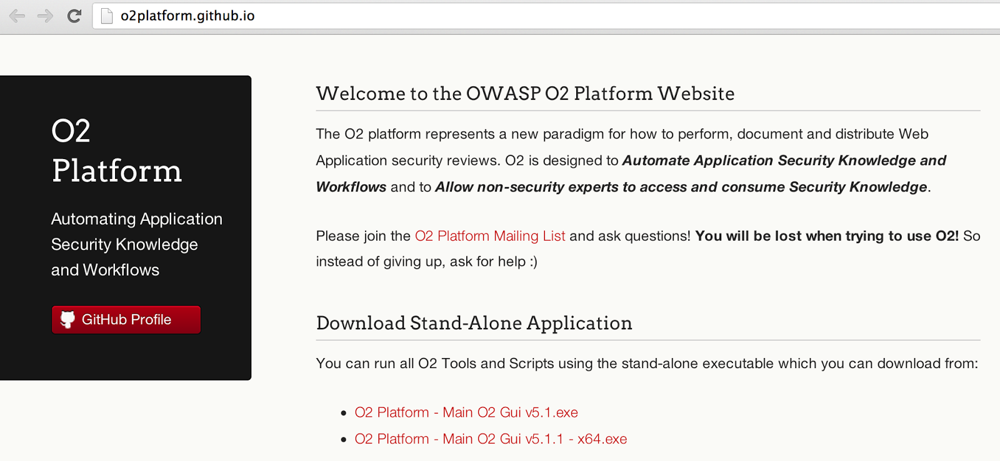

Next step was to set up custom domain, which is explained here:

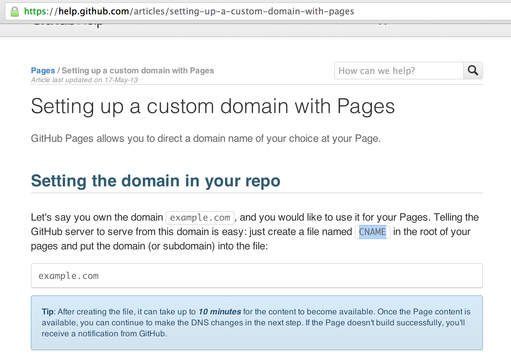

and is basically a case of creating new file:

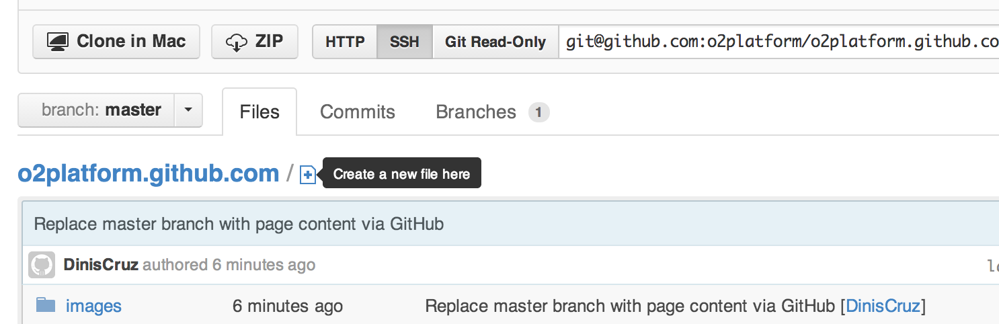

Called CNAME, with the contents of the domain

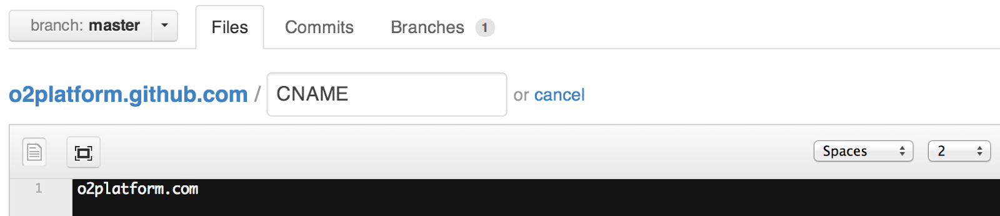

After saving it (and local cache flushed), the GitHub pages now point to [http://o2platform.com](http://o2platform.com/)  

