##  Adding files to TeamMentor's web root via a UserData folder (synced with GitHub) 

This post shows how to add custom files to the TeamMentor's webroot using a special feature of the TeamMentor's **_UserData_** folder.

In this demo I'm going to use the **_UserData_** [setup in this post](http://blog.diniscruz.com/2014/01/using-teammentor-34-tbot-admin-pages-to.html) (currently synchronised with a GitHub repo)

Basically we are going to edit a file in GitHub, which will end up in the root of the associated TeamMentor website (which is quite a powerful PoC and bug fixing feature).

First step is to go to the synced GitHub repo ([created here](http://blog.diniscruz.com/2014/01/using-teammentor-34-tbot-admin-pages-to.html)) and click the **Create a new file here** button in GitHub's UI:

[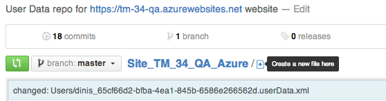](http://4.bp.blogspot.com/-jn7bgFUrsVc/UurkoG7ZToI/AAAAAAAAGVw/IuTeO54ne2Q/s1600/Screen+Shot+2014-01-29+at+13.58.56.png)

... the next page allows us to define a folder name (which needs to be **WebRoot_Files** if we want these files to the copied to webroot of the current TeamMentor application) :

[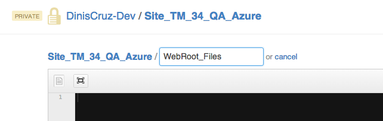](http://4.bp.blogspot.com/-ybYDRAexS44/UurkoJNBrqI/AAAAAAAAGVo/WS-LwjVHXew/s1600/Screen+Shot+2014-01-29+at+13.59.05.png)

... and a file name (which can be anything):

[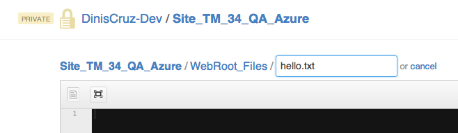](http://4.bp.blogspot.com/-4vx1E7NFdWw/UurkoAKAPHI/AAAAAAAAGVs/hg5UTlXnjEs/s1600/Screen+Shot+2014-01-29+at+13.59.18.png)

... the file contents are added using the GitHub's text editor:

[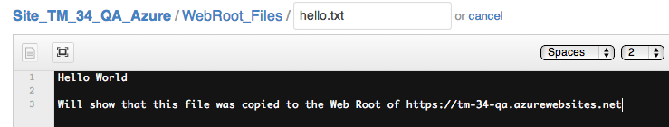](http://3.bp.blogspot.com/-we4jow4Cul4/UurkrH7mgnI/AAAAAAAAGWk/LJa6xLvDufg/s1600/Screen+Shot+2014-01-29+at+13.59.45.png)

... and saved using the _Commit New File_ button:  

[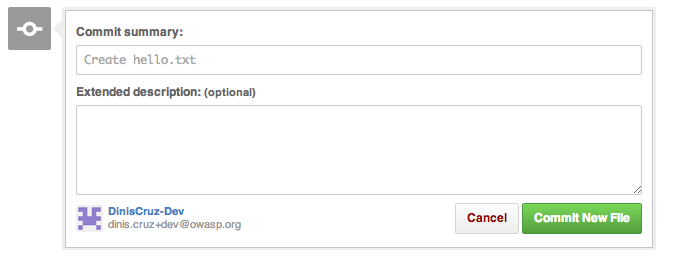](http://2.bp.blogspot.com/-Q34V7hkrad4/UurkpI07VOI/AAAAAAAAGWE/-ZWu4ZipOKw/s1600/Screen+Shot+2014-01-29+at+13.59.51.png)

Here is the file added to the GitHub's **_UserData_** repo:

[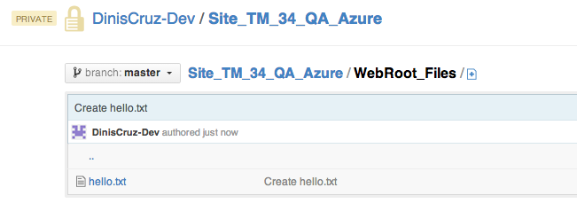](http://2.bp.blogspot.com/-RQ2Fd4CaSFU/UurkpOHwgxI/AAAAAAAAGWA/KaIN8Vw-kZI/s1600/Screen+Shot+2014-01-29+at+13.59.56.png)

Here is the commit (created by GitHub)

[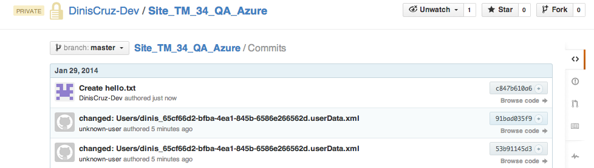](http://3.bp.blogspot.com/-bas8FZdh5zM/Uurkp7oGwqI/AAAAAAAAGWM/ZY426-bVNJQ/s1600/Screen+Shot+2014-01-29+at+14.00.03.png)

Back in TeamMentor, if we click on the **Reload UserData**

[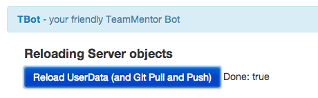](http://3.bp.blogspot.com/-VE2jBunkkho/UurkqDPVziI/AAAAAAAAGWU/wwXceGpuQSg/s1600/Screen+Shot+2014-01-29+at+14.00.23.png)

A server side (to TeamMentor) git pull will occur, and the file added in the GitHub's UI is now also present in the local TeamMentor's **_UserData_** folder:

[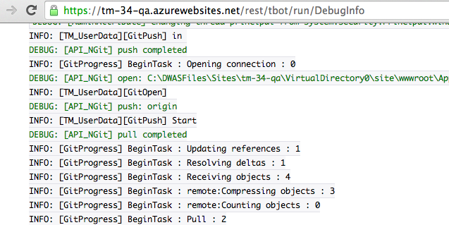](http://2.bp.blogspot.com/-o-nVMRMpbIQ/UurkqqLjKuI/AAAAAAAAGWc/FELMPMm9Hkk/s1600/Screen+Shot+2014-01-29+at+14.00.43.png)

Note: in the next version of TM, the Git messages are much better (for example they will show the names of the files affected by a pull)

Here is a simple C# script that confirms that the file is already in the local **_UserData_** folder (this script was executed in the C# REPL that is part of TeamMentor's admin features)  

[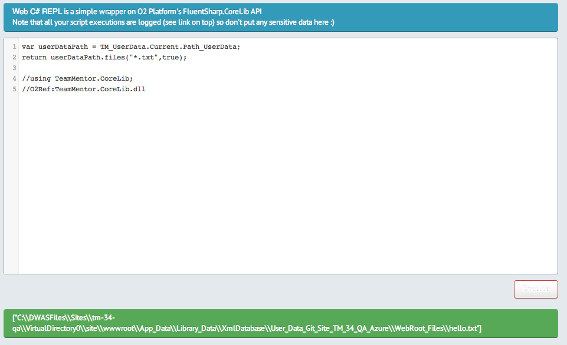](http://3.bp.blogspot.com/-xv2IW8OdiDU/UurktRC0yWI/AAAAAAAAGXU/LREz8YUKbjM/s1600/Screen+Shot+2014-01-29+at+14.02.27.png)

But, at this stage, if we try to open the **_hello.txt_** file in a browser, we will see that it doesn't (yet) exist:  

[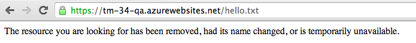](http://1.bp.blogspot.com/-PxEq9XQ-eO8/UurqcCnVi5I/AAAAAAAAGX4/aOkJH5txtm0/s1600/Screen+Shot+2014-01-31+at+00.12.06.png)

The reason is because the logic that checks for the existence of _WebRoot_Files_ in the current **_UserData_** folder, is only executed on server startup or cache reload.

The best solution is to go to the _TBot's_ **_Reload Server Object_**'s page and click on the **_Reload Cache_** button:

[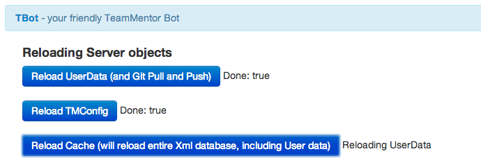](http://1.bp.blogspot.com/-IqnYsWlBC40/Uurkrqhk6qI/AAAAAAAAGW0/1JMk4aldJYE/s1600/Screen+Shot+2014-01-29+at+14.03.09.png)

And once that is done, the **_hello.txt_** file will now exist in the TeamMentor's root folder:

[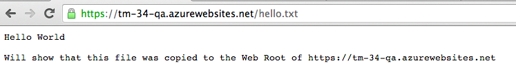](http://4.bp.blogspot.com/-fYdTwBbreFs/UurqcHS8OxI/AAAAAAAAGX8/oVshG6teLXE/s1600/Screen+Shot+2014-01-31+at+00.07.13.png)  

Just to confirm that all is ok, let's try renaming that file in GitHub:

[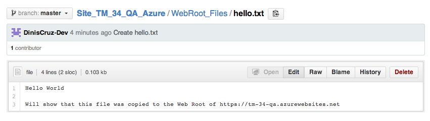](http://4.bp.blogspot.com/-r55iouYlrpY/Uurkr2dGPcI/AAAAAAAAGW8/EhZRaa8ffo8/s1600/Screen+Shot+2014-01-29+at+14.04.20.png)

... to **_helloAgain.txt_**  

[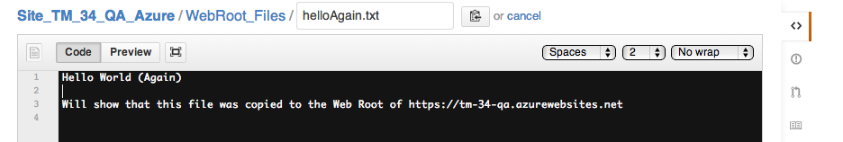](http://4.bp.blogspot.com/-AzNPSQ4yMQs/UurksWpLebI/AAAAAAAAGXE/GL3DmTF-zmA/s1600/Screen+Shot+2014-01-29+at+14.04.31.png)

... saving it:

... checking that update commit is there:

[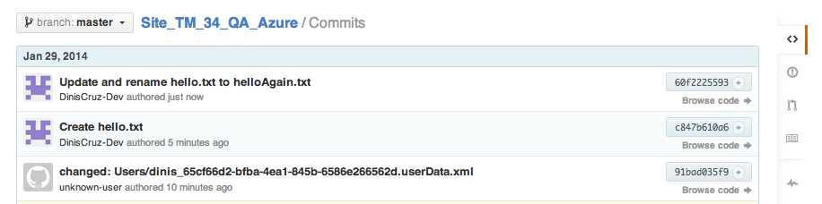](http://4.bp.blogspot.com/-n0bjryboEGQ/UurktLx-y-I/AAAAAAAAGXk/XJEBB2UW4s8/s1600/Screen+Shot+2014-01-29+at+14.04.48.png)

... reloading the TeamMentor's cache:

... and finally confirming that the file has been updated in the live TM server.

  
**Note:** Doing this for **_*.txt_** file is not that interesting.

Where this technique will really show its power, is when we create **_*.aspx_** server-side pages, **_*.html_** client-side pages, **_*.ashx_** asp.net handlers  or **_*.cshtml_** Razor pages (these last ones will need to be placed inside a special **_TBot_** folder).

I will show how this works in one of my next blog posts. 
