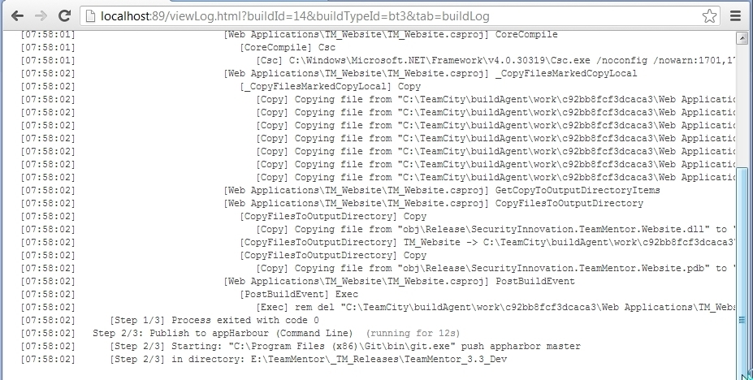
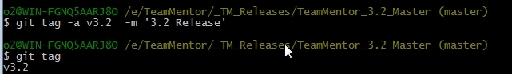
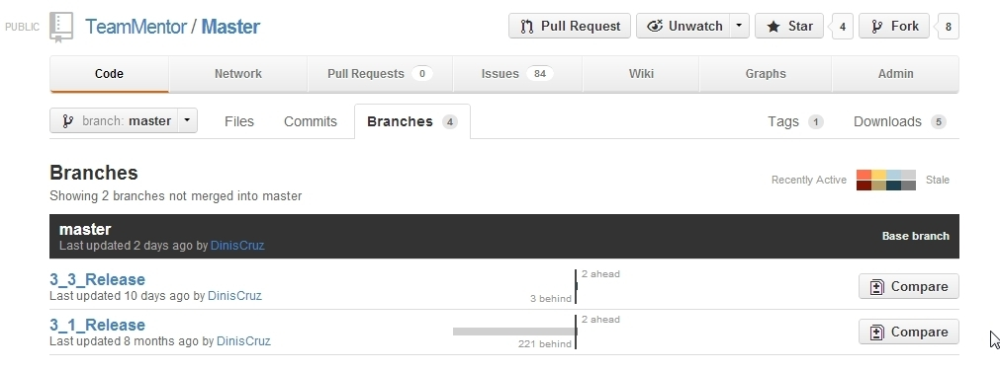
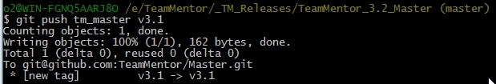
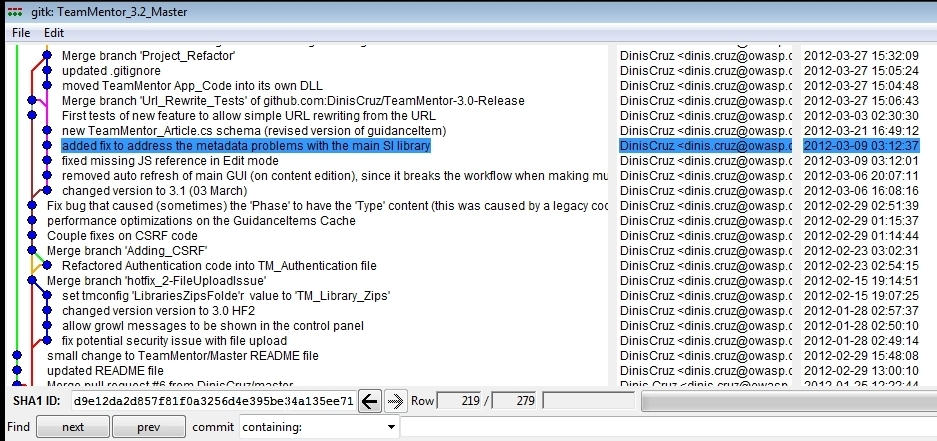

##  Adding Tags to TeamMentor Master repository 

With 3.2 out, its time to add some [Git Tags](http://git-scm.com/book/en/Git-Basics-Tagging) to the main [TeamMentor/Master](https://github.com/TeamMentor/Master/) repository (which at the moment has none):  
  

  
In a local Git Bash of this repository, we can create a tag using **$ git tag -a v3.2  -m '3.2 Release'**

  
Next we push that tag into GitHub using **$ git push tm_master v3.2**

And if we look back in GitHub's Tag page, we will see that our **v3.2 **tag is in there:

  

At the moment we are keeping track of the previous versions using Git Branches (but I think that tags will do a better job)

  
For example here is 3.1 release (with the _f71b016241 _id)

We can use this ID value to create the 3.1 tag

  
Use **gitk **to find the SHA1 ID of the 3.0 release

  
Which we use to create the 3.0 tag:

After pushing to GitHub, the Tag page looks like this:

What is really cool about these Git Tags is that they also provide a nice location to download a particular release :) 

- - - 
[Table of Contents](../Table_of_Contents.md)
