## Changing the 'View TM article by anonymous users' status via GitHub

From the 3.3. release of TeamMentor (TM) it is now possible to change configuration settings of live servers directly from GitHub.

For example I just published a QA version of the [https://services.teammentor.net](https://services.teammentor.net/) site on Azure's [https://tm-services.azurewebsites.net](https://tm-services.azurewebsites.net/)

Here is what [https://services.teammentor.net](https://services.teammentor.net/)  (on version 3.2.3) looks like:

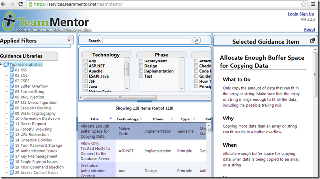

Here is what [https://tm-services.azurewebsites.net](https://tm-services.azurewebsites.net/) (on version 3.3 RC4) looks like:

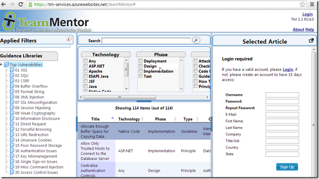

Can you spot the difference?

Here is the file (on GitHub) that controls if Anonymous users should be able to see TM's articles:

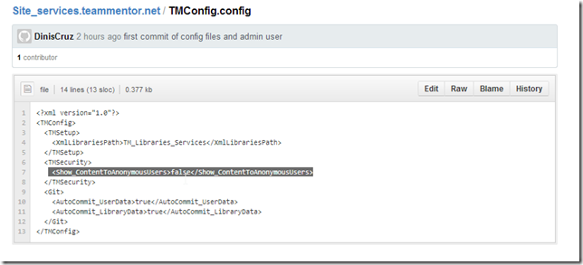

So the solution is to edit this file (in GitHub):

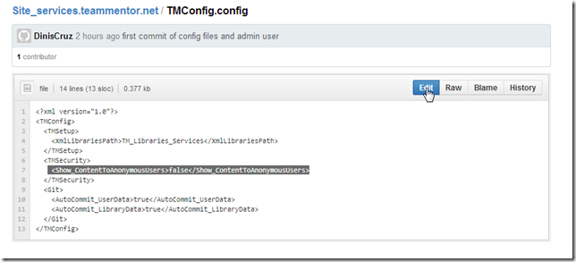

change that value to true:

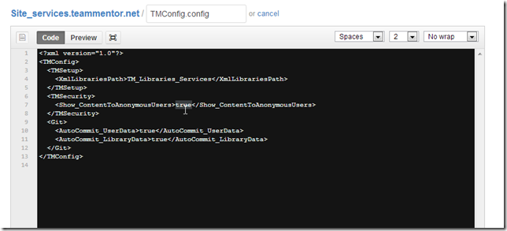

Commit that change in GitHub's UI:

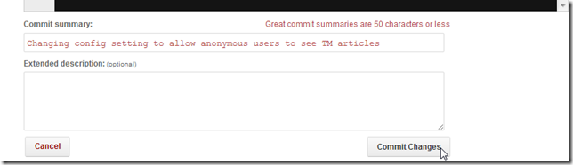

With this commit being now part of this repository:

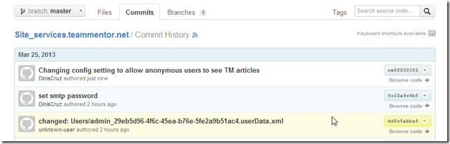

Next we go into the new Tbot interface ([https://tm-services.azurewebsites.net/tbot](https://tm-services.azurewebsites.net/tbot) ), which requires admin privs:

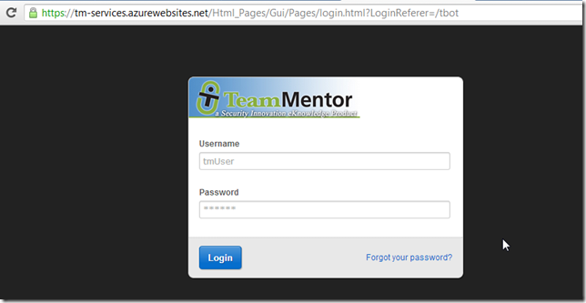

After login , open the **_'Reload Server Objects'_** page

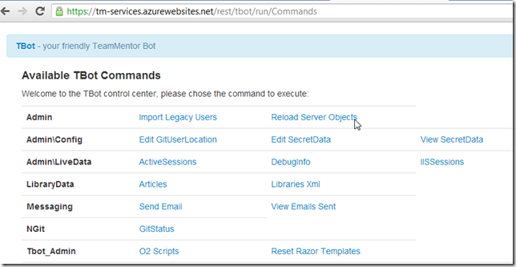

And click on the **_Reload UserData (and Git Pull and Push)_** button

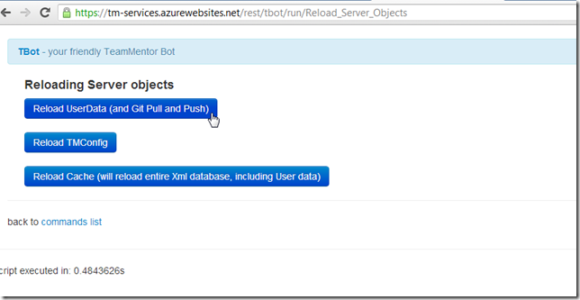

which when executed:

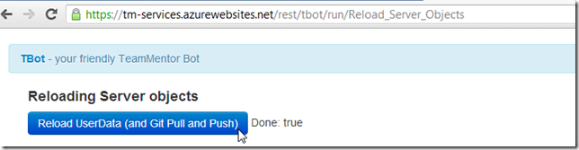

will have updated the local TMConfig.config file:

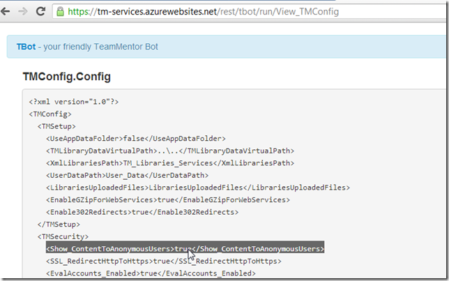

And if we logout, we will see the expected behavior:

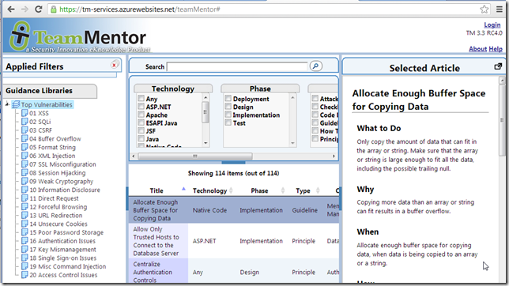

Finally, if we look at GitHub's commit history, we will see the commit we did in GitHub nicely merged with the commits that happened at the live server

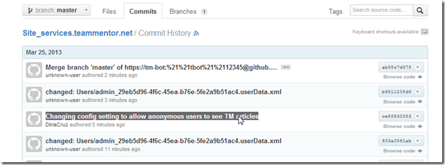

Here is the GitHub's Network Graph of this repository, which shows both types of commits (the ones performed at at the live server vs the one at GitHub)

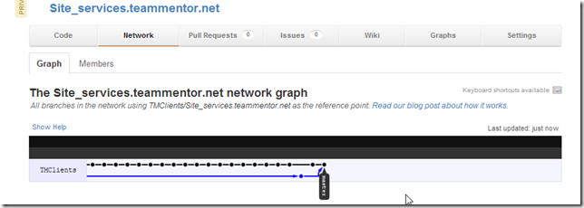
