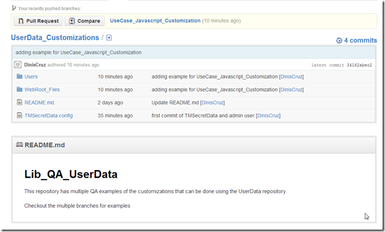

## Creating QA versions of TeamMentor UserData repository, and using branches to show/test the multiple config options

Now that a number of TeamMentor settings can be configured from the UserData repositories, we need a way to test and document what can be done.

Let's start by creating  a public GitHub repository ([https://github.com/TeamMentor/UserData_Customizations](https://github.com/TeamMentor/UserData_Customizations)) to hold the multiple examples/tests:  

Set the GitUser location to it:

And reload the user data:

Once the reload is complete, there will be a new folder called **_User_Data_Git_UserData_Customizations_** in the local XmlDatabase folder:  

Note that if you are running TM from localhost (as in the current example) then the user data will not be auto committed (due to the dynamic nature of UserData, if GitAutoCommit was enabled it would not be possible to load userdata repositories used on live TM sites (like the multiple _Site_nnn.git_ ones) without creating commit conflicts):

Before we move to the branches let's commit the current TMSecretData.config and admin files:

**Use Case #1: Changing version by running Customized Javascript code**

The first example is going to show how to execute some Javascript in the main TM Gui from a file provided in the user data folder.

Let's create a branch to hold the changes:

Add a folder called **_WebRoot_Files_**:

Add a folder called **__Customizations_** (inside the **_WebRoot_Files_**)

Add a JavaScript file called **_TM_Custom_Settings.js_** inside the **__Customizations_** folder:

Note: the reason for this file, is that it is automatically included (if it exists) in the Javascript consolidated download that is done on the main TM GUI. Here is the mapping file that also shows the execution order of this script:

Next edit the **_TM_Custom_Settings.js_** file and use it to (for example) change the **_TM.tmVersion_** value.

And in TBot , trigger a **_Cache Reload_**  

If you keep an eye in the TM_WebSite folder (the root of the TM website), you will see that it looks like this before the the **_Cache Reload_**  

and like this after the **_Cache Reload_**:

What happened is that the contents of the UserData's WebRoot_Files was copied into TM's web root.

Which means that the **_TM_Custom_Settings.js_** created above is now part of TM:

A hard refresh of the browser, will now show the customized **_TM.tmVersion_** value:

To wrap up this branch, let's modify the README.md file:

Commit the changes:

 

And push the branch to GitHub (note the explicit branch mapping on the git push command):

A quick look at GitHubs repo:

will show our branch and modified files:

**Use Case #2: Setting Google Analytics (server-side) value by running Customized C# code**  

In this example we will set enabled and configure the Server side google analytics settings (used to provide metrics on TM usage)

Note: see the [Running Customized C# code loaded from TeamMentor's UserData repository](http://blog.diniscruz.com/2013/04/running-customized-c-code-loaded-from.html) post to understand the role of the **_FirstScriptToInvoke.h2_** script

Let's create a new branch called **UseCase_CSharp_Customization** using as a starting point the existing **_UseCase_Javascript_Customization_**  

Modify the **_\WebRoot_Files\_Customizations\TM_Custom_Settings.js_** file:

In the User data repository (which is checkout into the **_UseCase_CSharp_Customization_** branch), add the **_H2Scripts_** folder

Inside that folder add the **_FirstScriptToInvoke.h2_** file

Which ([as explained in this post](http://blog.diniscruz.com/2013/04/running-customized-c-code-loaded-from.html)) will be executed on startup.

Before adding code to the **_FirstScriptToInvoke.h2_** file, its to good to test/debug that code using the TM's CSharp REPL:

and confirm on the log viewer that Google Analytics (GA) calls are now being logged:

Once we're happy with the C# snippet to execute, we can add it to the **_FirstScriptToInvoke.h2_** file:

To double check that the Google Analytics (GA) settings are being configured on TM setup, I restarted Cassini, and confirmed that the log viewer shows the **_FirstScriptToInvoke.h2_** file execution:

and the successful configuration/use of Google Analytics:

Final step is to update the README.md file

Add the files to git

Commit the changes:

And push Commit into a new branch at GitHub:

