## Deploying TeamMentor to AppHarbor (.NET Cloud) using Git push

Now that AppHarbor supports git publishing (i.e. they create a git repository for an 'AppHarbor Application'), it is very easy and fast to deploy a new version of TeamMentor.

First step is to go to AppHarbor.com and create an application (for this example I'm calling it **'Testing-AppHarbor'**):  

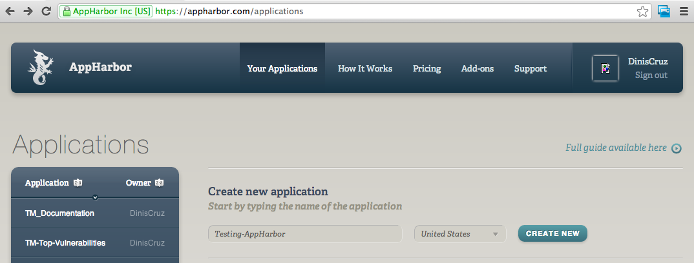

Once the application is created, click on the bottom-left 'Repository URL' button, which will copy to your clipboard the AppHarbor Git url:

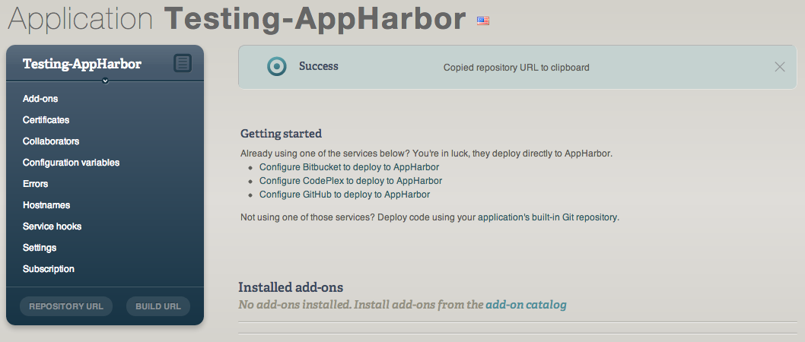

In this example it was: https://DinisCruz@appharbor.com/testing-appharbor.git

Next open an GitBash on the repository you want to push and execute:

**$ git remote add appharbor_test https://DinisCruz@appharbor.com/testing-appharbor.git**  

**$ git push appharbor_test master**  

After a bit (depending on your upload speed) you should get a Git push message

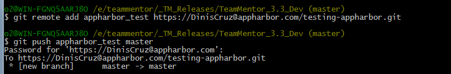

Back in the AppHarbor website, the application page should look like this:

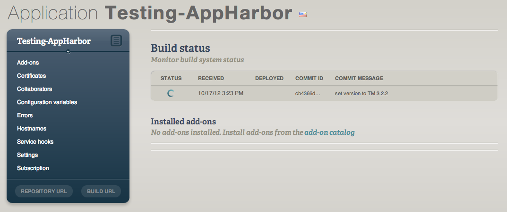

You can click on the icon under the 'Status' column (the one animating) to see the current status of the build (note that sometimes AppHarbor takes a couple minutes to trigger the compilation process)

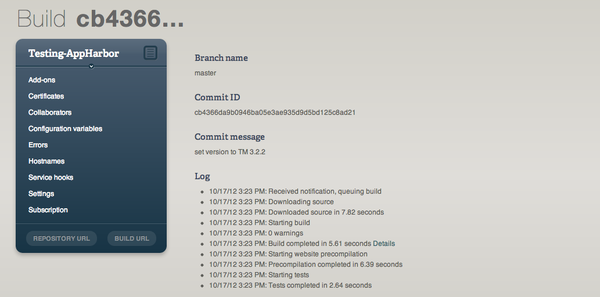

The **'Details'** link can be used to see the MSBuild compilation log (very useful when the compilation fails)

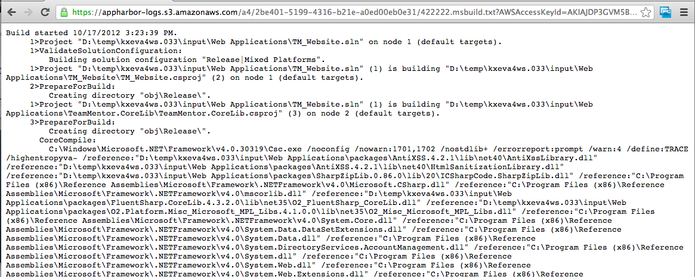

Once the build and deployment is done, if you go back to the Application page you should see that your build is now Active

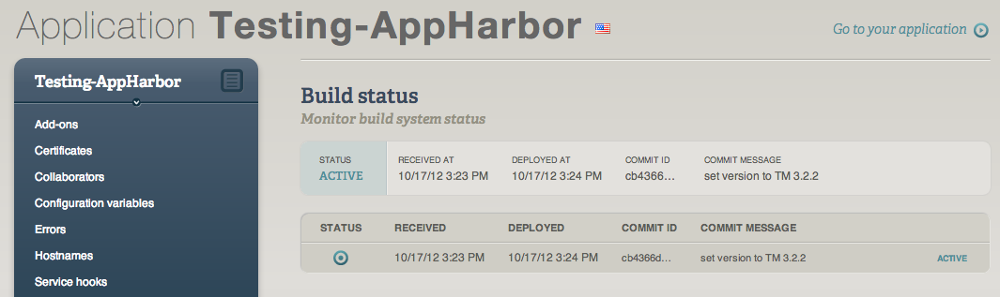

And clicking on 'Go to your application' will take you to the website you just created

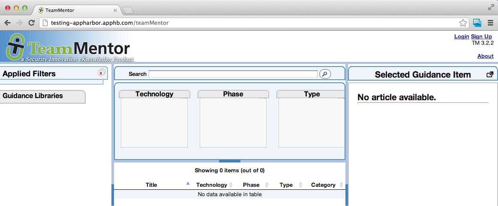

By default there are no libraries installed from a [TeamMentor/Master](http://github.com/teammentor/master) clone/copy, but this is easily solved by:

  * logging in as **Admin**,
  * going to the **Control Panel**
  * choosing the **Advanced Admin Tools **option
  * using the **Install/Upload Libraries** tool.

For example, click on the **_'Top 20 Vulnerabilities'_** link to add the Library hosted at GitHub's [TeamMentor/Library_Top_Vulnerabilities](https://github.com/TeamMentor/Library_Top_Vulnerabilities) (TeamMentor engine will go to that repository, download the ZIP file and install it)

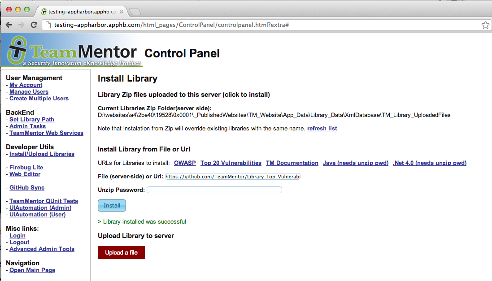

Once that is done, click on 'Open Main Page' to go back to the main TM Gui where the 'Top 20 Vulnerabilities' Library is now installed:

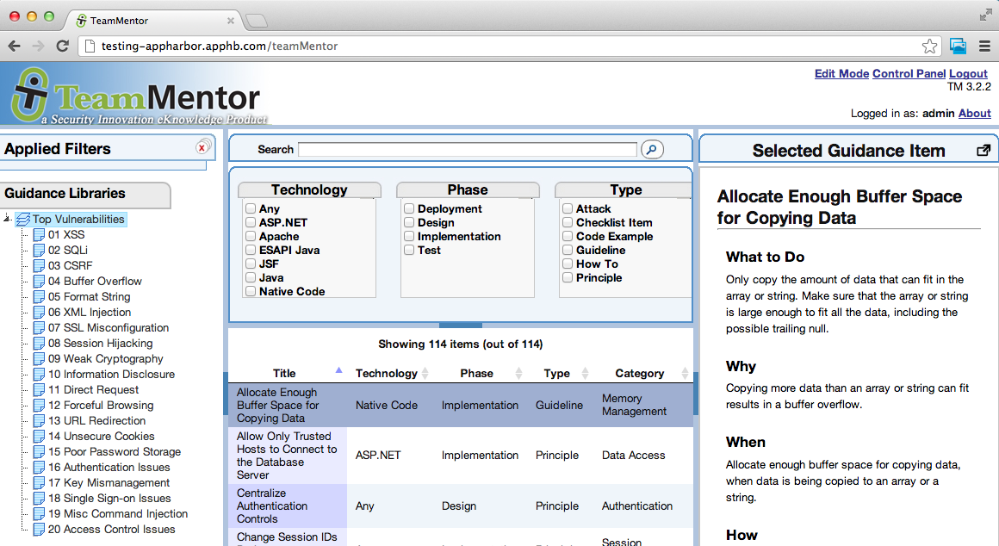

**Auto deploy on GitHub Commit**  

So far we talked about how to push an git repository into AppHarbor from your local disk, but that is not the only way you can do it.

AppHarbor also supports [GitHub Service Hooks](https://github.com/github/github-services) which can be configured via the GitHub's repository admin panel.

For example, here is how I use AppHarbor to create a new deployment every-time I do a Git Push into the main TeamMentor/Master repository (which is very useful for QA and Testing)

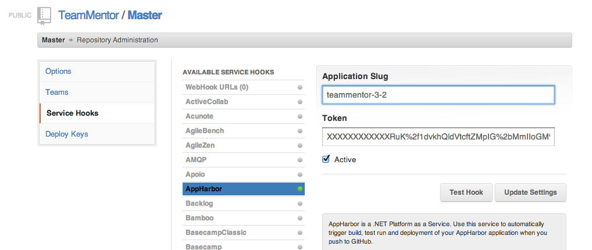
