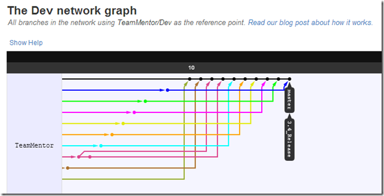
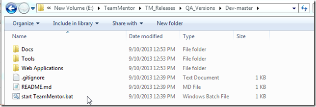
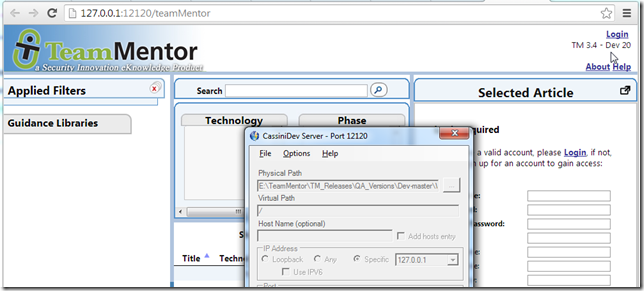

## Example of using GitHub Pull Requests to merge changes made on Branches

After the fixes explained in the [Git Flow - Moving patches from one Commit into another Commit](http://blog.diniscruz.com/2013/09/git-flow-moving-patches-from-one-commit.html)  post and the reset of the TeamMentor 3.4 branch, Michael reapplied his other changes/fixes to the correct 3.4 commit, and I'm now in the process merging his Pull Requests into the 3.4_Release branch (and eventually into the master branch).

This post walks through my current workflow.

At the moment there are a number of Pull Requests to process:  

... which were all created using Git Branches:

In the image above, the top lines show the commits/branches that have already been committed, and the bottom ones the branches that still need to be committed (currently on the 'open' Pull Requests)

**Git Pull Request workflow**

1) open the Pull Request page:

2) click on the link to the issue that is being fixed:

3) read the issue (and its history)

4) back in GitHub's Pull Request, click on the **_Files Changed_** link to see the proposed code changes:

5) if I'm happy with the request, on the '_Discussion_' tab, I click on the **_Merge pull request_** button

... followed by **_Confirm merge_**  

6) optional: if this was under a repo that I owned, I would also delete the branch, in this case, Michael will have to do it on his repo/fork)

7) optional: confirm on GitHub's Network Graph that the merge happened ok (i.e. the commit is now on the **_3.4_Release_** branch and the **_Issue_462_** branch no longer is shown on Michael's fork)

8) optional: check that the respective issue has been correctly tagged/linked with this pull request

... do this for the other Pull Requests....

Here is how the Network Graph looks like after all merges have occurred:

At the moment there are only two branches that need to be merged:

1) [https://github.com/TeamMentor/Dev/pull/85](https://github.com/TeamMentor/Dev/pull/85) : currently conflicting (i.e the merge cannot happen automatically):

2) [https://github.com/TeamMentor/Dev/pull/87](https://github.com/TeamMentor/Dev/pull/87) -- no idea what issue this is fixing (the link to the GitHub issue is missing)

Hopefully this shows the power of Git and GitHub's commit/review workflow where:  

* each bug has a separate Issue, Branch and Pull Request
* code review of proposed changes is really easy to do
* multiple fixes can be done in parallel with very view conflicts
* conflicts (when exist) are easy to indentify and deal with
* GitHub's visualizations make a massive difference in making this workflow really smooth
* everything done by GitGub is based on git commands, which means that all actions could had been done locally, on git clones of [TeamMentor/Dev](https://github.com/TeamMentor/Dev) and [michaelhidalgo/Dev](https://github.com/michaelhidalgo/Dev)

In fact, speaking of a manual step, now that we have the 3.4_Release with (just about) the final set of commits, I'm going to merge the 3.4_Release branch with the master branch (which will eventually become the release one)

To do that, I opened a (local) clone of TeamMentor/Dev:

... updated it (since it is out of date with the changes made directly on the GitHub's version), using the command: **_$ git pull origin_**  

... see all branches available, using the command:  **$ git branch --a**  

... merged **_3.4_Release_** branch into **_master_** branch, using the command **$ git merge remotes/origin/3.4_Release**  

... pushed these changes into GitHub, using the command **$ git push origin master:master**

(note how no files were changed with this push, since all data was already in the 3.4_Release branch, this commit was just saying to GitHub's version: '_please point the master branch into the 3.4_Release commit_')

After this commit, GitHub's network graph will show that the **_master_** branch is now at the same commit as the **_3.4_Release_** branch

But we are not done here, we will still need to update the compiled TeamMentor Dlls (and see if any UnitTests broke)

Let's start by opening up the solution file in VisualStudio 2010:

... then clean and build the solution:

... which succeeded ok:

Next, change the version number to **_TM 3.4 -- Dev 20_**  

And start TM locally (just to see is all looks good):

Now, its time to run all UnitTests (in this case using ReSharper NUnit plugin):

... with two tests failing:

The first one was easy to fix (it was a case of updating the UnitTests to the changes made to the **_TM_User_** required fields):

The 2nd one was caused because the Google Analysis file has changed:

Here is the test that does this check:

... which basically checks that the [http://www.google-analytics.com/ga.js](http://www.google-analytics.com/ga.js) we are using is still the same one served by google (this is a good security practice since TeamMentor's security is not dependent on Google's server).

The fix is to update that file:

... and rerun all tests (just to confirm it):

**Committing changes made locally.**

Keeping up with the model of only doing commits on branches, I quickly created a new branch, using the command: **_$ git checkout --b 3.4_Dll_Updates_**  

(note how the small changes I made were also marked as 'Modified (namely the version change, the UnitTests fixes and the recompiled dlls)

... added the files to be committed using the command: **_$ git add ._**  

... created an commit using the command: **_$ git commit -m 'Changing version, adding compiled Dlls, fixing couple UnitTests'_**  

... pushed this branch to GitHub (not 100% necessary, but it will help with the graph), using the command **_$ git push origin 3.4_Dll_Updates:3.4_Dll_Updates_**  

... applied these changes to the 3.4_Release branch (locally and at GitHub), using the commands:  

* _$ git push origin 3.4_Dll_Updates:3.4_Dll_Updates_
* _$ git checkout 3.4_Release_
* _$ git merge 3.4_Dll_Updates_
* _$ git push origin 3.4_Release:3.4_Release_

(note that this is an example of a 'manual Pull Request')

A quick look at GitHub's network graph, shows the **_3.4_Release_** branch at the same commit as **3.4_Dll_Updates** branch (both one commit behind the **_master_** branch)

Finally we update master with these changes, using the commands:  

* **_$ git checkout master_**
* **_$ git merge 3.4_Release_**
* **_$ git push origin master:master_**

... and now all branches are at the same level:

**Testing QA version created by TeamCity and deployed to Azure:**  

As shown in  [past blog posts](http://blog.diniscruz.com/search/label/TeamCity), we also have TeamCity configured to monitor TeamMentor commits and auto-publish new builds into Azure.

In this case after the latest commit into GitHub TeamMentor/Dev master repo, TeamCity picked up the changes and:  
* Built the code
* Published to Azure
* Run all unit-tests

At the moment there is one unit failing:

... which doesn't look problematic (it fells like a TeamCity specific case).

The Azure deployment went ok:

With a clean version of TM ready for testing:

...easily populated with a couple libraries:

**Running TM locally from Zip File**

A final test is to go to the main [https://github.com/TeamMentor/Dev](https://github.com/TeamMentor/Dev) site and click on the [Download Zip](https://github.com/TeamMentor/Dev/archive/master.zip) button:

...extract the zip files into a local folder, and click on the 'start TeamMentor.bat' file:

...which will start the .Net Cassini webserver on port _12120:_  

_(note how the version number matches the commit made earlier)_

At this stage:  

* TM is just about ready for a final round of QA
* TM 3.4 RC1 will be created as soon as:
  * Michael fixes the couple pending issues
  * All UI UnitTests pass
  * All backend UnitTests pass (shown above)
