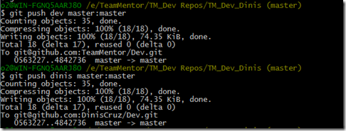

## Fixing a couple bugs and pushing new TeamMentor 3.4 Dev Version (from 4 to 5)

This post shows one way to use GitHub to update the main development branch of TeamMentor.

At the moment [TeamMentor/Dev](https://github.com/TeamMentor/Dev) repo  is at version **_3.3 -- Dev 4_**

This version was pushed on Friday, and it introduced a nasty side effect on the wsdl generation (see issue [546](https://github.com/TeamMentor/Master/issues/546)) and a minor bug in the user edit (from the old control panel).

Both probs were picked up by Michael's TM UI Unit Tests, which is another good example of the power of that type of UI/Browser integration tests.

So, I went into my local dev repo, made the code fixes, checked that they were working and executed all unit tests (to make sure we are still good)

Next I committed the changes locally:

And pushed the commit to the main Dev repo and my personal Dev repo (this is the same as doing a Pull Request and authorizing it via the GUI):

Since TeamCity is configured to run on commit the master branch of TeamMentor/Dev a quick look at its web interface shows that the build started

... after 4m:13s the build was completed, with all unit tests are passed and

... and the Dev QA site pushed into Azure:

