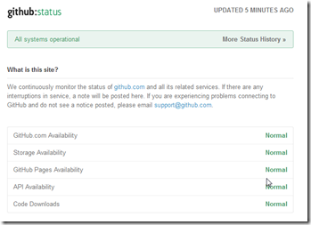
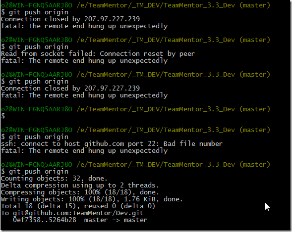

## GitHub.com needs to improve their the 'Normal' status definition and error reporting dashboard

At the moment (i.e. when I wrote this post), all should be 'Normal' with GitHub, since according [to their status](https://status.github.com/), their world looks like this:   

But to me here, a simple/small git push took about 5 minutes of retries:

which doesn't look 'Normal' to me!

I think **GitHub.com needs to improve their  the 'Normal' status definition and error reporting dashboard**

Note that yesterday was the same thing.

Something weird is going on in GitHub's land
