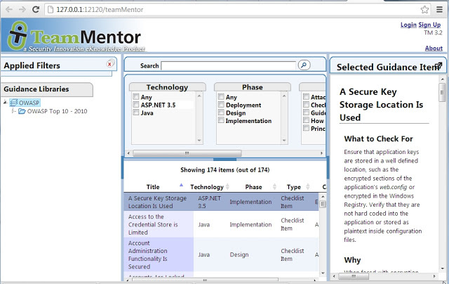
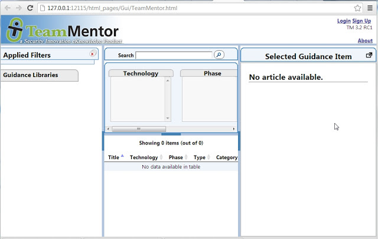
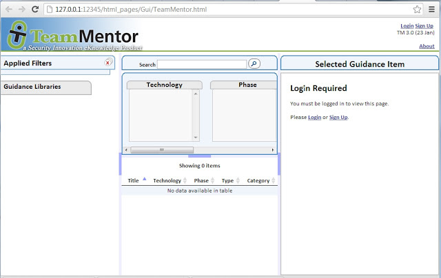

##  Going back in time using Git's checkout

I'm still amazed at Git's speed in moving back and forwards in time. For example I was trying to find a particular GUI that we created for TeamMentor and was able to use git checkout to look at previous versions:

**git checkout master** (25 Oct 2012  TM 3.2)

**git checkout dd867bfb4b9519c3b9c6ddfe2c0f9b1f6720f162** (4th Sep 2012: TM 3.2 RC1) :

**git checkout 890caa053feee04bf0b7139787e0ee6100963771** (23rd Jan 2012: TM 3.0) :

**git checkout 557177691139bf2385973b45bf39508042a11621** (18th Jan 2012: TM 3.0 RC9) :

[

Looking at these images, I thought of a cool script to write (here it is in pseudocode):

    foreach id in avaiable_checkouts_
    {
           git checkout id    
           {  
              start webserver  
               open default page in browser (if possible 'add a library if not there')  
               take screenshot (only store unique values and if possible 'add watermark with version and date')        
               close web server  
          }  
    }      
    create animation from screenshots taken _

It's all doable with O2's APIs (I just don't have the time today)  :)
