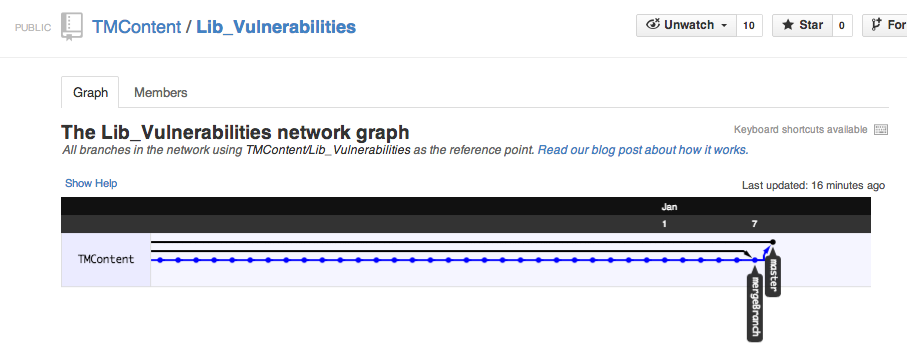

## How to update a forked GitHub repo (in this case tm-sme/Lib_Vulnerabilities)

Today I helped to update the [tm-sme/Lib_Vulnerabilities](https://github.com/tm-sme/Lib_Vulnerabilities) repo which is a fork of the [TMContent/Lib_Vulnerabilities](https://github.com/TMContent/Lib_Vulnerabilities) and is being auto-updated in real-time when changes made to the [https://sme.teammentor.net/](https://sme.teammentor.net/) server (i.e every time there is a content change in [https://sme.teammentor.net](https://sme.teammentor.net/) there is a server-side _git commit_, followed by a _git pull_ to [tm-sme/Lib_Vulnerabilities](https://github.com/tm-sme/Lib_Vulnerabilities) (which is a pretty sweet workflow))

The issue we had was how to push the changes from [tm-sme/Lib_Vulnerabilities](https://github.com/tm-sme/Lib_Vulnerabilities) into the [TMContent/Lib_Vulnerabilities](https://github.com/TMContent/Lib_Vulnerabilities)  repo, so that they can be synced back to [https://vulnerabilities.teammentor.net](https://vulnerabilities.teammentor.net/)

Note: this workflow would had been easier if the two repos where in sync, but it happened that there was one commit made to [TMContent/Lib_Vulnerabilities](https://github.com/TMContent/Lib_Vulnerabilities) (which is the master repo) on the [13th of Dec (d26f385)](https://github.com/TMContent/Lib_Vulnerabilities/commit/2e64495adc41ad74a517ddeb010d0368dd26f385) in between a bunch of updates to the [tm-sme/Lib_Vulnerabilities](https://github.com/tm-sme/Lib_Vulnerabilities) repo (done automatically by TeamMentor). Bottom line: at this stage the repos are not compatible, which is why the GitHub Pull Requests don't work.

**Here are the Git commands I executed locally to merge these repos successfully:**

**Step 1)** Clone repo and try to do a simple pull

1) git plugin$ git clone git@github.com:tm-sme/Lib_Vulnerabilities.git  
2) cd Lib_Vulnerabilities/  
3) git remote add upstream git@github.com:TMContent/Lib_Vulnerabilities.git  
4) git checkout -b mergeBranch  
5) git pull upstream master:mergeBranch  
which doesn't work:

> ! [rejected]        master     -> mergeBranch  (non-fast-forward)_

**Step 2)** Create a local (forced) copy of the main repo and do the merge locally

6) git checkout -b upstreamVersion

7) git pull -f upstream master:upstreamVersion

8) git checkout mergeBranch

9) git merge upstreamVersion

which works:

>        Merge made by the 'recursive' strategy.
>        LICENSE.TXT | 50 ++++++++++++++++++++++++++++++++++++++++++
>        1 file changed, 50 insertions(+)
>        create mode 100644 LICENSE.TXT

**Step 3)** push the merged files to both repos

10) git push origin mergeBranch:mergeBranch

>        Counting objects: 7, done.
>        Delta compression using up to 4 threads.
>        Compressing objects: 100% (5/5), done.
>        Writing objects: 100% (5/5), 3.99 KiB | 0 bytes/s, done.
>        Total 5 (delta 2), reused 0 (delta 0)
>        To git@github.com:tm-sme/Lib_Vulnerabilities.git
>         * [new branch]      mergeBranch -> mergeBranch

11) push upstream mergeBranch:mergeBranch

>        Counting objects: 2971, done.
>        Delta compression using up to 4 threads.
>        Compressing objects: 100% (774/774), done.
>        Writing objects: 100% (2890/2890), 431.68 KiB | 0 bytes/s, done.
>        Total 2890 (delta 2199), reused 2801 (delta 2116)
>        To git@github.com:TMContent/Lib_Vulnerabilities.git
>         * [new branch]      mergeBranch -> mergeBranch

**Step 4)** merge into main branch of main repo

12) ... the next step was done on GitHub using a Pull Request on the [TMContent/Lib_Vulnerabilities](https://github.com/TMContent/Lib_Vulnerabilities)  repo

>       git push upstream mergeBranch:master

**Step 5)** update local master and forked repo master

13) git checkout master

14) git pull upstream master:master

15) git push origin master:master

**Here is what the main repo looks after the merge**  

