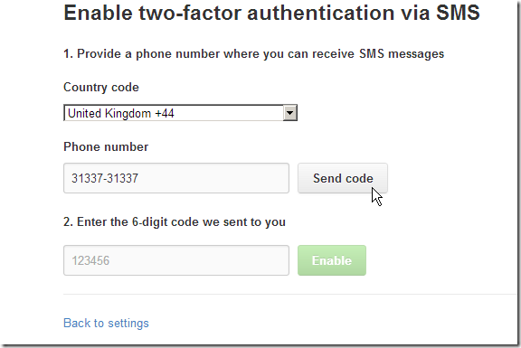

## Prob with (older version of) NGit where it was failing to create Git repositories in Azure/TeamCity

Using an NGit version from a couple months ago.  

    
    var userHome = Path.Combine(Path.Combine(HostingEnvironment.ApplicationPhysicalPath, "App_Data"), "git");  
    //using System.IO;  
    //using System.Web.Hosting;

var runTime = "Sharpen.dll".assembly().type("Runtime");

var properties = (Hashtable)runTime.invokeStatic("GetProperties");

var result = "There are {0} properties  ".format(properties.size());  
properties["user.home"] = userHome;  
//return properties["user.home"];  
foreach(DictionaryEntry item in properties)  
result+= "{0} = {1} ".format(item.Key, item.Value);

return result;

var tempRepo = "tempRepo".tempDir(false);  
try  
{  
var initCommand = NGit.Api.Git.Init();  
initCommand.SetDirectory(tempRepo);   
initCommand.Call();  
}  
catch(Exception ex)  
{  
return ex.Message + ex.StackTrace;  
}

//O2Ref:NGit.dll  
//O2Ref:Sharpen.dll  
//return new API_NGit().init(tempRepo).str();  
return tempRepo.isGitRepository();

  
//using O2.FluentSharp;

/*var runTime = "Sharpen.dll".assembly().type("Runtime");  
var properties = (Hashtable)runTime.invokeStatic("GetProperties");  
var result = "There are {0} properties  ".format(properties.size());  
  
foreach(DictionaryEntry item in properties)  
result+= "{0} = {1} ".format(item.Key, item.Value);  
return result;  
return "FluentSharp.NGit.dll".assembly();*/

//using System.Collections;  
//O2Ref:TeamMentor.CoreLib.dll  
//O2Ref:FluentSharp.NGit.dll  

I would get this exception:

  

The error is the one documented here: [https://github.com/mono/ngit/issues/14](https://github.com/mono/ngit/issues/14)

After forking the repo and building it locally in VS 2010, I run the UnitTests (note: only one of 2284 tests failed after a couple retries (there were about 20 that failed on fist execution, but passed to individual retest)):

I then added the compiled assemblies to TeamMentor, and now this script:  

    
    var properties = Sharpen.Runtime.GetProperties();  
    var result = "There are {0} properties  ".format(properties.size());  
    //properties["user.home"] = userHome;  
    //return properties["user.home"];  
    foreach(DictionaryEntry item in properties)  
        result+= "{0} = {1} ".format(item.Key, item.Value);

  
var tempRepo = "tempRepo".tempDir(false);  
try  
{  
var initCommand = NGit.Api.Git.Init();  
initCommand.SetDirectory(tempRepo);   
initCommand.Call();  
}  
catch(Exception ex)  
{  
return ex.Message + ex.StackTrace;  
}  
return tempRepo;

return result;

  
//using System.Collections;  
//O2Ref:Sharpen.dll  
//O2Ref:NGit.dll  
  
 Executed on the O2 Platform Browser-based C# REPL:

Creates the local repository on a local folder.

**NOTE: **For reference here is how to write that reflection script using the O2 API;s

  

    
    var runTime = "Sharpen.dll".assembly().type("Runtime");  
    var properties = (Hashtable)runTime.invokeStatic("GetProperties");  
    "There are {0} properties".debug(properties.size());  
    foreach(DictionaryEntry item in properties)  
        "{0} = {1}".info(item.Key, item.Value);

//using System.Collections  
return aPI_NGit;

//O2Ref:FluentSharp.NGit.DLL  
//O2Ref:Sharpen.dll  

