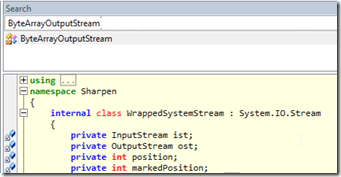

## Seeing an NGit Diff by using reflection to access the internal Sharpen.ByteArrayOutputStream Class

I was trying to get the NGif diff output stream, but hit on an issue that the **_Sharpen.ByteArrayOutputStream_** class is internal

  
Here is an example from NGit UnitTests on how to use the NGI Diff Command:

The key part is:

Note how the **_Sharpen.ByteArrayOutputStream_** was created and used on** _Diff.SetOutputStream , _**but (as we will see below), we will have a problem because  this class is **_internal_**:

On an [O2 Platform](http://blog.diniscruz.com/p/owasp-o2-platform.html) [C# REPL script](http://blog.diniscruz.com/p/c-repl-script-environment.html), lets create a quick repo and a valid Diff result:

Our objective is to get the Diff formatted output shown in the NGit Unit test.

A quick look at the Diff class, shows no public fields, properties or methods that expose it:

And by default the **_out _**field is null:

Basically what we need to do is this:

But as you can see, we can't create an instance of the **_Sharpen.ByteArrayOutputStream _**  
**_  
_**Well, we can't create it directly, but we can easily create it using reflection :)

To do that, lets start by getting an reference to the **_Sharpen.dll _**assembly

then add a reference to the **_ByteArrayOutputStream_**  type

invoke its constructor to create a live instance of it:

since the Sharpen.OutputStream class is public, we can cast our **_ByteArrayOutputStream_**  object into it:

we then assign it to the NGit command, which will give us the diff log we wanted

Note that the out field is now not null:

Here is the Source code of the C# code snippet created:  

    
    var outputStream = "Sharpen.dll".assembly()  
                                    .type("ByteArrayOutputStream")  
                                    .ctor()  
                                    .cast<OutputStream>();

  
var tempRepo = "tempRepo".tempDir();  
var nGit = tempRepo.git_Init();

var file = "testFile.txt";  
nGit.writeFile (file, "some content\naaaa\n");  
nGit.add (".",false).commit_using_Status();  
nGit.writeFile (file, "some content\naa Change\n");

var diff = nGit.Git.Diff();

diff.SetOutputStream(outputStream).Call();  
return outputStream.str();

//using Sharpen  
//O2Ref:FluentSharp.NGit.DLL  
//O2Ref:NGit.dll  
//O2Ref:Sharpen.dll  

