## Using Git Branches to fix Issues added to TeamMentor's GitHub repository

This is the currently workflow that I'm following when coding/fixing TeamMentor Issues added to the [TeamMentor/Master/Issues](https://github.com/TeamMentor/Master/issues) list.  

  * Find issue to address
  * Create and checkout new branch (with the issue ID on its title)
  * Apply the fixes (on the new branch)
  * Commit the changes (on the new branch)
  * Checkout master branch
  * Merge changes (from new branch) into master , using the --no--ff (no fast-forward) option (this is very important, see [here](http://stackoverflow.com/questions/6701292/git-fast-forward-vs-no-fast-forward-merge) and [here](http://stackoverflow.com/questions/2850369/why-does-git-use-fast-forward-merging-by-default/2850413#2850413) for a good explanation why)
  * Push to GitHub

**Lets look at this in action.**  

Here is a simple issue to fix: [https://github.com/TeamMentor/Master/issues/389](https://github.com/TeamMentor/Master/issues/389)

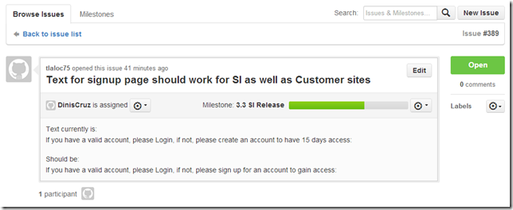

In GitHub, the issue is #389, so on a local clone of the Master repository, we create a branch called **_Issue_389_** (using the --b switch to create it)

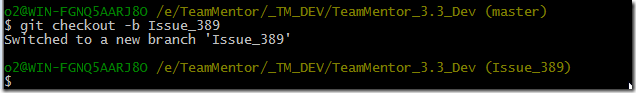

In VisualStudio, apply the fix to the code:

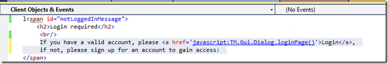

Quickly look in a browser to confirm the change (this should also be reconfirmed via a UI UnitTest):

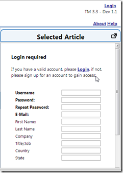

Commit the change to the **Issue_389** branch:

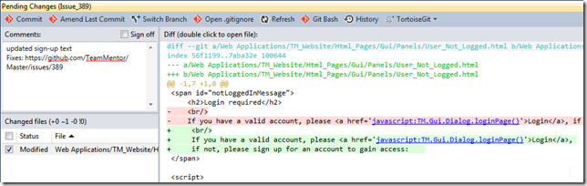

Which means that at this moment, there is nothing else to commit on the **_Issue_389_** branch:

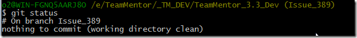

which is now one commit ahead of master

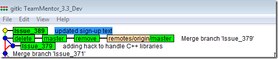

Next step is to **_checkout _**(into) master and do the **_git merge_** using the **_--no--ff _**

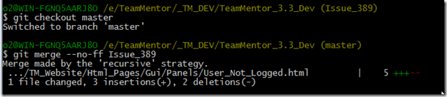

Gitk shows the effect of the **_--no--ff_** (ie. the use of the branch was preserved)

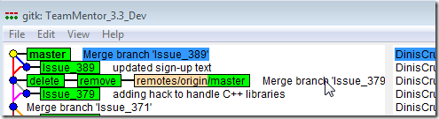

Final step is to push the commits to GitHub:

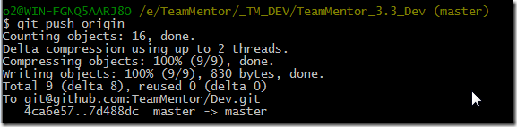

Here is the commit at GitHub:

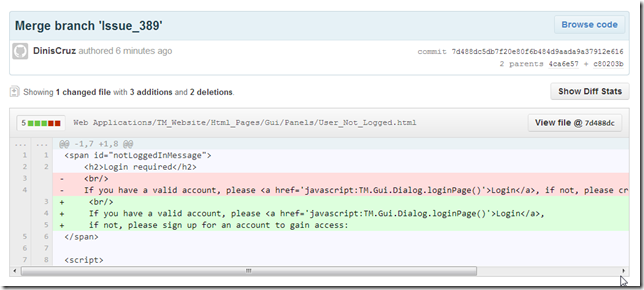

Here is the GitHub's Network view:

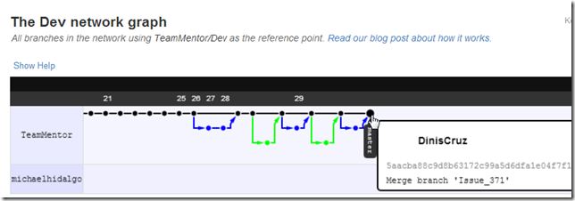
