## Using NGit to create native Git support in Azure deployed app (with automatic pushes and pulls)

This entry will show a pretty powerful new feature in [TeamMentor](http://teammentor.net/) (TM) which I'm very proud and excited about!

This feature is so important, that it literary caused a delay on the release of TM 3.3 for about 1 month (my instinct was pushing me on this direction since I 'knew' that this could be done, and that it would be a killer feature). Btw, there is a lot more NGit/Git support than what is shown here, but I'm sure you will see the power in the workflow described below.

Basically, TM's backend engine will now automatically perform:

* a **git pull** when the TM server starts (or it cache is rebuilt)
* a **git commit** followed by a **git push** on every library edit (on both content and structure changes).

And since TM uses the .NET Library [NGit](http://blog.diniscruz.com/search/label/NGit), what we have here is a pretty powerful **self-contained .Net-based 'git for content versioning'** solution.

Practically speaking, **this is a Git workflow that runs on Azure-hosted-site without requiring Git to be installed on the live servers!**

This solves the problem created by the lack of git.exe (and supporting files) on an Azure's deployed web application (Azure's git support is limited to pushing code to Azure's servers, which will trigger  MSBuild-like website publishing workflow)

**Here is a example of this managed Git workflow in action.**  

The [https://tm-tm4tm.azurewebsites.net](https://tm-tm4tm.azurewebsites.net/) site:

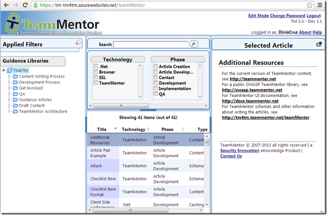

is currently configured to use the UserData from this repository

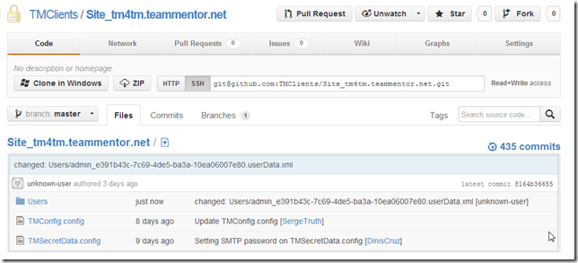

which contains a reference to the [https://github.com/TMContent/Lib_TM4TM](https://github.com/TMContent/Lib_TM4TM) repository:

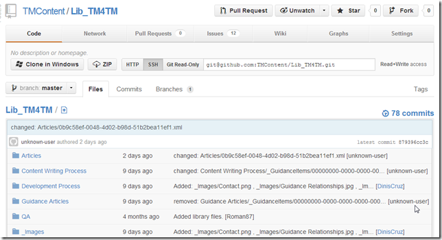

In practice, what this means is that the TM articles we see in [https://tm-tm4tm.azurewebsites.net](https://tm-tm4tm.azurewebsites.net/) are the ones hosted and managed  by the [https://github.com/TMContent/Lib_TM4TM](https://github.com/TMContent/Lib_TM4TM) repository.

But since the mapping is done via NGit and the account used (in Azure) to connect to GitHub's Lib_TM4TM has push privileges, it is now possible to make a change in [https://tm-tm4tm.azurewebsites.net](https://tm-tm4tm.azurewebsites.net/) that is auto committed locally and then into [https://github.com/TMContent/Lib_TM4TM](https://github.com/TMContent/Lib_TM4TM)

**Auto Committing and pushing changes**  

For example, here are the last commits at [https://github.com/TMContent/Lib_TM4TM](https://github.com/TMContent/Lib_TM4TM)

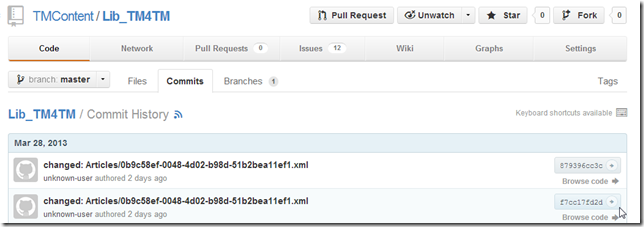

In the [https://tm-tm4tm.azurewebsites.net](https://tm-tm4tm.azurewebsites.net/) server, lets' add an new Guidance Item (i.e. an Article)

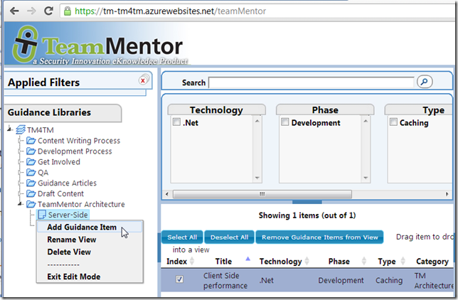

Since (in TM 3.3) the articles are created immediately, by the time the editor is shown, the article shown in the popup-window will already exist on disks (i.e. there is already an **_384ed731-96a1-4c00-a830-345abfc827e2.xml_** file on the server)

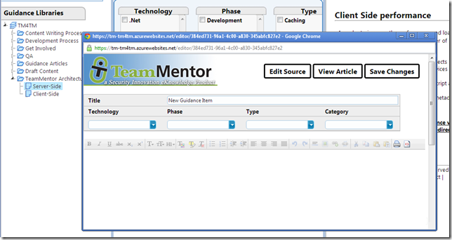

And with the new **'auto Git commit'** feature, the git commit of the new article will be available (after a couple secs) at GitHub:

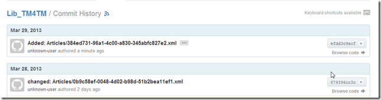

This **_'commit on new article_**' is made of two file changes:  

  * The new article (the **_384ed731-96a1-4c00-a830-345abfc827e2.xml_** file)
  * The mapping of the new Article's GUID to the chosen 'view' element (which is part of the **_Tm4TM.xml_** library xml file)

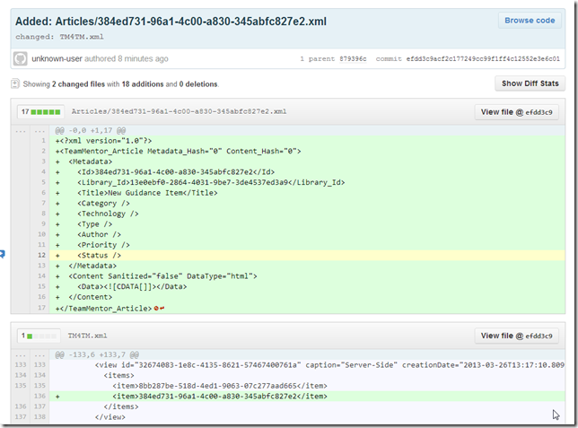

**Next let's make some changes to the new article:**

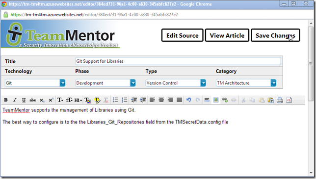

After saving, the article is now available at

[https://tm-tm4tm.azurewebsites.net/article/384ed731-96a1-4c00-a830-345abfc827e2](https://tm-tm4tm.azurewebsites.net/article/384ed731-96a1-4c00-a830-345abfc827e2) or   
[https://tm-tm4tm.azurewebsites.net/article/Git_Support_for_Libraries](https://tm-tm4tm.azurewebsites.net/article/Git_Support_for_Libraries)

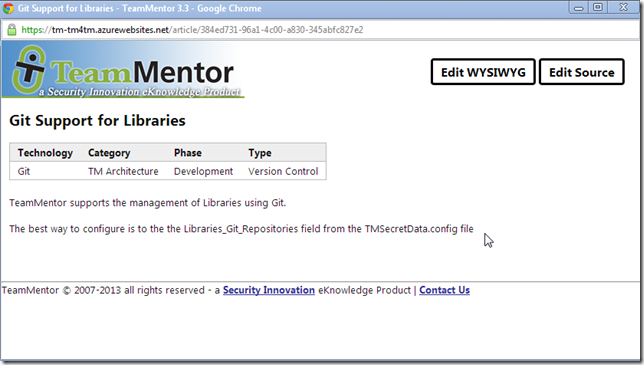

As before, there is a new Commit at GitHub ([https://github.com/TMContent/Lib_TM4TM/commits/](https://github.com/TMContent/Lib_TM4TM/commits/)):

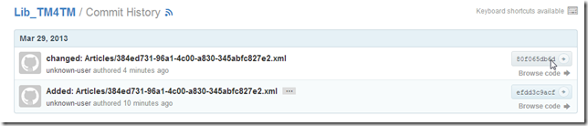

Which contains the 'metadata changes' and the new article's html content (created by the WYSIWYG TM online editor):

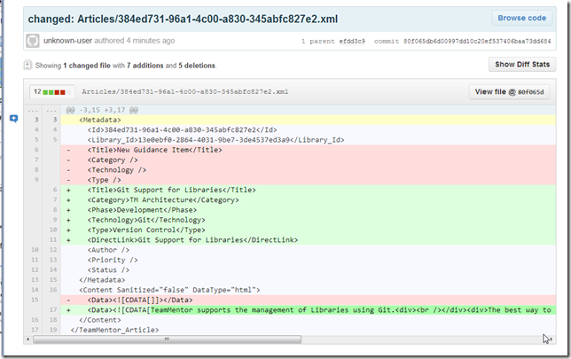

And since this is all Git based, many more complex and multi-user/hosting scenarios are easily supported (for example I can have a local copy of the TM4TM server/repo which I can edit offline and push to GitHub (directly or via Pull Requests)).

The git merge strategy is the same used by GitHub:

* If there are no conflicting changes, everything happens automatically or via GUIs pages
* If there are merge conflicts, the Git Bash and Windows Diff tools should be used to address them
