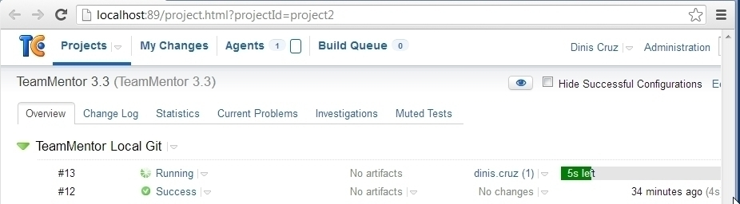

## Using TeamCity to build on Git Commit, deploy to AppHarbor and open browser

I just gave [TeamCity](http://www.jetbrains.com/teamcity/) a test drive and I really LIKED it :)

After using it for a bit, I was able to create a really nice [CI](http://en.wikipedia.org/wiki/Continuous_integration) that:

  * Monitors the local file system for a Git Commit (of TeamMentor)
  * On Git Commit, trigger a build (of the main VisualStudio 2010 project)
  * If the build is OK, trigger a git push into AppHarbor
  * Open a WebBrowser with the AppHarbor site

All automated from the moment there is a commit :)

**Let's see this in action**

It all starts with a deployed instance of TeamMentor at version Dev.2.1 (see top right)

With TeamCity running locally on my box (as a service) keeping an eye on the local git repository

In VisualStudio, lets make a simple change (bumping the version to Dev.2.2)

Using _Git Source Control Provider_ VisualStudio Extension, create a Commit  

Which (after about 10 to 20 secs) is picked up by TeamCity

The 'build logs' update in real-time, and provide a lot of good info:

After the build completes, and the AppHarbor push is done, the target website will be opened: (notice that it is now on version Dev.2.2)

For reference here are the Build Steps in TeamCity configuration page:

