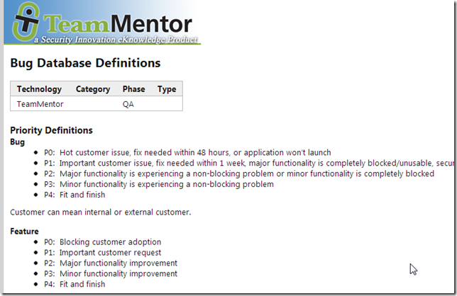
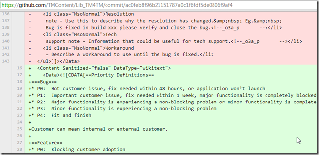
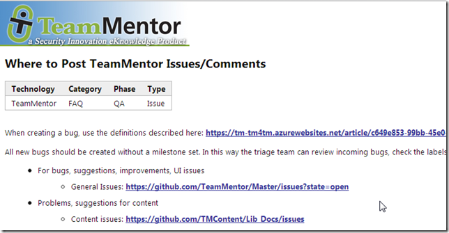
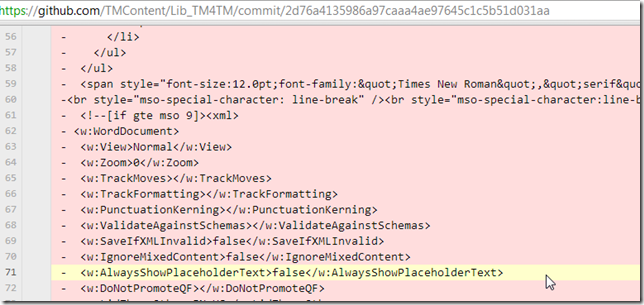
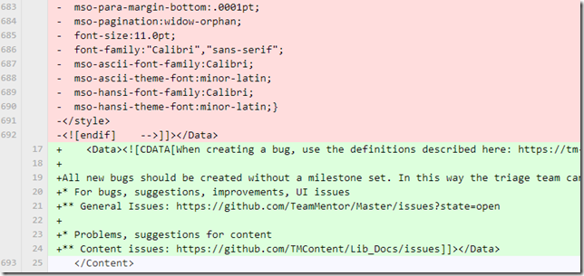
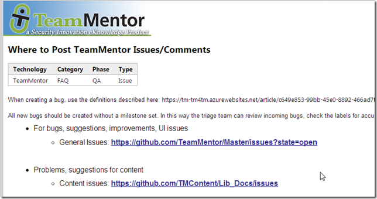

## What the move from HTML to WikiText looks like (in GitHub)

Copy and paste of HTML is such a mess (even today in 2013).

I just converted a couple (converted from Word doc) TM articles from HTML into WikiText and it is shocking the difference in the amount of code (and complexity)

**Example #1:** [Bug Database Definitions](https://tm-tm4tm.azurewebsites.net/article/c649e853-99bb-45e0-8892-466ad7f4d641)

Here is what the article looks like:

And here is the ['Html to Wiki' Commit](https://github.com/TMContent/Lib_TM4TM/commit/ac0feb8f96b21151787a0c1f6fdf5de0806f9af4)

**Example #2:** [Where to Post TeamMentor Issues/Comments](https://tm-tm4tm.azurewebsites.net/article/5e8f7cf1-85b2-43f4-9d15-3a560fe775ec)

And here is the ['Html to Wiki' Commit](https://github.com/TMContent/Lib_TM4TM/commit/2d76a4135986a97caaa4ae97645c1c5b51d031aa)

In this 2nd case, ironically the WikiText version looks better (look at the difference with the screenshot below with the above) because of the lack of HTML formatting mess:

